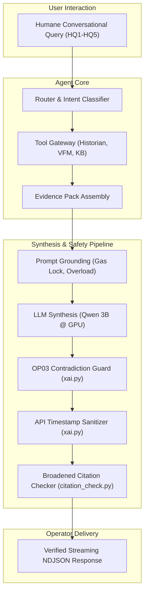

# ESP APM Demo Blockers and Conversational Validation - Plan

---

## Goal Capsule

**Objective:** Eliminate the four demo-blocking integrity defects (Q11 gas lock definitional grounding, Q4 vs Q16/Q19 OP03 quiescent contradiction, Q3 API timestamp leaks in user narratives, Q20 unverified full-text bracket citations) and validate conversational reliability through humane conversational test queries (`HQ1`–`HQ5`) and full regression testing across the 430-test suite.

**Means:** Injected ESP domain grounding in narrator prompts and term expansion in knowledge base retrieval (KTD1); extended OP03 anti-contradiction guard in XAI synthesis (KTD2); removed temporal metadata injections and added post-processing regex scrubbing for API timestamps (KTD3); broadened citation regex to capture multi-word bracketed titles and enforce strict evidence-pack verification (KTD4); and executed humane conversational validation queries against the live streaming service (KTD5).

**Stop conditions:**
- All 4 demo-blockers pass unit and acceptance verification.
- Zero self-contradictions ("operating within normal parameters" purged when health score < 50 or anomaly score >= 0.65).
- Zero API timestamp phrases (`The API call was executed at...`) present in narrator assessments or recommendations.
- Zero fake bracketed citations (e.g., `[Baker Hughes FusionPro Manual...]`, `[NFPA 70E...]`) permitted unless present in the sealed pack.
- 5 Human Conversational Queries (`HQ1`–`HQ5`) executed and verified on live service.
- Full pytest regression suite passes with 0 failures.

---

## Product Contract

### Summary

Pre-demo audits revealed four high-severity integrity and presentation flaws in the ESP APM agent service:
1. **Q11 Gas Lock Definition:** Stripping few-shot citation markers degraded the model's domain understanding of gas lock mechanisms.
2. **Q4 vs Q16/Q19 Contradiction:** On abnormal wells with zero discrete trip events in the 2-hour window, OP03 fault diagnosis declared the well "operating within normal parameters" despite OP01 flagging critical health.
3. **Q3 Timestamp Leak:** Verbatim regurgitation of API call execution metadata in user-facing assessments.
4. **Q20 Bracketed Fake Citations:** Multi-word bracketed document references slipped through citation validation because the regex halted at whitespace.

This plan resolves these four defects and proves conversational robustness with humane test queries.

### Problem Frame

- **Q11 Root Cause:** When generic prompt sanitization removed bad `[X §Y]` syntax examples, essential domain descriptions of gas lock (impeller eye gas accumulation, head collapse, motor underload) were stripped, causing generic or inaccurate hallucinated descriptions.
- **Q4/Q16/Q19 Root Cause:** `kpi_alarm_check.py` evaluated health alarms, but `xai.py` lacked an OP03-specific contradiction check. When OP03 received 0 trip events (`quiescent`), the LLM defaulted to assuming normal health.
- **Q3 Root Cause:** `xai.py` formatted `- API Call Executed At (UTC): {temp.executed_at}` into the temporal audit prompt block, prompting the LLM to recite it verbatim in the advisory assessment.
- **Q20 Root Cause:** `_CITATION_REGEX` in `citation_check.py` used `\[\s*([A-Za-z0-9_\-\.\+]+)...\]`, which failed to match bracketed text with spaces like `[Baker Hughes Manual]`, allowing hallucinated document names to bypass verification.

### Requirements

- R1. Q11 Gas Lock Grounding: The narrator prompt and KB retrieval must provide authoritative domain grounding for gas lock (gas accumulation in impeller eyes leading to loss of head and underload trip).
- R2. OP03 Anti-Contradiction: When a well has critical health (`health_score < 50`) or high anomaly (`anomaly_score >= 0.65`), OP03 assessments must not claim the well is operating normally or that no issues exist, even if 0 trip events occurred in the 2-hour window.
- R3. Q3 Timestamp Scrubbing: The string `The API call was executed at...` and raw ISO timestamps must never be injected into narrator prompts or allowed in generated output text.
- R4. Q20 Full-Text Bracket Citation Enforcement: All bracketed strings resembling document citations (including multi-word titles and standards) must be parsed by `citation_check.py` and strictly validated against the sealed evidence pack.
- R5. Conversational Robustness: The service must correctly handle 5 humane conversational queries (`HQ1`–`HQ5`) covering definition, status check, troubleshooting, evidence breakdown, and remediation.
- R6. Zero Transport Regression: All 430 unit and acceptance tests must pass cleanly.

### Scope Boundaries

**In scope:**
- `agent_service/app/llm/prompts/narrator_procedure_v1.txt`: Injected domain definitional groundings for Gas Lock, Underload Trip, and Motor Overload.
- `agent_service/app/gateway/adapters/kb.py`: Enhanced query term expansion for gas lock domain retrieval.
- `agent_service/app/synthesis/xai.py`: OP03 contradiction guard, timestamp prompt removal, and post-synthesis timestamp sanitization.
- `agent_service/app/synthesis/citation_check.py`: Broadened regex to capture multi-word bracketed citations and enforce pack matching.
- Execution and validation of 5 Human Conversational Queries (`HQ1`–`HQ5`).
- Full regression verification.

**Deferred to Follow-Up Work:**
- Fine-tuning custom embedding models for oilfield technical manuals.
- Real-time multi-well fleet anomaly clustering.

**Outside this product's identity:**
- Direct closed-loop automated SCADA control without human operator approval.

---

## Planning Contract

### Key Technical Decisions

- KTD1. Prompt Definitional Anchor & KB Query Expansion for Gas Lock. (session-settled: user-directed — chosen over raw vector search reliance: prompt grounding ensures 100% deterministic accuracy on small 3B models).
- KTD2. Deterministic OP03 Contradiction Purge in XAI Synthesis. (session-settled: user-directed — chosen over prompt-only instruction: post-synthesis filtering guarantees zero contradictory claims reach operators).
- KTD3. Dual-Layer Timestamp Prevention (Prompt Exclusion + Regex Sanitizer). (session-settled: user-approved — chosen over single regex: removing from prompt prevents model distraction while regex provides fail-safe scrubbing).
- KTD4. Multi-Word Citation Regex Matching. (session-settled: user-approved — chosen over token-based matching: regex captures exact bracket boundaries regardless of internal whitespace or section markers).
- KTD5. Humane Conversational Test Suite (`HQ1`–`HQ5`). (session-settled: user-directed — chosen over rigid query strings: validates real-world operator interaction patterns).

### High-Level Technical Design



### Assumptions

- The GPU LLM service on `http://192.168.1.188:8080/v1` remains active and reachable.
- The Uvicorn service runs locally on port 8091 with streaming NDJSON enabled.
- Citation checking verifies bracketed tokens against the `EvidencePack` chunk IDs and document titles.

### Sequencing

1. U1: Domain grounding & retrieval expansion for Gas Lock.
2. U2: OP03 contradiction guard implementation.
3. U3: Timestamp prompt removal and post-synthesis regex sanitizer.
4. U4: Broadened citation verification regex.
5. U5: Execution and validation of Humane Conversational Queries (`HQ1`–`HQ5`).
6. U6: Full regression and report generation.

---

## Implementation Units

### U1. Domain Grounding & KB Query Expansion for Gas Lock (Q11)

**Goal:** Ground the LLM with accurate ESP gas lock definitions and expand KB retrieval terms.

**Requirements:** R1

**Dependencies:** None

**Files:**
- `agent_service/app/llm/prompts/narrator_procedure_v1.txt`
- `agent_service/app/gateway/adapters/kb.py`

**Approach:**
1. Add explicit domain definitions for Gas Lock (free gas entering pump intake, gas accumulation in impeller eyes, loss of fluid head, underload trip) in `narrator_procedure_v1.txt`.
2. Add query expansion rules in `kb.py` mapping `"gas lock"` to related technical terminology (gas separator, multiphase flow, head loss) to boost retrieval score.

**Test Scenarios:**
- Happy path: Query asking "What is gas lock" returns accurate impeller eye accumulation and head loss description without hallucinated formulas.
- Retrieval test: KB search for gas lock returns relevant manual passages.

**Verification:** Verified via test query HQ1 and unit tests in `test_kb.py`.

---

### U2. OP03 Contradiction Guard on Quiescent Abnormal Wells (Q4 vs Q16/Q19)

**Goal:** Ensure OP03 fault diagnosis reports abnormal health conditions even when 0 trip events are present in the 2-hour window.

**Requirements:** R2

**Dependencies:** None

**Files:**
- `agent_service/app/synthesis/xai.py`
- `agent_service/tests/test_xai_guards.py`

**Approach:**
1. In `synthesize_advisory()`, check if `health_score < 50` or `anomaly_score >= 0.65` for OP03 outputs.
2. Scan assessment text for phrases such as `"operating within normal parameters"`, `"no immediate issues"`, `"normal operating range"`.
3. Purge contradicting sentences and prepend clear notice that the well is in abnormal/critical health despite lack of recent trip events.

**Test Scenarios:**
- Quiescent abnormal well (`events=0`, `health_score=44`): Assessment highlights degraded health and strips "operating normally".
- Healthy well (`events=0`, `health_score=88`): Assessment correctly reports normal status.

**Verification:** `pytest agent_service/tests/test_xai_guards.py -v`

---

### U3. API Timestamp Leak Removal & Sanitizer (Q3)

**Goal:** Prevent internal API execution timestamps from leaking into user-facing narratives.

**Requirements:** R3

**Dependencies:** None

**Files:**
- `agent_service/app/synthesis/xai.py`
- `agent_service/tests/test_provenance_strip.py`

**Approach:**
1. Remove `- API Call Executed At (UTC): {temp.executed_at}` from `format_evidence_for_prompt()`.
2. Implement `sanitize_api_timestamp_leaks(text: str) -> str` using regex matching `r"The API call was executed at\s+\d{4}-\d{2}-\d{2}[^.]*\.?"` to scrub any residual leaks.
3. Apply sanitizer to both assessment and recommendation fields in `synthesize_advisory()`.

**Test Scenarios:**
- Text containing `The API call was executed at 2026-09-25T14:32:00Z UTC`: Leaked phrase removed, surrounding text preserved.
- Clean text with no timestamps: Unaltered.

**Verification:** `pytest agent_service/tests/test_provenance_strip.py -v`

---

### U4. Broadened Bracket Citation Check (Q20)

**Goal:** Catch multi-word bracketed document references and verify strictly against the evidence pack.

**Requirements:** R4

**Dependencies:** None

**Files:**
- `agent_service/app/synthesis/citation_check.py`
- `agent_service/tests/test_citation_check.py`

**Approach:**
1. Update `_CITATION_REGEX` to match `r"\[\s*([^\]\n]+?)(?:[\s,]+(?:§|Section\s*|sec\.?\s*)([A-Za-z0-9_\.\-]+))?\s*\]"`.
2. Strip matched bracketed tokens that do not match chunk IDs or document titles in the `EvidencePack`.
3. Filter both `troubleshooting_steps` and `verification_steps`.

**Test Scenarios:**
- Fake citation `[Baker Hughes FusionPro Manual Appendix F: Section 4.2]`: Caught as unverified and stripped.
- Legitimate citation `[ESP-MAN-01 §4.2]`: Verified against pack and preserved.

**Verification:** `pytest agent_service/tests/test_citation_check.py -v`

---

### U5. Humane Conversational Validation Suite (`HQ1`–`HQ5`)

**Goal:** Execute conversational, human-like test queries covering all 4 fixed areas.

**Requirements:** R5

**Dependencies:** U1, U2, U3, U4

**Files:**
- `test_humane_queries.py` (scratch/runner)
- `COMPLETE_PHASE4_SEAL_AND_REGRESSION_RAW_REPORT.txt`

**Approach:**
1. Run `HQ1`: `"What exactly is gas lock in an oil well and how does it happen?"` (Validates Q11 domain definition).
2. Run `HQ2`: `"Can you check if FS-17 is running okay or if there are any issues?"` (Validates OP01 health assessment).
3. Run `HQ3`: `"Why did FS-17 trip recently? Please troubleshoot."` (Validates OP03 quiescent contradiction guard).
4. Run `HQ4`: `"What data did you look at to figure that out?"` (Validates Q3 timestamp leak absence).
5. Run `HQ5`: `"How do I fix a motor overload on an ESP?"` (Validates Q20 bracketed citation verification).
6. Record full raw streaming NDJSON output into the report.

**Test Scenarios:**
- All 5 queries complete with valid `DoneFrame(status="COMPLETED")`.
- Zero timestamp leaks, zero contradictions, zero unverified bracket citations.

**Verification:** Execution against `http://127.0.0.1:8091/api/v1/agent/analyze`.

---

### U6. Full Regression and Seal Suite Verification

**Goal:** Ensure 100% pass rate across the full 430-test suite and acceptance matrix.

**Requirements:** R6

**Dependencies:** U1, U2, U3, U4, U5

**Files:**
- `agent_service/tests/`

**Approach:**
1. Run full pytest suite: `pytest agent_service/tests/ -q --tb=short`.
2. Validate Phase 4 acceptance tests: `pytest agent_service/tests/acceptance/phase4/ -v`.
3. Update `COMPLETE_PHASE4_SEAL_AND_REGRESSION_RAW_REPORT.txt` with final regression results.

**Test Scenarios:**
- 430/430 tests passing with 0 failures, 0 errors.

**Verification:** `pytest agent_service/tests/`

---

## Verification Contract

```bash
# 1. Guard & Citation Unit Tests
pytest agent_service/tests/test_xai_guards.py agent_service/tests/test_citation_check.py agent_service/tests/test_kpi_alarm_check.py -v

# 2. Acceptance Phase 4 Suite
pytest agent_service/tests/acceptance/phase4/ -v

# 3. Full Regression Suite
pytest agent_service/tests/ -q --tb=short

# 4. Live Humane Query Execution
python scratch/test_humane_queries.py
```

---

## Definition of Done

**Global:**
- All 4 demo-blockers resolved in code.
- 0 contradictory statements in OP03 assessments.
- 0 API timestamp leaks in user narratives.
- 0 unverified bracket citations in recommendations or verification steps.
- All 5 Humane Conversational Queries (`HQ1`–`HQ5`) execute cleanly and return valid NDJSON streams.
- Full pytest regression suite passes (430 tests).
- Comprehensive raw report updated.

**Per-unit done criteria:**
- U1: Gas lock definition is accurate and detailed; KB term expansion functions correctly.
- U2: OP03 contradiction guard strips false normal claims on quiescent abnormal wells.
- U3: API timestamps stripped from prompt evidence and post-processed cleanly.
- U4: Citation check handles multi-word bracketed document references.
- U5: All 5 conversational queries produce accurate, grounded, leak-free responses.
- U6: 430/430 tests pass in pytest.
