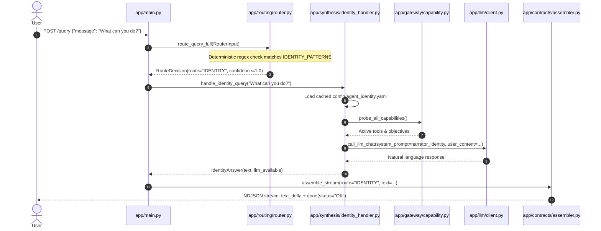

## Goal Capsule

### Objective
Introduce a dedicated top-level route `IDENTITY` alongside existing `SIMPLE`, `WORKFLOW`, and `FOLLOW_UP` routes. The agent answers meta-level self-knowledge queries ("who are you", "what can you do", "what are your limits") by combining a static self-model document with live capability introspection, short-circuiting the heavy workflow pipeline entirely.

### Means
1. Expand the route contract enum with `IDENTITY`.
2. Add deterministic pattern matching in the query router to short-circuit self-knowledge inquiries before invoking the LLM router.
3. Define a static self-model document in `agent_service/config/agent_identity.yaml` capturing role, scope, boundaries, and personality.
4. Implement a lightweight `identity_handler` that combines the static self-model with live runtime capabilities from `app/gateway/capability.py`.
5. Format and dispatch to the LLM via a dedicated prompt `app/llm/prompts/narrator_identity_v1.txt`.
6. Stream response directly as `text_delta` + `done` without evidence packs, QoD checks, or visualization cards.

### Authority Hierarchy
- Product & Scope: Static Self-Model document (`agent_identity.yaml`) defines boundaries and identity.
- Runtime Truth: Live registry probe (`probe_all_capabilities()`) defines supported objectives/tools.
- Routing Precedence: `IDENTITY` pattern match short-circuits before Rule 0 (`OP06_KNOWLEDGE_LOOKUP`) and LLM router calls.

### Stop Conditions
- Successful delivery of natural language self-description answering "what are you", "what can you do", and "what are your limits".
- Zero invocation of `build_plan`, `validate_plan`, `dispatch_plan_calls`, or `seal`.
- Zero changes or regressions to existing `SIMPLE`, `WORKFLOW`, or `FOLLOW_UP` routes.

---

## Product Contract

### Problem Frame & Scope Boundaries
* **In Scope**:
  - Detection of meta/identity queries ("who are you", "what are you", "what do you do", "what can you do", "what are your limits", "what can't you do", "what is this platform").
  - Routing to a distinct `IDENTITY` route in logs, audit records, and response streams.
  - Merging static platform role/boundary definitions with dynamically discovered capabilities.
  - Streaming natural-language answers with engineering tone, strict grounding, and zero hallucinated actuation capabilities.
* **Out of Scope**:
  - Live equipment actuation or approval of setpoints (strictly advisory).
  - Telemetry diagnostics for specific wells (remains `WORKFLOW` / `OP01`-`OP05`).
  - Petroleum engineering procedure and textbook lookups (remains `OP06_KNOWLEDGE_LOOKUP`).
  - Screen-specific contextual parsing or dynamic error state analysis (deferred to Platform Guide V2).

### Requirements
- R1. Route Contract: `IDENTITY` must be registered in `RouteType` enum and `RouteDecision`.
- R2. Deterministic Pattern Short-Circuit: The router must check for self-knowledge phrases before calling the LLM router or falling into generic `OP06` keyword triggers.
- R3. Static Self-Model: An `agent_identity.yaml` configuration must declare the agent's identity, role, scope, operating boundaries, and communication style.
- R4. Dynamic Capability Introspection: The identity handler must query live capability metadata at query time so newly registered tools/objectives are automatically reflected.
- R5. Dedicated Narrative Prompt: `narrator_identity_v1.txt` must synthesize answers strictly grounded in the merged self-model and capability list.
- R6. Pipeline Isolation: The `IDENTITY` route must run parallel to the workflow pipeline, producing no evidence pack, no QoD check, no numeric provenance check, and no visual cards.
- R7. Audit Logging: Audit records must log route `IDENTITY` and stage timing under `identity_handler`.

### Actors & User Flows
* **Operational Engineer / Operator**:
  1. Types `"What can you do?"` or `"Who are you?"` into the chat interface.
  2. Router identifies the pattern and assigns route `IDENTITY`.
  3. Identity handler loads static self-model, inspects live capabilities, formats prompt, and calls LLM.
  4. User receives an authoritative, concise response outlining role, objectives, and boundaries without empty cards or confusion with well telemetry.

### Acceptance Scenarios
- AE1. Identity Inquiry: `"What are you?"` -> Returns concise statement of role (ESP APM Diagnostic Assistant for Farha South fleet), advisory-only nature, and read-only boundary.
- AE2. Capabilities Inquiry: `"What can you do?"` -> Lists currently active objectives (OP01-OP14), knowledge lookup, and well monitoring coverage.
- AE3. Boundary Inquiry: `"What can't you do?"` or `"What are your limits?"` -> Explicitly states read-only boundary, refusal of control/actuation, and refusal of out-of-domain chat.
- AE4. Negative Preservation: `"What is gas lock?"` and `"Why did FS-17 trip?"` continue to route to `OP06` and `OP03` respectively.

---

## Planning Contract

### Key Technical Decisions
* **KTD-1: Top-Level Route vs. Objective**: Self-knowledge is meta-level and does not interact with subsurface well data or physical systems. Modeling it as route `IDENTITY` prevents cluttering the objective registry with non-domain objectives and keeps audits unambiguous.
* **KTD-2: Deterministic Short-Circuit**: Phrases such as `"who are you"`, `"what are you"`, and `"what can you do"` are unmistakable. Short-circuiting in `router.py` saves ~1-2 seconds of LLM router latency and prevents Rule 0 (`OP06`) keyword false-positives.
* **KTD-3: Merged Static + Dynamic Knowledge**: Static identity (who the agent is and its safety boundaries) is versioned in YAML. Active capabilities (what tools and objectives exist) are introspected at query time via `probe_all_capabilities()`, guaranteeing zero drift when new adapters are enabled.
* **KTD-4: Direct Response Streaming**: Response stream utilizes `ResponseAssembler.assemble_stream` with route `IDENTITY`, yielding `text_delta` frames followed by `done(status="OK")`, entirely skipping plan building and evidence sealing.

### High-Level Technical Design



---

## Implementation Units

### U1. Route Contract & Enum Registration
* **Goal**: Add `IDENTITY` to system route definitions so contracts, audit sinks, and routing logic recognize it as a valid first-class route.
* **Files**:
  - `agent_service/app/contracts/enums.py`
  - `agent_service/app/contracts/routing.py`
* **Changes**:
  - Update `RouteType` literal: `"SIMPLE" | "WORKFLOW" | "FOLLOW_UP" | "IDENTITY"`.
  - Ensure `RouteDecision` schema allows `route="IDENTITY"`.
* **Test Expectation**: Unit test verifying `RouteDecision(route="IDENTITY", confidence=1.0)` serializes and validates cleanly.

### U2. Static Self-Model Configuration
* **Goal**: Establish the version-controlled identity document defining the agent's persona, role, boundaries, and fleet scope.
* **Files**:
  - `agent_service/config/agent_identity.yaml`
* **Contents**:
  - `identity.name`: "ESP APM Operations Copilot"
  - `identity.system`: "Electric Submersible Pump Asset Performance Management (Farha South Fleet)"
  - `identity.role`: "Read-only engineering copilot and diagnostic assistant"
  - `identity.tone`: "Terse, factual, petroleum engineering operations tone"
  - `boundaries.read_only`: true (no VSD speed changes, no breaker trips, no setpoint writes)
  - `boundaries.domain_only`: true (refuses non-petroleum / non-platform questions)
  - `boundaries.supported_fleet`: ["FS-17", "FS-91", "FNW-01", "FWS-06", ...]
* **Test Expectation**: Config loader verifies YAML existence, parses fields, and caches in memory.

### U3. Identity Narrator Prompt Template
* **Goal**: Provide the LLM synthesizer with strict instructions on how to articulate self-knowledge using the supplied self-model and live capabilities.
* **Files**:
  - `agent_service/app/llm/prompts/narrator_identity_v1.txt`
* **Contents**:
  - Instruct model that it is describing itself based on the provided `<StaticSelfModel>` and `<LiveCapabilities>`.
  - Strict mandate: never claim capability to execute equipment writes or control downhole hardware.
  - Always state advisory nature clearly.
  - Return plain text (no markdown tables, no JSON, no code blocks).

### U4. Identity Synthesis Handler Module
* **Goal**: Build the synthesis handler that merges the static self-model with live runtime capabilities and invokes the LLM.
* **Files**:
  - `agent_service/app/synthesis/identity_handler.py`
* **Logic**:
  - Cached loader for `agent_identity.yaml`.
  - Dynamic caller to `probe_all_capabilities()` from `app.gateway.capability`.
  - Prompt builder formatting `<StaticSelfModel>` + `<LiveCapabilities>` + `<UserQuery>`.
  - Call `call_llm_chat` with `caller="identity_handler"`.
  - Offline fallback: if LLM is unavailable, return deterministic self-introduction based directly on `agent_identity.yaml` with `llm_available=False`.
* **Test Expectation**:
  - Happy path: LLM generates text using live capabilities.
  - Gateway down: Deterministic fallback text returned with `llm_available=False`.

### U5. Router Short-Circuit & Query Flow Integration
* **Goal**: Intercept identity questions in the router and route them directly to `identity_handler` in `main.py`.
* **Files**:
  - `agent_service/app/routing/router.py`
  - `agent_service/app/main.py`
* **Logic**:
  - Define `IDENTITY_PATTERNS` regex in `router.py`:
    `r"\b(who are you|what are you|what do you do|what can you do|what can't you do|what are your (limits|capabilities)|about (yourself|this assistant)|explain your architecture)\b"`
  - In `route_query_full` and fallback router: match `IDENTITY_PATTERNS` before Rule 0 / LLM router call.
  - In `main.py`: Add `if decision.route == "IDENTITY":` handler branch.
  - Persist session turn count (preserving last asset/objective).
  - Assemble stream via `ResponseAssembler.assemble_stream(run_id=run_id, route="IDENTITY", text=answer.text, llm_available=answer.llm_available)`.
* **Test Expectation**:
  - `"what are you"` routes to `IDENTITY` with 1.0 confidence in <10ms.
  - Full stream returns `text_delta` and `done(status="OK")`.

### U6. Comprehensive Acceptance & Regression Suite
* **Goal**: Verify end-to-end functionality and guarantee zero regressions on existing routes.
* **Files**:
  - `agent_service/tests/test_identity_route.py`
* **Test Scenarios**:
  - Test 1: `"Who are you?"` -> Route `IDENTITY`, advisory copilot description.
  - Test 2: `"What can you do?"` -> Route `IDENTITY`, enumerates active capabilities.
  - Test 3: `"What are your limits?"` -> Route `IDENTITY`, mentions read-only and no actuation.
  - Test 4: Offline fallback when LLM gateway fails.
  - Test 5: Boundary regression — `"What is gas lock?"` still routes to `SIMPLE` / `OP06`.
  - Test 6: Boundary regression — `"Why did FS-17 trip?"` still routes to `WORKFLOW` / `OP03`.

---

## Verification Contract

### Test Commands
```bash
# Unit and integration tests for identity route
a:\TAS-AI\ESP\.venv\Scripts\pytest.exe agent_service/tests/test_identity_route.py -v

# Router regression test to ensure existing routes are preserved
a:\TAS-AI\ESP\.venv\Scripts\pytest.exe agent_service/tests/test_router_definitional_regression.py -v

# Full fast test suite
a:\TAS-AI\ESP\.venv\Scripts\pytest.exe agent_service/tests/test_phase0_adapter_units.py -k "not slow"
```

### Quality Gates
- Routing latency for identity queries < 15ms (deterministic short-circuit).
- Response stream contains 0 card IDs and 0 evidence IDs.
- Zero `<!--` or unparsed markdown artifacts in text delta.

---

## Definition of Done
1. Route contract `IDENTITY` registered across contracts, enums, router, and main dispatcher.
2. `agent_identity.yaml` static self-model established in `agent_service/config/`.
3. Deterministic pattern matching captures identity queries without LLM routing calls.
4. `identity_handler` dynamically merges static self-model with `probe_all_capabilities()`.
5. Automated test suite in `agent_service/tests/test_identity_route.py` passes 100%.
6. Full regression verification confirms OP01-OP14 and OP06 knowledge queries remain completely untouched.
