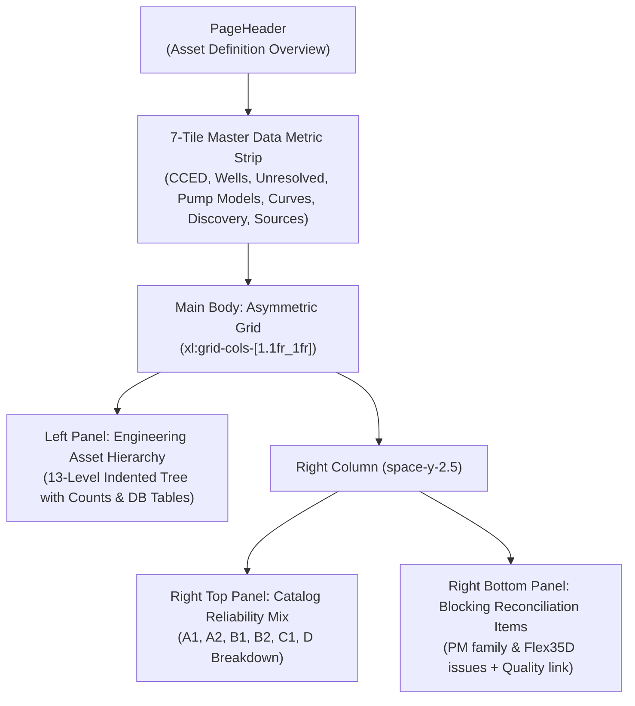
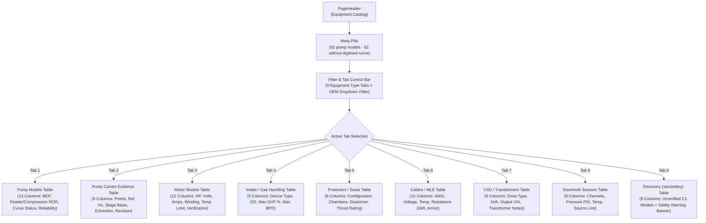
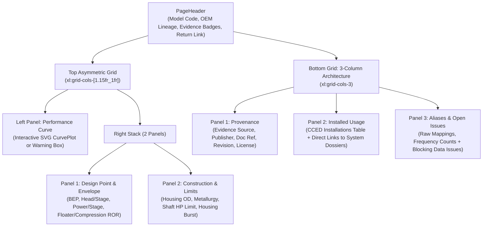

# Complete Ultra-Detailed Component Enumeration & View Map: Engineering & Configuration Workspace

> [!NOTE]
> This file is a direct alias and resolution mirror for [Enumeration-Engineering_Configuration.md](file:///x:/TAS/ESP_APM_server/esp-insight-suite/audit/Enumeration-Engineering_Configuration.md) to ensure consistent path resolution across naming conventions.

This document provides a runtime-accurate, component-by-component analysis of the **Engineering & Configuration Workspace** in the **ADVAIT ESP-PMM** application. It establishes the architectural separation between governed engineering master data (**Asset ConneX**) and live operational measurements (**OTConnex**). Every visual region, component, button, status indicator, stat card, and data table is documented with exact live operational values from the operator's environment and accompanied by clear, bracketed plain-English explanations.

---

## 1. Executive Summary: Engineering & Configuration Workspace

The Engineering / Configuration workspace serves as the governed master data authority for the entire ESP fleet. While the Operations workspace (`/`) monitors live SCADA/OT telemetry, this workspace governs the physical, electrical, and hydraulic definitions required to validate telemetry, simulate downhole behavior, and enforce safe operating limits.

### Core Architectural Principles
1. **Separation of Concerns (Asset ConneX vs. OTConnex)**:
   - `Asset ConneX` (The master data repository that stores equipment specifications, wellbore trajectories, fluid PVT properties, and OEM pump curves): Stores governed, versioned, read-only engineering definitions.
   - `OTConnex` (The industrial operational technology network that delivers real-time SCADA and sensor measurements): Delivers time-series telemetry (e.g. PIP, motor current, intake pressure). Telemetry is never written to master data, and master data is never guessed from telemetry trends.
2. **Deterministic Calculation Gating**:
   - Engineering simulations (such as Total Dynamic Head, nodal pressure analysis, and frequency sweeps in the Engineering Workbench) require certified calculation-grade equipment curves (`A1`, `A2`, `B1`, `B2`).
   - If an installation references an unverified model or placeholder (`C1`, `D`), the platform strictly locks hydraulic calculations to prevent misleading simulations.
3. **Evidence-First Master Data**:
   - Every catalog record links directly to a registered engineering source document (such as OEM catalogs, factory test sheets, or completion tallies). No synthetic curves or unverified parameters are ever injected.

### Workspace Summary Statistics
- **Root Layout Shell**: `L2` (`src/routes/engineering.tsx` [engineering.tsx](file:///x:/TAS/ESP_APM_server/esp-insight-suite/src/routes/engineering.tsx))
- **Dedicated Sub-Navigation Rail**: 188px desktop sidebar / mobile scroll ribbon with 4 functional groups and 10 primary destinations.
- **Governed Wells**: 170 wells across 1 operational oilfield.
- **Governed Installed Systems**: 170 ESP assemblies imported from operator CCED records.
- **Pump Catalog Models**: 62 total models (56 calculation-grade, 31 CCED-priority, 6 discovery/unverified).
- **Quality & Reconciliation**: 2 active blocking reconciliation issues preventing computation on 5 installations.

---

## 2. Shared Layout Shell: L2 Sub-Navigation Rail (`src/routes/engineering.tsx`)

- **File Path**: [`src/routes/engineering.tsx`](file:///x:/TAS/ESP_APM_server/esp-insight-suite/src/routes/engineering.tsx)
- **Wraps**: All routes under `/engineering/*`.
- **Layout Type**: Persistent two-tier layout featuring a fixed left-hand sub-navigation rail on desktop (`w-[188px]`) and a horizontal scroll ribbon on tablet and mobile viewports (`xl:hidden`).

### A. Rendered Sub-Navigation Shell Components

#### 1. Desktop Sub-Navigation Sidebar Rail (`<aside className="hidden w-[188px] xl:block">`)
- `Sidebar Container` (A fixed 188-pixel-wide vertical panel on the left of the screen that organizes engineering routes into logical groups):
  - **Header Block**:
    - `Workspace Title` (`"ESP Engineering Configuration"`): Monospace uppercase header identifying the active configuration workspace.
    - `Workspace Subtitle` (`"Asset ConneX governed master data"`): Caption indicating that all contained data is governed by master data standards.
  - **Group 1: `Reference master`** (The library of verified manufacturer equipment specifications and global overview):
    - `Engineering Overview` (`Link to="/engineering"` exact): Navigates to Page 1 (P1: Engineering Home / Asset Definition Overview).
    - `Equipment Catalog` (`Link to="/engineering/catalog"`): Navigates to P2: Master Equipment Catalog (pumps, motors, protectors, cables, VSDs, sensors).
  - **Group 2: `Installed fleet`** (The physical downhole assemblies currently deployed in field wells):
    - `Installed ESP Systems` (`Link to="/engineering/installations"`): Navigates to P4: Installed ESP Systems & Assembly Fleet.
    - `Well Definition (revisions)` (`Link to="/engineering/definition"`): Navigates to P10: Well Definition Revisions Registry.
  - **Group 3: `Engineering analysis`** (Deterministic simulation, pump curves, and sizing comparisons):
    - `Engineering Workbench` (`Link to="/engineering/workbench"`): Navigates to P12: Engineering Workbench (curve & scenario simulator).
    - `Design Cases` (`Link to="/engineering/design-cases"`): Navigates to P13: Design Cases vs. Operating Points.
  - **Group 4: `Governance`** (Quality control, provenance registry, and curve ingestion pipelines):
    - `Validation & Readiness` (`Link to="/engineering/governance/validation"`): Navigates to P14: Engineering Validation & Readiness Matrix.
    - `Source / Provenance Registry` (`Link to="/engineering/governance/sources"`): Navigates to P15: Source & Provenance Registry.
    - `Data Quality & Reconciliation` (`Link to="/engineering/governance/quality"`): Navigates to P16: Data Quality & Reconciliation Queue.
    - `Import / Catalog Administration` (`Link to="/engineering/governance/import"`): Navigates to P17: Import & Catalog Administration Pipeline.
  - **Footer Status Banner**:
    - `StatusPill tone="critical"` (A color-coded pill showing how many data issues are actively blocking engineering calculations): Renders `{blocking} blocking QA` (Live value: `2 blocking QA` in critical red tone).

#### 2. Mobile & Tablet Navigation Ribbon (`
`)
- `Ribbon Link Bar` (A horizontal scrolling row of 10 compact pill buttons allowing tablet and mobile users to quickly jump between engineering sections without a vertical sidebar).

---

## 3. Ultra-Detailed Per-Page Component & View Breakdown

---

### P1: Engineering Home / Asset Definition Overview — `/engineering`
*(Formerly indexed as P8 in the global application enumeration)*

- **Page Title**: `Asset Definitions overview — ADVAIT ESP-PMM`
- **Route**: `/engineering` (Direct index route of the Configuration / Engineering workspace)
- **File Path**: [`src/routes/engineering.index.tsx`](file:///x:/TAS/ESP_APM_server/esp-insight-suite/src/routes/engineering.index.tsx)
- **Layout Used**: L2 (`src/routes/engineering.tsx` Sub-Navigation Shell)
- **Overlay Present**: None (A high-density master data dashboard featuring an indented asset hierarchy tree, evidence reliability breakdown, and blocking reconciliation items)

---

#### A. Visual & Layout Architecture (Top → Bottom, Left → Right)

##### 1. Page Header (`PageHeader`)
- `PageHeader` (The top banner of the screen that tells the operator which page they are looking at and what its primary purpose is):
  - **Title**: `"Asset Definition Overview"` (The primary heading identifying this page as the central hub for governed master data).
  - **Description**: `"Governed engineering master data (Asset ConneX concept). Every catalog value carries a source and reliability class; OT measurement remains in OTConnex and is never written here."` (A plain-English note reminding engineers that real-time sensor measurements are never mixed into permanent engineering records).
  - **Meta Status Pill 1**: `StatusPill tone="info"` (A small blue pill indicating that this page displays strictly governed, unalterable master data):
    - Content: `"Engineering configuration — read-only master data"`
  - **Meta Status Pill 2**: `StatusPill tone="critical"` (A prominent red pill alerting the engineer to data discrepancies that are halting simulations):
    - Content: `"2 blocking issues"` (Dynamic count evaluated from unresolved quality issues).

##### 2. Master Data Metric Strip (`Metric` — 7 High-Density Stat Cards)
- `Grid Container`: Structured as a 7-column layout (`grid grid-cols-2 gap-2 lg:grid-cols-4 xl:grid-cols-7`).
1. `CCED SOURCE ROWS` (The total number of equipment records imported from the operator's central engineering database):
   - Value: `170`
   - Subtext: `169 with raw designation · 1 blank` (Indicates that 169 well records possess original model strings, while 1 record lacks an equipment nameplate).
   - Tone: `watch` (Amber accent because 1 record has a blank designation).
2. `WELLS` (The total number of physical wellbores managed under the artificial lift program):
   - Value: `170`
   - Subtext: `1 fields · ESP lift` (Confirms that all 170 wells are located within 1 operational field and utilize electrical submersible pumps).
   - Tone: `normal` (Neutral border styling).
3. `UNRESOLVED / PARTIAL MATCH` (Records where the equipment serial or model could not be verified with 100% certainty, so engineering calculations are locked to prevent inaccurate simulations):
   - Value: `15`
   - Subtext: `excluded from calculations` (Safety guard note informing the user that 15 wells cannot be used in simulation workbench until reconciled).
   - Tone: `watch` (Amber accent warning of incomplete equipment matches).
4. `PUMP MODELS` (The total number of distinct centrifugal pump models cataloged in the engineering database):
   - Value: `62`
   - Subtext: `31 CCED-priority · 56 calc-grade` (Indicates 31 models match active fleet equipment, and 56 have certified curves ready for simulation).
   - Tone: `normal` (Neutral border styling).
5. `DIGITISED CURVES` (The number of pump models that have full digitized performance curve points loaded into memory):
   - Value: `0`
   - Subtext: `0 points loaded` (Explicit confirmation that raw digitized curve tables are currently pending ingestion).
   - Tone: `warning` (Yellow/amber warning pill highlighting the need to run the curve digitizer import wizard).
6. `SECONDARY DISCOVERY` (Equipment models identified from secondary third-party databases, kept for reference only):
   - Value: `748`
   - Subtext: `of 751 reported (C1)` (Shows that 748 out of 751 secondary catalog entries are classified as C1 discovery-grade and cannot be used as calculation inputs).
   - Tone: `watch` (Amber accent denoting uncertified third-party data).
7. `EVIDENCE SOURCES` (The number of registered manufacturer publications, manuals, and field records backing the catalog):
   - Value: `15`
   - Subtext: `26 raw → normalized aliases` (Shows 15 primary source documents mapping 26 historical equipment aliases into standard industry model names).
   - Tone: `normal` (Neutral border styling).

##### 3. Main Dashboard Body (Asymmetric Two-Column Architecture: `1.1fr` vs `1fr`)
- `Left Column (1.1fr)`: Hosts the interactive 13-tier `Engineering asset hierarchy` tree panel.
- `Right Column (1fr)`: Hosts two vertically stacked panels: `Catalog reliability mix` (top) and `Blocking reconciliation items` (bottom).

---

#### B. Detailed Breakdown of Panels

##### 1. Left Panel: `Engineering asset hierarchy` Panel
- `Panel` (A bordered card container with a standardized header, subtitle, and flush table body):
  - **Title**: `"Engineering asset hierarchy"` (A tree diagram showing how physical oilfield equipment is structured from field down to downhole sensor).
  - **Subtitle**: `"Enterprise → Field → Pad → Well → Artificial Lift System → ESP Assembly → components"` (A breadcrumb explanation of the governed data taxonomy).
  - **Body Structure**: High-density flush list (`p-0`) with subtle row dividers (`divide-y divide-border`).
  - **Indented Tree Rows (13 Distinct Levels)**:
    - Each row displays: an indented tree branch glyph (`└`), an entity level name (with clickable deep links where sub-pages exist), the physical underlying database table name (`esp_*`), and the live record count.

| Level # | Indented Entity Name | Plain-English Component Role | Database Entity / Filter | Live Count | Interactive Deep Link |
| :---: | :--- | :--- | :--- | :---: | :--- |
| **1** | `Enterprise / Customer` | Top-tier operating enterprise holding the field concession | `CCED` | `1` | — |
| **2** | `Field` | Geographical hydrocarbon producing reservoir asset | `esp_fields` | `1` | — |
| **3** | `Pad / Area` | Surface drilling pad or gathering station grouping wells | `esp_wells.pad_area` | `1` | — |
| **4** | `Well` | Subsurface wellbore penetrating the target reservoir | `esp_wells` | `170` | [`/engineering/installations/well`](file:///x:/TAS/ESP_APM_server/esp-insight-suite/src/routes/engineering.installations.well.tsx) |
| **5** | `Artificial Lift System` | Mechanical artificial lift classification method | `lift_method = ESP` | `170` | — |
| **6** | `ESP Assembly` | Governed downhole string assembly record | `esp_installed_systems` | `170` | [`/engineering/installations/assembly`](file:///x:/TAS/ESP_APM_server/esp-insight-suite/src/routes/engineering.installations.assembly.tsx) |
| **7** | `Pump Section(s)` | Downhole multistage centrifugal pump sections installed | `esp_installed_pump_sections` | `170` | — |
| **8** | `Intake / Gas handler` | Specialized intake separator or multiphase charge pump | `esp_gas_handling_models` | `32` | — |
| **9** | `Protector` | Seal section equalizing motor pressure and barring well fluid | `esp_protector_models` | `8` | — |
| **10** | `Motor` | Downhole 2-pole 3-phase induction motor driving the shaft | `esp_motor_models` | `5` | — |
| **11** | `Gauge / Sensor` | Downhole pressure, temperature, and vibration gauge package | `esp_sensor_models` | `0` | — |
| **12** | `Cable / MLE` | Main 3-phase power cable and motor lead extension splice | `esp_cable_models` | `0` | — |
| **13** | `VSD / Transformer / Panel` | Surface variable speed drive, step-up transformer, and switchboard | `esp_vsd_models` | `0` | — |

##### 2. Right Top Panel: `Catalog reliability mix` Panel
- `Panel` (A card listing how many equipment models fall into each certified evidence tier):
  - **Title**: `"Catalog reliability mix"`
  - **Subtitle**: `"Pump models by evidence class — C1/D are discovery only, never calculation input"` (Reminds engineers that lower-tier catalog items cannot drive simulations).
  - **Body Structure**: Flush list (`p-0`) rendering each reliability tier with its associated `ReliabilityBadge`, calculation status label, and live count.

| Evidence Class Code | Badge & Tone | Plain-English Evidence Meaning | Usability Status | Live Count |
| :---: | :--- | :--- | :--- | :---: |
| **`A1`** | `<ReliabilityBadge code="A1"/>` (Green normal pill) | Current OEM model datasheet / direct certified factory curve sheet | `calculation-grade` (Usable for simulations) | `13` |
| **`A2`** | `<ReliabilityBadge code="A2"/>` (Green normal pill) | Current OEM catalog or official series performance curve | `calculation-grade` (Usable for simulations) | `20` |
| **`B1`** | `<ReliabilityBadge code="B1"/>` (Blue info pill) | Peer-reviewed engineering literature or verified operator legacy curve | `calculation-grade` (Usable for simulations) | `1` |
| **`B2`** | `<ReliabilityBadge code="B2"/>` (Amber watch pill) | Historical OEM catalog or field study calibrated curve points | `calculation-grade` (Usable for simulations) | `22` |
| **`C1`** | `<ReliabilityBadge code="C1"/>` (Yellow warning pill) | Curated secondary catalog nameplate without verified curve points | `discovery / not usable` (Calculations locked) | `3` |
| **`D`** | `<ReliabilityBadge code="D"/>` (Red critical pill) | Missing, unresolved, or placeholder equipment designation | `discovery / not usable` (Calculations locked) | `3` |

##### 3. Right Bottom Panel: `Blocking reconciliation items` Panel
- `Panel` (A critical issues card displaying equipment records that must be corrected before workbench simulations can run):
  - **Title**: `"Blocking reconciliation items"`
  - **Subtitle**: `"Must be resolved before the Engineering Workbench can compute against these installations"`
  - **Active Blocking Issues List**:
    - **Item 1 (`PM family`)**:
      - `StatusPill tone="critical"`: `"Hydraulic model missing"` (Red badge indicating the exact failure mode).
      - Title: `"Hydraulic model missing — PM family"` (Identifies that 4 installations belong to an ambiguous PM family designation).
      - Affected Systems Badge: `4 inst.` (Shows that 4 well strings are prevented from being simulated).
      - Required Action Narrative: `"Resolve from completion tally, pump serial/part number or OEM records; do not infer P4/P6/P10."` (Clear engineering instruction forbidding assumptions).
    - **Item 2 (`Flex35D`)**:
      - `StatusPill tone="critical"`: `"Hydraulic model missing"` (Red badge indicating the exact failure mode).
      - Title: `"Hydraulic model missing — Flex35D"` (Identifies that 1 installation references a Flex35D pump whose curve sheet is unlinked).
      - Affected Systems Badge: `1 inst.` (Shows that 1 well string is prevented from being simulated).
      - Required Action Narrative: `"Resolve from installation/BHA/OEM record."` (Clear engineering instruction to inspect bottomhole assembly tallies).
  - **Panel Footer Link**:
    - `Footer Action Bar`: Bordered bottom row containing a direct navigation link.
    - `Link to="/engineering/governance/quality"`: `"Open Data Quality & Reconciliation →"` (Blue text link navigating to the full reconciliation triage table).

---

#### C. Overlays, Drawers & Modals
- **Zero Blocking Overlays**: Page 1 operates strictly as an inline, non-intrusive master data summary. There are no popup dialogs, blocking modals, or slide-out drawers on this page. All hierarchy browsing, reliability inspection, and reconciliation triage initiate through standard URL routing.

---

#### D. "From Where to Go — To Where" (Complete Navigation Triggers Map)

| Visual Location | On-Screen Trigger / Control | Plain-English Trigger Role | Destination Route | Target Screen / State |
| :--- | :--- | :--- | :--- | :--- |
| **Hierarchy Row 4** | `Well` (`/engineering/installations/well`) | Opens the wellbore survey, casing geometry, and trajectory page | `/engineering/installations/well` | P7: Wellbore & Completion Definition |
| **Hierarchy Row 6** | `ESP Assembly` (`/engineering/installations/assembly`) | Opens the mechanical downhole component stack and string spec | `/engineering/installations/assembly` | P6: String Assembly Specification |
| **Blocking Panel Footer** | `Open Data Quality & Reconciliation →` | Opens the full triage queue of open equipment reconciliation items | `/engineering/governance/quality` | P16: Data Quality & Reconciliation Queue |
| **Sub-Nav Sidebar** | `Engineering Overview` | Refreshes the central master data overview page | `/engineering` | P1: Engineering Home (self) |
| **Sub-Nav Sidebar** | `Equipment Catalog` | Opens the verified catalog of OEM pumps, motors, seals, and cables | `/engineering/catalog` | P2: Master Equipment Catalog |
| **Sub-Nav Sidebar** | `Installed ESP Systems` | Opens the fleet register of installed equipment strings | `/engineering/installations` | P4: Installed ESP Systems Fleet |
| **Sub-Nav Sidebar** | `Well Definition (revisions)` | Opens the governed revision registry of well completion inputs | `/engineering/definition` | P10: Well Definition Revisions |
| **Sub-Nav Sidebar** | `Engineering Workbench` | Opens the hydraulic simulation and frequency what-if simulator | `/engineering/workbench` | P12: Engineering Workbench |
| **Sub-Nav Sidebar** | `Design Cases` | Opens the design vs. actual operating point comparison tool | `/engineering/design-cases` | P13: ESP Design Cases |
| **Sub-Nav Sidebar** | `Validation & Readiness` | Opens the calculation gating matrix auditing each well's readiness | `/engineering/governance/validation` | P14: Engineering Validation Matrix |
| **Sub-Nav Sidebar** | `Source / Provenance Registry` | Opens the catalog evidence document registry and literature sources | `/engineering/governance/sources` | P15: Source & Provenance Registry |
| **Sub-Nav Sidebar** | `Import / Catalog Administration` | Opens the curve ingestion pipeline and OEM registry manager | `/engineering/governance/import` | P17: Import & Catalog Administration |
| **Global Header** | `Workspace Switcher: Operations` | Switches from engineering configuration back to real-time surveillance | `/` | Fleet Cockpit (Operations Mode) |

---

### P2: Master Equipment Catalog — `/engineering/catalog/`
*(Central library of manufacturer equipment models, performance specifications, and evidence grading)*

- **Page Title**: `ESP equipment catalog — ADVAIT ESP-PMM`
- **Route**: `/engineering/catalog` (Direct index route of the Equipment Catalog)
- **File Path**: [`src/routes/engineering.catalog.index.tsx`](file:///x:/TAS/ESP_APM_server/esp-insight-suite/src/routes/engineering.catalog.index.tsx)
- **Layout Used**: L2 (`src/routes/engineering.tsx` Sub-Navigation Shell)
- **Overlay Present**: None (A high-density 9-tab catalog explorer with OEM filtering, stage geometry parameters, and reliability badges)

#### A. Visual & Layout Architecture (Top → Bottom, Left → Right)

##### 1. Page Header (`PageHeader`)
- `PageHeader` (The top banner of the screen that tells the operator which page they are looking at and what its primary purpose is):
  - **Title**: `"Equipment Catalog"` (The primary heading identifying this page as the manufacturer reference equipment catalog).
  - **Description**: `"OEM reference master data. Values are transcribed from registered evidence only — where no curve evidence exists the record is marked BEP/Envelope only or Curve pending, never back-filled with synthetic performance."` (An engineering governance reminder that missing equipment curves are never guessed or filled with fake data).
  - **Meta Status Pill 1**: `StatusPill tone="info"` (A blue badge showing the total number of pump models cataloged in the system):
    - Content: `"62 pump models"` (Live dynamic count from `d.pumpModels.length`).
  - **Meta Status Pill 2**: `StatusPill tone="watch"` (An amber badge highlighting how many pump models currently lack full digitized curve point tables):
    - Content: `"62 without digitised curve"` (Live count evaluated by comparing models against `d.curvePoints`).

##### 2. Filter & Tab Navigation Bar (`
`)
- `Tab Button Group` (A row of 9 compact buttons used to switch the catalog view between different downhole and surface equipment types):
  1. `Pump Models` (Switches the view to centrifugal pump stages, best efficiency points, and flow envelopes).
  2. `Pump Curves` (Switches the view to curve digitization status, reference frequencies, and extraction methods).
  3. `Motors` (Switches the view to downhole 3-phase induction motors, voltage, current, and temperature limits).
  4. `Intake / Gas handling` (Switches the view to vortex gas separators and multiphase gas handling charge pumps).
  5. `Protectors / Seals` (Switches the view to seal sections, chamber configurations, and thrust bearing ratings).
  6. `Cables / MLE` (Switches the view to main 3-phase power cables and motor lead extensions).
  7. `VSD / Transformers` (Switches the view to surface variable speed drives and step-up transformers).
  8. `Downhole Sensors` (Switches the view to gauge packages, pressure ratings, and telemetry channels).
  9. `Discovery (secondary)` (Switches the view to unverified third-party catalog entries held for reference only).
- `OEM Filter Dropdown` (`<select className="ml-auto ...">`) (A dropdown menu on the right that filters the active table by manufacturer):
  - Options: `"All OEMs"` (Default: shows all equipment regardless of manufacturer), `"Baker Hughes"`, `"Schlumberger / REDA"`, `"ChampionX"`, `"Novomet"`, `"Borets"`.

---

#### B. Detailed Breakdown of Each Tabbed View

##### Tab 1: `Pump Models` View
- `Panel` (A bordered card container displaying the primary centrifugal pump catalog):
  - **Title**: `"Pump models"` (The catalog table listing certified pump stages).
  - **Subtitle**: `"Series, geometry, BEP and recommended operating range with evidence class"` (Specifies that every pump lists its Best Efficiency Point, operating limits, and evidence rating).
  - **Body Structure**: Flush table (`overflow-x-auto`) featuring 13 data columns.

| Column Header | Plain-English Column Role | Alignment | Data Formatting / Component | Sample Data Row |
| :--- | :--- | :---: | :--- | :--- |
| **Model** | Certified manufacturer pump model code (Clickable link to pump detail dossier) | Left | `<Link to="/engineering/catalog/pumps/$modelId">` | `GN3500` / `Flex35D` / `P4` |
| **OEM** | Original Equipment Manufacturer who engineered the pump | Left | Text string (`text-muted-foreground`) | `Baker Hughes` / `Schlumberger` |
| **Series** | Outer diameter housing series classification | Left | Text string | `400 Series` / `513 Series` |
| **OD in** | Outer housing diameter in inches | Right | Monospace numeric (2 decimal places) | `4.00 in` |
| **BEP bpd** | Best Efficiency Point flow rate in barrels per day | Right | Monospace integer with thousands separators | `3,500 bpd` |
| **ft/stage** | Head developed per pump stage at BEP in feet | Right | Monospace numeric (1 decimal place) | `28.5 ft` |
| **hp/stage** | Power consumed per pump stage at BEP in horsepower | Right | Monospace numeric (2 decimal places) | `0.58 hp` |
| **Floater ROR bpd** | Recommended Operating Range for floater impeller construction | Right | Monospace range (`min–max bpd`) | `2,500–4,500` |
| **Compression ROR bpd** | Recommended Operating Range for fixed compression impeller construction | Right | Monospace range (`min–max bpd`) | `2,200–4,800` |
| **Curve evidence** | Badge displaying curve completeness and count of digitized curve points loaded | Left | `<CurveStatusBadge>` (Tone reflects completeness) | `BEP/Envelope only (0 pts)` |
| **WSW check** | Cross-check validation status against water source well engineering tests | Left | Text status string (`text-[10px]`) | `Valid` / `Pending check` |
| **Evidence** | Certified data source reliability tier (A1 factory curve down to D unverified) | Left | `<ReliabilityBadge code="A1">` | `A1` (OEM factory curve) |
| **Installed** | Number of active well installations in the field running this pump model | Right | Monospace integer | `14` / `4` / `1` |

##### Tab 2: `Pump Curves` View
- `Panel` (A card tracking digitised curve availability against source documents):
  - **Title**: `"Pump curve evidence"`
  - **Subtitle**: `"Catalog curve availability (what the source document holds) is tracked separately from digitised points loaded in this build. Zero points = no usable curve; no synthetic curve is ever generated."` (Affirms that without raw points, calculations operate strictly on flow bounds).
  - **Body Structure**: Flush table (`overflow-x-auto`) featuring 9 data columns.

| Column Header | Plain-English Column Role | Alignment | Data Formatting / Component | Sample Data Row |
| :--- | :--- | :---: | :--- | :--- |
| **Model** | Certified manufacturer pump model code (Clickable link) | Left | `<Link to="/engineering/catalog/pumps/$modelId">` | `GN3500` |
| **OEM** | Original Equipment Manufacturer | Left | Text string | `Baker Hughes` |
| **Points** | Total count of digitized (flow, head, power) coordinate points loaded in memory | Right | Monospace integer | `0` (Curve pending ingestion) |
| **Ref Hz** | Baseline electrical frequency for the performance curve (typically 60 Hz) | Right | Monospace integer | `60 Hz` |
| **Ref rpm** | Baseline rotational speed for the performance curve (typically 3500 rpm) | Right | Monospace integer | `3500 rpm` |
| **Basis** | Stage reporting basis (e.g. single stage vs. multi-stage test assembly) | Left | Text string (`text-[10px]`) | `Single stage` / `10-stage test` |
| **Extraction** | Method used to extract curve points from the manufacturer sheet | Left | Text string (`text-[10px]`) | `Vector digitizer` / `Table scan` |
| **Revision** | Document engineering revision number of the source performance curve | Left | Monospace string (`text-[10px]`) | `Rev 4.1` / `2024-C` |
| **Status** | Overall curve availability and completeness indicator badge | Left | `<CurveStatusBadge>` | `BEP/Envelope only` |

##### Tab 3: `Motors` View
- `Panel` (The catalog table listing downhole electrical submersible induction motors):
  - **Title**: `"Motor models"`
  - **Body Structure**: Flush table featuring 12 data columns.

| Column Header | Plain-English Column Role | Alignment | Component / Formatting | Sample Data Row |
| :--- | :--- | :---: | :--- | :--- |
| **Model** | Downhole motor model designation | Left | Monospace text | `Centrilift 456 Series` |
| **OEM** | Motor manufacturer | Left | Text string | `Baker Hughes` |
| **Series** | Outer diameter housing series | Left | Text string | `456 Series` |
| **OD in** | Outer diameter in inches | Right | Monospace decimal (`4.56 in`) | `4.56` |
| **hp** | Nameplate maximum continuous horsepower rating | Right | Monospace integer (`hp`) | `120 hp` |
| **V** | Nameplate rated voltage (volts AC) | Right | Monospace integer (`V`) | `2,150 V` |
| **A** | Nameplate rated full-load current (amperes) | Right | Monospace numeric (`A`) | `34.5 A` |
| **Winding** | Stator winding insulation and metallurgy classification | Left | Text string | `Kapton / PEEK` |
| **Max °F** | Maximum rated downhole operating temperature in Fahrenheit | Right | Monospace integer (`°F`) | `300 °F` |
| **Evidence** | Data reliability tier badge | Left | `<ReliabilityBadge code="A2">` | `A2` (OEM catalog) |
| **Verification** | Manufacturer verification status badge | Left | `<VerificationBadge status="verified">` | `Verified` |
| **Installed** | Count of deployed motors across the operating fleet | Right | Monospace integer | `5` |

##### Tab 4: `Intake / Gas handling` View
- `Panel` (The catalog table listing intake screens, rotary gas separators, and gas handling devices):
  - **Title**: `"Intake / gas separators / gas handlers"`
  - **Body Structure**: Flush table featuring 9 data columns.

| Column Header | Plain-English Column Role | Alignment | Component / Formatting | Sample Data Row |
| :--- | :--- | :---: | :--- | :--- |
| **Model** | Gas handling device model code | Left | Monospace text | `VGS-400` / `Poseidon P-4` |
| **OEM** | Equipment manufacturer | Left | Text string | `Schlumberger` / `Baker Hughes` |
| **Device type** | Mechanical separation mechanism (e.g. Standard Intake, Rotary Separator, Gas Handler) | Left | Text badge | `Rotary Gas Separator` |
| **OD in** | Outer diameter in inches | Right | Monospace decimal | `4.00 in` |
| **Max GVF %** | Maximum allowable Gas Volume Fraction at intake before vapor lock occurs | Right | Monospace percentage | `45.0 %` |
| **Max bpd** | Maximum total fluid intake throughput capacity in barrels per day | Right | Monospace integer | `6,000 bpd` |
| **Evidence** | Data reliability tier badge | Left | `<ReliabilityBadge code="A1">` | `A1` |
| **Verification** | Verification audit status | Left | `<VerificationBadge status="verified">` | `Verified` |
| **Installed** | Count of installed units in the field | Right | Monospace integer | `32` |

##### Tab 5: `Protectors / Seals` View
- `Panel` (The catalog table listing downhole seal sections protecting the motor from well fluid):
  - **Title**: `"Protectors / seal sections"`
  - **Body Structure**: Flush table featuring 9 data columns.

| Column Header | Plain-English Column Role | Alignment | Component / Formatting | Sample Data Row |
| :--- | :--- | :---: | :--- | :--- |
| **Model** | Protector section model code | Left | Monospace text | `BPS-400 BSLB` |
| **OEM** | Protector manufacturer | Left | Text string | `Baker Hughes` |
| **Configuration** | Internal seal arrangement (e.g. Bag-Labyrinth, Dual Bag, Triple Chamber) | Left | Text string | `Bag / Labyrinth (BSLB)` |
| **Chambers** | Number of isolated expansion chambers | Left | Monospace integer | `3 chambers` |
| **Elastomer** | Elastomer bladder material compound for thermal and H2S resistance | Left | Text string | `Aflas / Chemraz` |
| **OD in** | Outer housing diameter in inches | Right | Monospace decimal | `4.00 in` |
| **Thrust lbf** | Thrust bearing downward/upward load capacity in pounds-force | Right | Monospace integer | `12,500 lbf` |
| **Evidence** | Data reliability tier badge | Left | `<ReliabilityBadge code="A2">` | `A2` |
| **Installed** | Count of deployed units across the fleet | Right | Monospace integer | `8` |

##### Tab 6: `Cables / MLE` View
- `Panel` (The catalog table listing 3-phase electrical downhole power cables and motor lead extensions):
  - **Title**: `"Cables / motor lead extensions"`
  - **Body Structure**: Flush table featuring 10 data columns.

| Column Header | Plain-English Column Role | Alignment | Component / Formatting | Sample Data Row |
| :--- | :--- | :---: | :--- | :--- |
| **Model** | Cable manufacturer model name | Left | Monospace text | `RedaHot 5kV Flat` |
| **OEM** | Cable manufacturer | Left | Text string | `Schlumberger` / `Kerite` |
| **Type** | Cable profile geometry (e.g. Round main cable vs. Flat motor lead extension) | Left | Text string | `Flat MLE` / `Round Main` |
| **AWG** | Conductor size in American Wire Gauge (e.g. #1, #2, #4 AWG) | Left | Monospace string | `#4 AWG` |
| **V rating** | Dielectric voltage insulation rating in volts | Right | Monospace integer | `5,000 V` |
| **Max °F** | Maximum continuous conductor temperature rating | Right | Monospace integer | `400 °F` |
| **Ω/kft** | Conductor electrical resistance in ohms per 1,000 feet | Right | Monospace decimal (3 decimals) | `0.248 Ω/kft` |
| **Armor** | Protective outer metal armor wrapping (e.g. Galvanized Steel, Monel, Stainless) | Left | Text string | `Galvanized Interlocking Steel` |
| **Evidence** | Data reliability tier badge | Left | `<ReliabilityBadge code="A2">` | `A2` |
| **Installed** | Count of deployed strings with this cable | Right | Monospace integer | `0` (Pending tally audit) |

##### Tab 7: `VSD / Transformers` View
- `Panel` (The catalog table listing surface variable speed drives and step-up power transformers):
  - **Title**: `"VSD / drives / transformers"`
  - **Body Structure**: Flush table featuring 9 data columns.

| Column Header | Plain-English Column Role | Alignment | Component / Formatting | Sample Data Row |
| :--- | :--- | :---: | :--- | :--- |
| **Model** | Drive or transformer commercial model | Left | Monospace text | `Electrospeed GCS 3` |
| **OEM** | Drive manufacturer | Left | Text string | `Baker Hughes` |
| **Drive type** | Power conversion technology (e.g. PWM VSD, Soft Starter, Multi-Pulse) | Left | Text string | `6-Pulse PWM VSD` |
| **kVA** | Apparent power rating in kilovolt-amperes | Right | Monospace integer | `350 kVA` |
| **Output V** | Maximum variable output voltage to the transformer | Right | Monospace integer | `480 V` |
| **Output A** | Maximum continuous output phase current in amperes | Right | Monospace integer | `420 A` |
| **Transformer note** | Step-up transformer tap configuration and secondary voltage capabilities | Left | Text string | `12-pulse isolation, multi-tap` |
| **Evidence** | Data reliability tier badge | Left | `<ReliabilityBadge code="A2">` | `A2` |
| **Installed** | Count of deployed units in the field | Right | Monospace integer | `0` (Surface registry pending) |

##### Tab 8: `Downhole Sensors` View
- `Panel` (The catalog table listing downhole multi-sensor gauge packages):
  - **Title**: `"Downhole sensors / gauges"`
  - **Body Structure**: Flush table featuring 8 data columns.

| Column Header | Plain-English Column Role | Alignment | Component / Formatting | Sample Data Row |
| :--- | :--- | :---: | :--- | :--- |
| **Model** | Sensor package model designation | Left | Monospace text | `Zenith V-3 Gauge` |
| **OEM** | Sensor manufacturer | Left | Text string | `Baker Hughes` |
| **Channels** | Measured physical channels (e.g. Intake P/T, Discharge P, Motor T, X/Y Vibration) | Left | Text string | `Intake P/T, Motor T, Vibration` |
| **Pressure psi** | Maximum downhole pressure rating in pounds per square inch | Right | Monospace integer | `10,000 psi` |
| **Max °F** | Maximum rated electronics survival temperature | Right | Monospace integer | `325 °F` |
| **Evidence** | Data reliability tier badge | Left | `<ReliabilityBadge code="A1">` | `A1` |
| **Source** | Registered evidence document label backing this sensor | Left | Text link (`text-muted-foreground`) | `Zenith V-3 Spec Rev 2` |
| **Installed** | Count of active downhole gauge installations | Right | Monospace integer | `0` (Sensor links pending) |

##### Tab 9: `Discovery (secondary)` View
- `Panel` (The repository of unverified third-party catalog records kept for future OEM verification):
  - **Title**: `"Secondary catalog discovery — not engineering evidence"`
  - **Subtitle**: `"748 loaded of 751 reported by the source. Reliability C1: model existence only — no OEM verification, no captured performance curve. Never used as calculation input."` (Emphasizes that these models cannot drive engineering simulations).
  - **Warning Alert Banner** (`border-warning/40 bg-warning/10 text-warning`):
    - `"Discovery rows are retained to widen model coverage and support future OEM verification. Promotion to the governed catalog requires OEM datasheet or catalog evidence (A1/A2) before any engineering use."` (Governance policy requirement for data promotion).
  - **Body Structure**: Flush table capped at the first 400 rows with 9 columns.
  - **Footer Notice**: `"Showing the first 400 of 748 discovery rows."` (Performance cap notification).

| Column Header | Plain-English Column Role | Alignment | Component / Formatting | Sample Data Row |
| :--- | :--- | :---: | :--- | :--- |
| **Manufacturer** | Raw manufacturer name from third-party database | Left | Text string | `Centrilift` / `REDA` |
| **Brand** | Commercial brand name | Left | Text string | `Autograph` |
| **Series** | Equipment housing series | Left | Text string | `400 Series` |
| **Raw model** | Original uncleaned equipment string from the discovery file | Left | Monospace text | `P-3500-FLT` |
| **Normalized** | Governed standard model string mapped to this record | Left | Monospace text | `GN3500` |
| **Evidence** | Reliability class badge (Always C1 discovery) | Left | `<ReliabilityBadge code="C1">` | `C1` |
| **OEM verification** | Verification status against manufacturer publications | Left | Text string | `Unverified` |
| **Curve status** | Curve availability in discovery source | Left | Text string | `No curve data` |
| **Engineering use** | Permitted computational use | Left | Status badge | `Discovery only` |

---

#### C. Overlays, Drawers & Modals
- **Zero Blocking Popups**: The equipment catalog operates as a clean, high-density inline tabbed explorer. Selecting any equipment tab immediately updates the data table without full-page reloads or modal obstructions. Clicking any pump model code directly navigates to P3 (OEM Pump Specification & Curve Viewer).

---

#### D. "From Where to Go — To Where" (Complete Navigation Triggers Map)

| Visual Location | On-Screen Trigger / Control | Plain-English Trigger Role | Destination Route | Target Screen / State |
| :--- | :--- | :--- | :--- | :--- |
| **Pump Models Table** | `Model` link (e.g. `GN3500`) | Opens the exhaustive technical specification and curve plot dossier for this pump model | `/engineering/catalog/pumps/$modelId` | P3: OEM Pump Specification & Curve Viewer |
| **Pump Curves Table** | `Model` link (e.g. `GN3500`) | Opens the curve extraction details, points table, and validation view | `/engineering/catalog/pumps/$modelId` | P3: OEM Pump Specification & Curve Viewer |
| **Top Filter Bar** | `Pump Models` tab button | Activates Tab 1 displaying the centrifugal pump stage specifications | `/engineering/catalog` | Active Tab: Pump Models |
| **Top Filter Bar** | `Pump Curves` tab button | Activates Tab 2 displaying curve digitization statuses and extraction methods | `/engineering/catalog` | Active Tab: Pump Curves |
| **Top Filter Bar** | `Motors` tab button | Activates Tab 3 displaying induction motor horsepower, voltage, and winding specs | `/engineering/catalog` | Active Tab: Motors |
| **Top Filter Bar** | `Intake / Gas handling` tab button | Activates Tab 4 displaying gas separators and multiphase handling devices | `/engineering/catalog` | Active Tab: Intake / Gas handling |
| **Top Filter Bar** | `Protectors / Seals` tab button | Activates Tab 5 displaying protector chambers and thrust bearing ratings | `/engineering/catalog` | Active Tab: Protectors / Seals |
| **Top Filter Bar** | `Cables / MLE` tab button | Activates Tab 6 displaying electrical power cables, conductor AWG, and voltage | `/engineering/catalog` | Active Tab: Cables / MLE |
| **Top Filter Bar** | `VSD / Transformers` tab button | Activates Tab 7 displaying variable speed drives and power transformers | `/engineering/catalog` | Active Tab: VSD / Transformers |
| **Top Filter Bar** | `Downhole Sensors` tab button | Activates Tab 8 displaying downhole pressure and temperature gauge packages | `/engineering/catalog` | Active Tab: Downhole Sensors |
| **Top Filter Bar** | `Discovery (secondary)` tab button | Activates Tab 9 displaying unverified third-party discovery catalog records | `/engineering/catalog` | Active Tab: Discovery (secondary) |
| **Top Filter Bar** | `All OEMs` dropdown menu | Filters the active equipment table to display items from a specific manufacturer | `/engineering/catalog` | Table filtered by selected OEM |
| **Sub-Nav Sidebar** | `Engineering Overview` | Navigates back to the master asset hierarchy and data overview | `/engineering` | P1: Engineering Home |
| **Sub-Nav Sidebar** | `Installed ESP Systems` | Opens the fleet register of installed equipment strings | `/engineering/installations` | P4: Installed ESP Systems Fleet |
| **Sub-Nav Sidebar** | `Engineering Workbench` | Opens the interactive frequency and curve simulation workbench | `/engineering/workbench` | P12: Engineering Workbench |

---

### P3: OEM Pump Specification & Curve Viewer — `/engineering/catalog/pumps/$modelId`
*(Deep-dive engineering dossier for a certified OEM pump model, featuring digitized H-Q curves, mechanical limits, and CCED fleet installation links)*

- **Page Title**: `Pump model {modelId} — ADVAIT ESP-PMM catalog`
- **Route**: `/engineering/catalog/pumps/$modelId` (Dynamic parameterized route loading a specific pump model)
- **File Path**: [`src/routes/engineering.catalog.pumps.$modelId.tsx`](file:///x:/TAS/ESP_APM_server/esp-insight-suite/src/routes/engineering.catalog.pumps.$modelId.tsx)
- **Layout Used**: L2 (`src/routes/engineering.tsx` Sub-Navigation Shell)
- **Overlay Present**: None (Asymmetric engineering layout featuring interactive SVG performance curves, design envelopes, construction metallurgy, and CCED installation links)

#### A. Visual & Layout Architecture (Top → Bottom, Left → Right)

##### 1. Page Header (`PageHeader`)
- `PageHeader` (The top banner of the screen that identifies the specific pump model and provides engineering governance badges):
  - **Title**: `"{p.model} — pump model definition"` (The primary heading displaying the certified OEM pump model code, e.g. `GN3500 — pump model definition`).
  - **Description**: `"{oemName} · {brand_line} · {series} series. {application_note}"` (Lineage string identifying the manufacturer, product line, housing series, and engineering application scope).
  - **Meta Status Badges & Controls**:
    - `ReliabilityBadge`: `<ReliabilityBadge code={p.reliability_code} title />` (A certified reliability grade pill, e.g. `A1` in green for factory curves, `A2` for catalog curves, or `C1` for unverified models).
    - `CurveStatusBadge`: `<CurveStatusBadge status={p.curve_completeness} digitisedPoints={points.length} />` (A badge displaying curve completeness, e.g. `BEP/Envelope only (0 pts)`).
    - `VerificationBadge`: `<VerificationBadge status={p.verification_status} />` (A badge indicating whether specifications were verified against OEM engineering manuals).
    - `Calculation Gating StatusPill`: `<StatusPill tone={isCalculationGrade ? "normal" : "critical"}>` (A safety gate pill reading `"Calculation-grade"` in neutral green if certified for simulations, or `"Not for calculations"` in critical red if calculations are blocked).
    - `Back Link`: `Link to="/engineering/catalog"` (`"← Equipment Catalog"`) (A blue text button navigating back to the parent equipment catalog).

##### 2. Top Asymmetric Grid (`grid gap-2.5 xl:grid-cols-[1.15fr_1fr]`)
- `Left Column (1.15fr)`: Dedicated to the high-resolution `Performance curve` plot or missing-points warning alert.
- `Right Column (1fr)`: Two vertically stacked panels: `Design point & envelope` and `Construction & limits`.

##### 3. Bottom 3-Column Grid (`grid gap-2.5 xl:grid-cols-3`)
- `Panel 1`: `Provenance` (Source publication, publisher, date, revision, and legal usage status).
- `Panel 2`: `Installed usage` (Fleet usage statistics and an interactive table linking to well system dossiers).
- `Panel 3`: `Aliases & open issues` (Historical CCED raw aliases and active data quality issues).

---

#### B. Detailed Breakdown of Panels

##### 1. Left Top Panel: `Performance curve` Panel
- `Panel` (The visual performance curve container rendering head, power, and efficiency vs. flow):
  - **Title**: `"Performance curve"`
  - **Subtitle**: Rendered dynamically:
    - *When curve points are loaded*: `"{N} digitised points · {stage_basis} · {extraction_method}"` (Displays point count, test assembly basis, and extraction tool).
    - *When no points are loaded*: `"No digitised curve available"` (Explicit statement of missing coordinate points).
  - **Body Content (State A: Points Available)**:
    - `CurvePlot` (An interactive SVG chart displaying hydraulic performance):
      - Solid Curve: Head per stage (ft/stage) across the entire flow spectrum.
      - Dashed Curve: Brake horsepower consumed per stage (hp/stage).
      - Shaded Green Band: Recommended Operating Range (Floater or Compression ROR).
      - Vertical Red Line: Best Efficiency Point (BEP flow).
    - Caption Note: `"Solid = head per stage, dashed = power per stage, shaded band = recommended operating range. Points transcribed from {sourceLabel}."`
  - **Body Content (State B: Zero Points Loaded — Amber Warning Box)**:
    - `Warning Box` (`rounded border border-warning/50 bg-warning/10 p-3 text-warning`):
      - Header: `"No digitised curve points — BEP and envelope only"`
      - Explanatory Text: `"Catalog curve availability is recorded as “BEP and envelope only”, but no source curve points are loaded in this build, so this model is NOT curve-complete. The Engineering Workbench must operate against BEP and floater/compression ROR bounds only — no synthetic curve is generated or shown as source truth."` (A foundational rule stating that ADVAIT never back-fills missing data with synthetic curves).

##### 2. Right Top Stack: `Design point & envelope` Panel
- `Panel` (A card presenting the factory hydraulic rating points and operating boundaries):
  - **Title**: `"Design point & envelope"`
  - **Body Structure**: Flush list (`p-0`) rendering 10 key hydraulic design parameters via `FieldRow`:

| Parameter Label | Plain-English Parameter Role | Data Formatting / Units | Sample Live Value |
| :--- | :--- | :--- | :--- |
| **Reference** | Baseline electrical frequency and shaft speed for factory test conditions | Monospace string (`Hz · rpm`) | `60 Hz · 3500 rpm` |
| **BEP flow** | Best Efficiency Point flow rate | Monospace integer (`bpd`) | `3,500 bpd` |
| **BEP head** | Head generated per stage at the best efficiency point | Monospace numeric (`ft/stage`) | `28.50 ft/stage` |
| **BEP power** | Power consumed per stage at the best efficiency point | Monospace numeric (`hp/stage`) | `0.580 hp/stage` |
| **BEP efficiency** | Pump hydraulic efficiency at the best efficiency point | Monospace percentage (`%`) | `68.5 %` |
| **Flow envelope** | Overall allowable flow envelope for the pump series | Monospace range (`min–max bpd`) | `2,200 – 4,800 bpd` |
| **Floater ROR** | Recommended Operating Range when configured with floating impellers | Monospace range (`min–max bpd`) | `2,500 – 4,500 bpd` |
| **Compression ROR** | Recommended Operating Range when configured with fixed compression stages | Monospace range (`min–max bpd`) | `2,200 – 4,800 bpd` |
| **WSW design capacity** | Capacity bounds validated against water source well operations | Monospace range (`min–max bpd`) | `2,000 – 5,000 bpd` |
| **WSW cross-check** | Audit verdict from water source well engineering validation | Text string | `Validated` / `Pending cross-check` |

##### 3. Right Lower Stack: `Construction & limits` Panel
- `Panel` (A card detailing mechanical construction, materials metallurgy, and pressure limits):
  - **Title**: `"Construction & limits"`
  - **Body Structure**: Flush list (`p-0`) rendering 10 structural limits via `FieldRow`:

| Parameter Label | Plain-English Parameter Role | Data Formatting / Units | Sample Live Value |
| :--- | :--- | :--- | :--- |
| **Housing OD** | Outside diameter of the pump steel housing | Monospace decimal (`in`) | `4.000 in` |
| **Min casing** | Minimum allowable well casing inner diameter to allow passage | Monospace decimal (`in`) | `5.500 in` |
| **Stage geometry** | Impeller design type (Radial flow for high head/low flow, Mixed flow for high volume) | Text string | `Mixed flow` |
| **Stage material** | Metallurgical composition of impellers and diffusers | Text string | `Ni-Resist Type 1` |
| **Bearing material** | Sleeve and bushing material for abrasive well environments | Text string | `Tungsten carbide / ceramic` |
| **Shaft** | Shaft metallurgical alloy and outside diameter | Monospace string (`alloy · diameter`) | `Monel K-500 · 0.875 in` |
| **Shaft hp limit** | Maximum allowable horsepower transmission before shaft shear occurs | Monospace string (`standard / high strength`) | `180 hp standard / 240 hp high strength` |
| **Housing burst** | Internal hydraulic burst pressure rating of the outer housing | Monospace integer (`psi`) | `5,000 psi` |
| **Temperature** | Maximum continuous fluid temperature rating | Text string | `Standard up to 250°F` |
| **Construction type** | Mechanical stage stacking design | Text string | `Floater / Fixed compression` |

##### 4. Bottom Grid Left: `Provenance` Panel
- `Panel` (A card tracking the exact engineering literature or test sheet backing this record):
  - **Title**: `"Provenance"`
  - **Subtitle**: `"Evidence backing every value on this record"`
  - **Body Structure**: Flush list (`p-0`) rendering 8 evidence provenance fields:

| Provenance Field | Plain-English Field Role | Data Formatting | Sample Value |
| :--- | :--- | :--- | :--- |
| **Source** | Formal title of the source engineering publication | Text string | `Baker Hughes ESP Performance Catalog 2024` |
| **Publisher** | Publishing organization or manufacturer | Text string | `Baker Hughes Inc.` |
| **Type / revision** | Publication category and official engineering revision code | Text string | `OEM Catalog · Rev 4.2` |
| **Document ref** | Internal reference or catalog document number | Monospace text | `BH-ESP-CAT-2024-V1` |
| **Document date** | Official publication date | Text string (`YYYY-MM-DD`) | `2024-01-15` |
| **Usage rights** | License terms governing the data | Text string | `Licensed operator use` |
| **Lifecycle** | Equipment commercial lifecycle status | Text status string | `Active commercial production` |
| **Last review** | Date this record was last audited by the lead artificial lift engineer | Text string (`YYYY-MM-DD`) | `2025-11-01` |

##### 5. Bottom Grid Center: `Installed usage` Panel
- `Panel` (A card detailing active wellbores in the CCED fleet running this pump model):
  - **Title**: `"Installed usage"`
  - **Subtitle**: `"CCED installations referencing this model"`
  - **Body Structure**: 4 summary statistic rows followed by an embedded installations table.
  - **Summary Stat Rows**:
    - `CCED installs`: Monospace integer showing total well deployments (e.g. `14`).
    - `Installed stage range`: Monospace string showing minimum and maximum stages observed in the field (e.g. `120 – 240 stages`).
    - `Installed motor hp range`: Monospace string showing motor sizes paired with this pump (e.g. `90.0 – 180.0 hp`).
    - `Raw aliases in CCED`: Monospace string listing original legacy names found in CCED (e.g. `GN3500, REDA-3500, G-3500`).
  - **Installed Systems Table**:

| Column Header | Plain-English Column Role | Alignment | Component / Formatting | Sample Data Row |
| :--- | :--- | :---: | :--- | :--- |
| **Well** | Well name (Clickable deep link to the installed system detail view) | Left | `<Link to="/engineering/installations/$systemId">` | `WELL-014` / `WELL-082` |
| **Section** | Sequence position in a multi-pump tandem stack (#1 upper, #2 lower) | Right | Monospace sequence tag | `#1` |
| **Stages** | Exact number of physical stages installed in this pump housing | Right | Monospace integer | `168` |
| **Note** | Operational completion tally notes or tandem section flags | Left | Text string (`text-muted-foreground`) | `Lower tandem section` |

##### 6. Bottom Grid Right: `Aliases & open issues` Panel
- `Panel` (A card tracking historical database alias strings and open data quality tickets):
  - **Title**: `"Aliases & open issues"`
  - **Subtitle**: `"Raw CCED designations mapped to this model"`
  - **Body Structure**: Two stacked list sections:
    - **Mapped Aliases List**:
      - `Raw Designation`: Monospace text string showing the legacy database equipment code (e.g. `GN-3500-FLT`).
      - `Mapping Status`: `<StatusPill>` showing whether the string is cleanly mapped, ambiguous, or unmapped (`mapped` in normal tone, `ambiguous` in amber watch tone).
      - `Occurrence Counter`: Right-aligned counter showing how many times this alias appears across the operator's database (e.g. `×9`).
    - **Open Data Quality Issues List**:
      - `Severity Badge`: `<StatusPill tone="critical">Blocking</StatusPill>` or `<StatusPill tone="watch">Warning</StatusPill>`.
      - `Issue Title`: Clear engineering headline describing the data discrepancy (e.g. `Hydraulic model missing — PM family`).
      - `Required Action Narrative`: Exact engineering instruction on how to resolve the discrepancy (e.g. `Resolve from completion tally, pump serial/part number or OEM records; do not infer P4/P6/P10.`).

---

#### C. Overlays, Drawers & Modals
- **Zero Blocking Popups**: The pump model definition screen is a fully dedicated engineering dossier. All links to well installations (`/engineering/installations/$systemId`) or return links to the catalog (`/engineering/catalog`) utilize clean router navigation without popup dialogs.

---

#### D. "From Where to Go — To Where" (Complete Navigation Triggers Map)

| Visual Location | On-Screen Trigger / Control | Plain-English Trigger Role | Destination Route | Target Screen / State |
| :--- | :--- | :--- | :--- | :--- |
| **Page Header** | `← Equipment Catalog` link | Navigates back to the master equipment catalog index | `/engineering/catalog` | P2: Master Equipment Catalog |
| **Installed Usage Table** | `Well` name link (e.g. `WELL-014`) | Opens the exhaustive installed system detail view for the selected well | `/engineering/installations/$systemId` | P5: Installed System Detail View |
| **Provenance Panel** | `Source` document link | Opens the source document registry entry for this OEM publication | `/engineering/governance/sources` | P15: Source & Provenance Registry |
| **Open Issues List** | Active Issue Item | Opens the full data quality queue focused on this equipment issue | `/engineering/governance/quality` | P16: Data Quality & Reconciliation Queue |
| **Sub-Nav Sidebar** | `Engineering Overview` | Returns to the central asset definitions dashboard | `/engineering` | P1: Engineering Home |
| **Sub-Nav Sidebar** | `Engineering Workbench` | Opens the curve simulator to simulate this pump at varying frequencies | `/engineering/workbench` | P12: Engineering Workbench |
| **Sub-Nav Sidebar** | `Validation & Readiness` | Opens the calculation gating matrix to see which wells are blocked by this pump | `/engineering/governance/validation` | P14: Engineering Validation Matrix |

---

## 4. Cross-Reference Index of Remaining Engineering Pages

For detailed micro-component analysis of remaining pages in the Engineering workspace, reference their dedicated sections below:
- **P4**: Installed ESP Systems Fleet — `/engineering/installations/`
- **P5**: Installed System Detail View — `/engineering/installations/$systemId`
- **P6**: String Assembly Specification — `/engineering/installations/assembly`
- **P7**: Wellbore & Completion Definition — `/engineering/installations/well`
- **P8**: Fluid PVT Properties — `/engineering/installations/fluid`
- **P9**: Operating & Design Limits — `/engineering/installations/limits`
- **P10**: Well Definition Revisions — `/engineering/definition/`
- **P11**: Single Well Provenance Dossier — `/engineering/definition/$wellId`
- **P12**: Engineering Workbench (Curve & Frequency Simulator) — `/engineering/workbench`
- **P13**: Design Cases vs. Operating Points — `/engineering/design-cases`
- **P14**: Engineering Validation & Readiness Matrix — `/engineering/governance/validation`
- **P15**: Source & Provenance Registry — `/engineering/governance/sources`
- **P16**: Data Quality & Reconciliation Queue — `/engineering/governance/quality`
- **P17**: Import & Catalog Administration Pipeline — `/engineering/governance/import`
