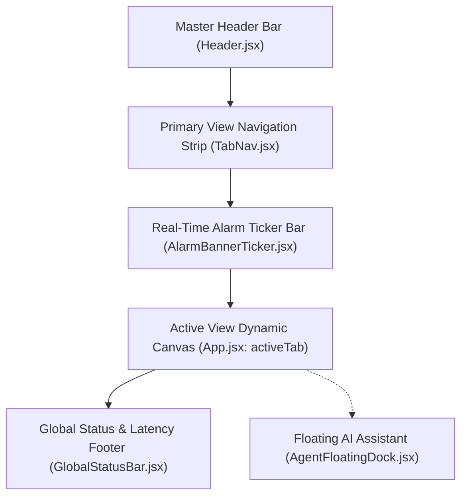
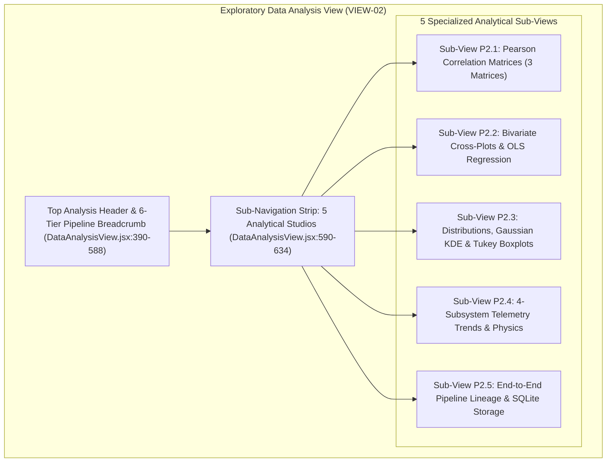
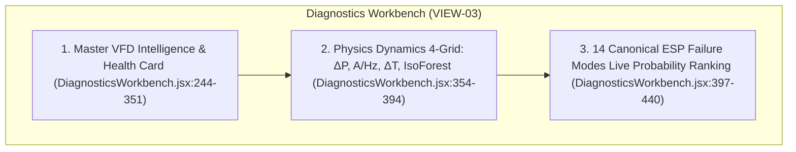
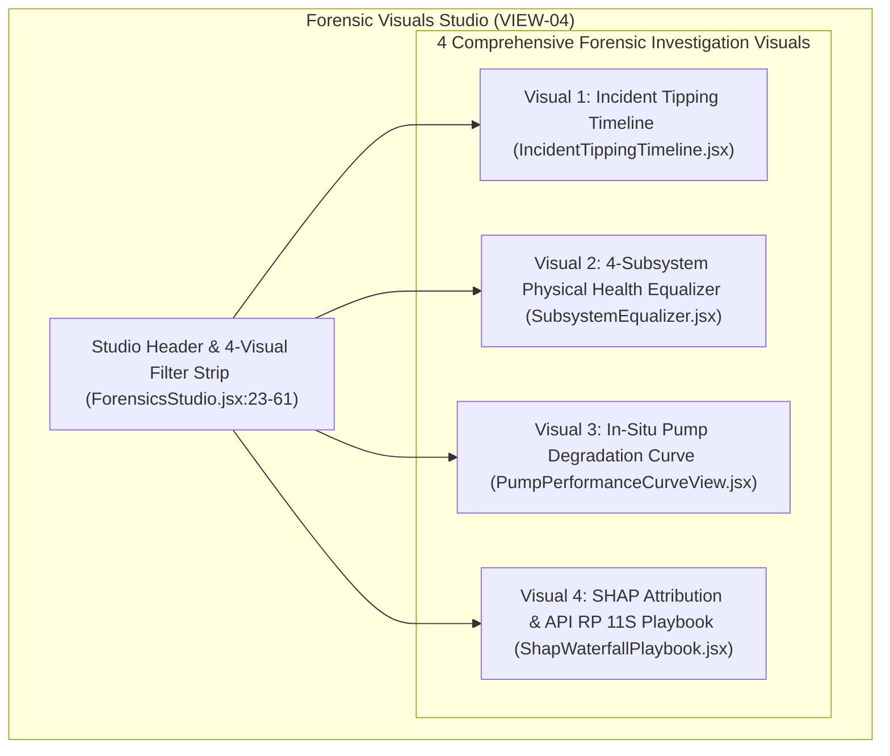
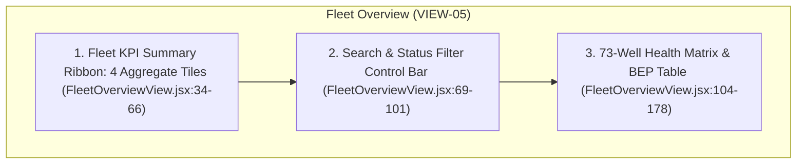

# OTConnex Production ML Dashboard — Ultra-Detailed Component Enumeration & View Map

**Target System:** OTConnex Real-Time Machine Learning & ESP Surveillance Dashboard  
**Deployment Target:** Server 3 Deployment Package (`Server3_Deployment_Package` / Server `184` runtime)  
**Host Application Root:** [`frontend/src/App.jsx`](file:///x:/TAS/v2_ESP/frontend/src/App.jsx)  
**Target Architecture:** SCADA • APM v2.0 Industrial Telemetry & Machine Learning Surveillance System  
**Monitored Assets:** 73 On-Site Electric Submersible Pump (ESP) Wellheads (Blocks 3 & 4)

---

## Executive Summary

This master document provides an exhaustive, component-by-component, and button-by-button enumeration of the OTConnex ML Dashboard as it runs in the production Server 3 deployment package. 

Every single visual element, button, toggle, status badge, stat tile, table column, chart series, drawer, and modal is documented with an immediate plain-English explanation following the strict format:
`[Component Name] (what the component is used for or means in simple plain English)`

---

# Table of Contents
1. [Layout Shell L1: Operations Command Center Master Shell](#layout-shell-l1-operations-command-center-master-shell)
2. [Page P1: Operations Cockpit (VIEW-01)](#page-p1-operations-cockpit-view-01)
3. [Page P2: Exploratory Data Analysis & Physics Dynamics (VIEW-02)](#page-p2-exploratory-data-analysis--physics-dynamics-view-02)
   - [Sub-View P2.1: Pearson Correlation Matrices (3 Matrices)](#sub-view-p21-pearson-correlation-matrices-3-matrices)
   - [Sub-View P2.2: Bivariate Cross-Plots & OLS Regression](#sub-view-p22-bivariate-cross-plots--ols-regression)
   - [Sub-View P2.3: Distributions, Gaussian KDE & 1.5×IQR Outlier Boxplots](#sub-view-p23-distributions-gaussian-kde--15iqr-outlier-boxplots)
   - [Sub-View P2.4: 4-Subsystem Telemetry Trends & Physics Derivatives](#sub-view-p24-4-subsystem-telemetry-trends--physics-derivatives)
   - [Sub-View P2.5: End-to-End Telemetry Pipeline Lineage & SQLite Architecture](#sub-view-p25-end-to-end-telemetry-pipeline-lineage--sqlite-architecture)
4. [Page P3: 13-Fault ML Diagnostics Workbench (VIEW-03)](#page-p3-13-fault-ml-diagnostics-workbench-view-03)
5. [Page P4: 4-Visual Forensic Visuals Studio (VIEW-04)](#page-p4-4-visual-forensic-visuals-studio-view-04)
   - [Forensic Visual 1: Incident Tipping Timeline](#forensic-visual-1-incident-tipping-timeline)
   - [Forensic Visual 2: 4-Subsystem Physical Health Equalizer](#forensic-visual-2-4-subsystem-physical-health-equalizer)
   - [Forensic Visual 3: In-Situ Pump Degradation H-Q Curve](#forensic-visual-3-in-situ-pump-degradation-h-q-curve)
   - [Forensic Visual 4: SHAP Attribution Waterfall & API RP 11S Playbook](#forensic-visual-4-shap-attribution-waterfall--api-rp-11s-playbook)
6. [Page P5: 73-Well Fleet Matrix Overview (VIEW-05)](#page-p5-73-well-fleet-matrix-overview-view-05)
7. [Global Overlays, Slide-Out Drawers & Interactive Modals](#global-overlays-slide-out-drawers--interactive-modals)
   - [Overlay O1: Asset Deep-Dive Modal](#overlay-o1-asset-deep-dive-modal)
   - [Overlay O2: MQTT Broker Gateway & Wire Packet Sniffer](#overlay-o2-mqtt-broker-gateway--wire-packet-sniffer)
   - [Overlay O3: SQLite Telemetry Historian Database Browser](#overlay-o3-sqlite-telemetry-historian-database-browser)
   - [Overlay O4: AI Engineering Co-Pilot Jane Floating Dock](#overlay-o4-ai-engineering-co-pilot-jane-floating-dock)
   - [Overlay O5: Draggable 4-Subsystem Physics Pop-Up Window](#overlay-o5-draggable-4-subsystem-physics-pop-up-window)
8. [Master Navigation Matrix ("From Where to Go — To Where")](#master-navigation-matrix-from-where-to-go--to-where)

---

# Layout Shell L1: Operations Command Center Master Shell

### Header Block
- **Layout Shell ID:** `SHELL-L1`
- **Component File(s):**
  - Parent Container: [`frontend/src/App.jsx`](file:///x:/TAS/v2_ESP/frontend/src/App.jsx)
  - Master Header: [`frontend/src/components/Header.jsx`](file:///x:/TAS/v2_ESP/frontend/src/components/Header.jsx)
  - Primary View Switcher: [`frontend/src/components/TabNav.jsx`](file:///x:/TAS/v2_ESP/frontend/src/components/TabNav.jsx)
  - Alarm Ticker: [`frontend/src/components/AlarmBannerTicker.jsx`](file:///x:/TAS/v2_ESP/frontend/src/components/AlarmBannerTicker.jsx)
  - Global Status Footer: [`frontend/src/components/GlobalStatusBar.jsx`](file:///x:/TAS/v2_ESP/frontend/src/components/GlobalStatusBar.jsx)
- **Visual Position:** Persistent top header (fixed at top), tab bar directly underneath, scrolling alarm ticker bar, active viewport body, and persistent footer bar at the bottom of the browser.
- **Present Overlays:** AI Agent Dock (`AgentFloatingDock.jsx`), MQTT Connection Modal (`MqttConnectionModal.jsx`), Asset Deep-Dive Modal (`AssetDeepDiveModal.jsx`), SQLite Browser Modal (`SqliteBrowserModal.jsx`).

### Section A: Master Header Bar Components (`Header.jsx`)
- `[Company Brand Logo] (Displays the official CC Energy Development company badge to identify the enterprise operating platform)`
- `[System Title Label] (Shows 'ESP OPERATIONS CENTER' to indicate the central control room software)`
- `[Field Location Badge] (Shows 'BLOCKS 3 & 4' to identify the specific geographic oilfield region being monitored)`
- `[Platform Version Pill] (Displays 'SCADA • APM v2.0' to indicate that the software is running the automated asset performance management version 2)`
- `[Sub-Header Description] (Text explaining: 'Real-time surveillance, virtual flow metering & diagnostics for 73 ESP assets')`
- `[Quick Section Jump Links] (A row of 11 anchor links that scroll the page directly to specific cards on the Cockpit view)`:
  - `[Jump to Production KPIs Link] (Scrolls the screen to the Virtual Flow Metering ribbon)`
  - `[Jump to Summary Link] (Scrolls the screen to the 7-card system summary row)`
  - `[Jump to Controls Link] (Scrolls the screen to the telemetry ingestion controls)`
  - `[Jump to Live Telemetry Link] (Scrolls the screen to the 14-parameter sensor table)`
  - `[Jump to Diagnosis Link] (Scrolls the screen to the active ML diagnostic verdict card)`
  - `[Jump to Wellbore View Link] (Scrolls the screen to the vertical wellbore digital twin drawing)`
  - `[Jump to Envelope Link] (Scrolls the screen to the P10-P90 statistical boundary corridor cards)`
  - `[Jump to Trends Link] (Scrolls the screen to the multi-axis time-series line chart)`
  - `[Jump to 13-Graphs Link] (Scrolls the screen to the individual sensor sparkline grid)`
  - `[Jump to Pump Curve Link] (Scrolls the screen to the real-time Head vs Flow operating curve)`
  - `[Jump to Fleet Grid Link] (Scrolls the screen to the field well cards grid)`
- `[Global Well Asset Selector Dropdown] (A searchable dropdown menu allowing the operator to switch the active well across all 73 field assets, e.g. selecting FS-031 updates every calculation and chart on the dashboard)`
- `[Dark/Light Theme Toggle Button] (Switches the visual appearance between high-contrast dark SCADA mode and bright daylight office mode)`
- `[Ingestion Collector Status Pill] (A green badge showing 'COLLECTOR ACTIVE' or red badge showing 'COLLECTOR STOPPED' to confirm background telemetry recording is running)`
- `[MQTT Broker Connection Status Button] (A clickable pill showing 'MQTT: CONNECTED' with green dot or 'MQTT: DISCONNECTED' with red alert; clicking opens the MQTT Broker Gateway & Wire Packet Sniffer modal)`
- `[Live System UTC Clock] (Displays real-time digital clock formatted as YYYY-MM-DD HH:MM:SS UTC to give exact time reference for field alarms)`

### Section B: Master View Navigation Tab Bar (`TabNav.jsx`)
- `[Operations Cockpit Tab Button] (Switches the active screen to View 1: Real-time surveillance, virtual flow metering, downhole telemetry, and pump curves)`
- `[Data-Analysis Tab Button] (Switches the active screen to View 2: Pearson correlation heatmaps, cross-plot regressions, Gaussian KDE distributions, and 4-subsystem flows)`
- `[13-Fault ML Diagnostics Tab Button] (Switches the active screen to View 3: Master VFD intelligence card, physics dynamics 4-grid, and 14-mode fault probability rankings)`
- `[4-Visual Forensics Studio Tab Button] (Switches the active screen to View 4: Post-trip investigation suite with tipping timeline, subsystem equalizer, in-situ pump degradation curve, and SHAP recovery playbook)`
- `[27-Well Fleet Matrix Tab Button] (Switches the active screen to View 5: Multi-well surveillance registry covering all field ESP assets with health index scores and best efficiency point metrics)`

### Section C: Real-Time Alarm Banner Ticker (`AlarmBannerTicker.jsx`)
- `[Alarm Severity Icon] (A flashing red warning triangle or amber bell icon indicating the priority level of active field alerts)`
- `[Scrolling Alarm Text Marquee] (An animated continuous ticker displaying latest operational events, such as 'FS-031: Intake Pressure Drawdown Breach below 400 PSI' or 'FS-012: Motor Temperature High Warning 118°C')`
- `[Timestamp Pill] (Shows the exact time in HH:MM:SS when the alarm condition was detected)`
- `[Alarm Acknowledge Quick Action] (Clicking an alarm item jumps directly to that well's diagnostic investigation card)`

### Section D: Global Status Footer Bar (`GlobalStatusBar.jsx`)
- `[Broker Latency Indicator] (Displays the network ping round-trip time in milliseconds, e.g., 'API RTT: 18ms', ensuring fast live updates)`
- `[WebSocket Stream Heartbeat Pill] (Pulsing green indicator showing active bidirectional socket telemetry feed)`
- `[SQLite Database Row Counter] (Displays live count of saved telemetry records, e.g., 'Historian: 142,850 rows', confirming database writes)`
- `[Active Topic String Display] (Shows current MQTT subscription topic pattern, such as 'esp/v1/+/telemetry')`
- `[Server Node Identifier] (Displays host runtime node, e.g., 'Node: Server-3 / 184', confirming deployment location)`

---

# Page P1: Operations Cockpit (VIEW-01)

### Header Block
- **Page Title:** Operations Cockpit
- **Route State:** `/` with state `activeTab === 'cockpit'`
- **Source File Path:** [`frontend/src/App.jsx:108-182`](file:///x:/TAS/v2_ESP/frontend/src/App.jsx#L108-L182)
- **Layout Shell:** `SHELL-L1`
- **Subordinate Components:**
  - `ProductionKpiRibbon.jsx`
  - `SystemSummary.jsx`
  - `IngestionControls.jsx`
  - `TelemetryTable.jsx`
  - `DiagnosisBanner.jsx`
  - `WellboreSchematic.jsx`
  - `OperatingEnvelopeCorridor.jsx`
  - `SynchronizedTrends.jsx`
  - `LiveTelemetryGrid.jsx`
  - `PumpPerformanceCurve.jsx`
  - `FleetHealthGrid.jsx`
  - `DatabaseExportSection.jsx`

```mermaid
flowchart TD
    subgraph CockpitLayout["Operations Cockpit (VIEW-01)"]
        Ribbon["1. Virtual Flow Metering (VFM) Ribbon (ProductionKpiRibbon.jsx)"]
        Summary["2. System Operational Summary 7-Card Grid (SystemSummary.jsx)"]
        Controls["3. Ingestion & Stream Management Controls (IngestionControls.jsx)"]
        LiveTable["4. 14-Parameter Real-Time Telemetry Matrix (TelemetryTable.jsx)"]
        Diagnosis["5. Active ML Diagnostic Verdict Card (DiagnosisBanner.jsx)"]
        Schematic["6. Digital Twin Vertical Wellbore Drawing (WellboreSchematic.jsx)"]
        Envelope["7. Statistical Operating Envelope P10-P90 Grid (OperatingEnvelopeCorridor.jsx)"]
        Trends["8. Multi-Axis Synchronized Time-Series Line Graph (SynchronizedTrends.jsx)"]
        Streams["9. 13-Sensor Sparkline Grid & AI Speed Advisor (LiveTelemetryGrid.jsx)"]
        PumpCurve["10. Real-Time Head-Capacity Pump Curve (PumpPerformanceCurve.jsx)"]
        FleetGrid["11. Field Wells Health Card Matrix (FleetHealthGrid.jsx)"]
        DbExport["12. SQLite Database & CSV Historian Export (DatabaseExportSection.jsx)"]
    end

    Ribbon --> Summary --> Controls --> LiveTable --> Diagnosis --> Schematic --> Envelope --> Trends --> Streams --> PumpCurve --> FleetGrid --> DbExport
```

---

### Section A: Rendered Components on Cockpit

#### Region 1: Virtual Flow Metering (VFM) & Production Ribbon (`ProductionKpiRibbon.jsx`)
- `[VFM Banner Header Bar] (Top border strip displaying ribbon title and active well identifier)`
- `[Energy Balance Status Pill] (Displays 'ENERGY BALANCE: VERIFIED' in green or 'WELL SHUT-IN' in red to confirm physical energy conservation laws match flow calculations)`
- `[Energy Balance Variance Percentage] (Displays numerical deviation between electrical power input and hydraulic fluid power output, e.g. '3.2% var')`
- `[Hydraulic Power Output Readout] (Displays calculated useful hydraulic horsepower delivered to the fluid column, e.g. '142 HP')`
- `[Electrical Power Input Readout] (Displays total electrical horsepower consumed by the motor drive, e.g. '188 HP')`
- `[Gross Liquid Rate Stat Tile] (Displays total volumetric liquid flow rate in Barrels Per Day (BPD) produced from the wellbore; automatically drops to 0.0 BPD if pump is stopped)`
- `[Net Oil Production Stat Tile] (Displays calculated oil volume in Stock Tank Barrels of Oil Per Day (BOPD) excluding water)`
- `[Produced Water Volume Stat Tile] (Displays calculated water production in Water Barrels Per Day (BWPD) with Water Cut percentage subtext, e.g. '68.5% Water Cut')`
- `[Associated Gas Rate Stat Tile] (Displays estimated gas evolution in Thousand Standard Cubic Feet Per Day (MSCFD))`
- `[Lost Production Deferment Stat Tile] (Displays lost barrel volume in BPD when the well experiences a trip or underperformance, highlighted in bright red alert)`
- `[Power Conversion Efficiency Tile] (Displays ratio of hydraulic power produced to electrical power consumed as a percentage, e.g. '75.5% Efficiency')`

#### Region 2: System Operational Summary 7-Card Grid (`SystemSummary.jsx`)
- `[Total Telemetry Records KPI Card] (Shows total count of SCADA time-series data points stored in the local SQLite historian database)`
- `[Ingestion Speed KPI Card] (Shows real-time streaming throughput in records per second, e.g. '42 rec/sec')`
- `[Active Wellhead Count KPI Card] (Shows count of actively monitored field wells transmitting data, e.g. '73 / 73 Wells Online')`
- `[MQTT Broker Uptime KPI Card] (Shows duration of uninterrupted broker connection formatted in days, hours, and minutes)`
- `[Fleet Nominal Health Percentage KPI Card] (Shows percentage of field assets operating inside normal safety bounds without warnings, e.g. '94.5% Fleet Nominal')`
- `[Active Trip Alarms KPI Card] (Shows count of wells currently in an emergency shutdown or trip state requiring immediate operator intervention)`
- `[Storage Disk Usage KPI Card] (Shows size of on-disk database files in megabytes or gigabytes, confirming database health)`

#### Region 3: Telemetry Ingestion Controls (`IngestionControls.jsx`)
- `[Simulator Run/Pause Toggle Button] (Starts or stops the background physics simulator that generates live downhole telemetry)`
- `[Stream Speed Multiplier Dropdown] (Sets playback speed: 1x real-time, 2x accelerated, 5x rapid testing, or 10x high-speed simulation)`
- `[Well Selection Radio Chips] (Quick buttons allowing the operator to cycle the active telemetry generator between specific test wells)`
- `[Scenario Injection Dropdown] (Injects realistic downhole fault scenarios for testing, such as 'Gas Lock', 'Severe Scale', 'Broken Shaft', or 'Motor Overheat')`
- `[Reset Ingestion Stream Button] (Clears live buffer queues and restarts the incoming stream from the initial baseline state)`

#### Region 4: 14-Parameter Live Telemetry Matrix (`TelemetryTable.jsx`)
- `[Telemetry Table Container] (High-density structured data table showing real-time readings for all 14 standard downhole and surface engineering sensors)`
- `[Intake Pressure Row] (Tag: 'Inp bar/psi', Name: 'Intake Pressure (PIP)', Unit: 'PSI', Category: 'Hydraulic', Normal Range: 400–850 PSI, Live Value, Status Pill)`
- `[Discharge Pressure Row] (Tag: 'Disch pr. Bar/psi', Name: 'Discharge Pressure (PDP)', Unit: 'PSI', Category: 'Hydraulic', Normal Range: 1800–2400 PSI, Live Value, Status Pill)`
- `[Wellhead Pressure Row] (Tag: 'WHP (PSI)', Name: 'Wellhead Surface Pressure', Unit: 'PSI', Category: 'Hydraulic', Normal Range: 80–220 PSI, Live Value, Status Pill)`
- `[Flowline Pressure Row] (Tag: 'FLP (PSI)', Name: 'Surface Flowline Pressure', Unit: 'PSI', Category: 'Hydraulic', Normal Range: 40–120 PSI, Live Value, Status Pill)`
- `[Annulus Casing Pressure Row] (Tag: 'AP (PSI)', Name: 'Casing Annulus Pressure', Unit: 'PSI', Category: 'Hydraulic', Normal Range: 20–90 PSI, Live Value, Status Pill)`
- `[Motor Current Load Row] (Tag: 'VSD Amps/Load', Name: 'Motor Electrical Current', Unit: 'A', Category: 'Electrical', Normal Range: 40–110 A, Live Value, Status Pill)`
- `[Motor Bus Voltage Row] (Tag: 'Volt', Name: 'Input Bus Voltage', Unit: 'V', Category: 'Electrical', Normal Range: 400–480 V, Live Value, Status Pill)`
- `[Operating Frequency Row] (Tag: 'Frequency', Name: 'VFD Drive Operating Frequency', Unit: 'Hz', Category: 'Electrical', Normal Range: 40–65 Hz, Live Value, Status Pill)`
- `[Cable Leakage Current Row] (Tag: 'Leak Current Ct', Name: 'Downhole Cable Leakage Current', Unit: 'mA', Category: 'Electrical', Normal Range: 0–15 mA, Live Value, Status Pill)`
- `[Downhole Gauge Current Row] (Tag: 'DHG Current', Name: 'Downhole Sensor Instrument Current', Unit: 'mA', Category: 'Electrical', Normal Range: 5–25 mA, Live Value, Status Pill)`
- `[Motor Internal Temperature Row] (Tag: 'Motor temp °C', Name: 'Motor Internal Winding Temp', Unit: '°C', Category: 'Thermal', Normal Range: 60–115 °C, Live Value, Status Pill)`
- `[Intake Fluid Temperature Row] (Tag: 'Int temp °C', Name: 'Pump Intake Fluid Temperature', Unit: '°C', Category: 'Thermal', Normal Range: 40–85 °C, Live Value, Status Pill)`
- `[Radial Vibration Severity Row] (Tag: 'Vibration G\'s-Vx', Name: 'Radial Vibration RMS', Unit: 'G', Category: 'Mechanical', Normal Range: 0.02–0.15 G, Live Value, Status Pill)`
- `[Liquid Flow Rate Row] (Tag: 'Liquid Rate (BPD)', Name: 'Estimated Liquid Production', Unit: 'BPD', Category: 'Production', Normal Range: 500–3000 BPD, Live Value, Status Pill)`

#### Region 5: Active Machine Learning Diagnosis Banner (`DiagnosisBanner.jsx`)
- `[Diagnosis Card Shell] (A high-contrast card framed in emerald green for normal operation or pulsing crimson red for active anomalies)`
- `[Diagnostic State Badge] (Shows 'HEALTHY NOMINAL' or 'ACTIVE ANOMALY DETECTED' in bold capital letters)`
- `[Primary Fault Classification Banner] (Displays the primary failure mode identified by the 14-fault classifier, such as 'Gas Interference & Lock' or 'Normal Operation')`
- `[ML Model Confidence Percentage Stat] (Displays the statistical confidence probability of the detected fault classification, e.g. '88.5% Confidence')`
- `[Health Index Circular Progress Gauge] (A color-graded circular gauge displaying the overall asset health score from 0 to 100, where 100 is pristine brand new and below 60 represents severe degradation)`
- `[Isolation Forest Anomaly Score Stat] (Shows the unsupervised outlier risk score calculated by the Isolation Forest algorithm, where values above 0.6 flag anomalous operating states)`
- `[Estimated Time to Trip (ETT) Stat] (Displays predictive countdown estimate before an automated safety shutdown occurs, e.g. 'Stable Operation', '24h – 48h', or 'TRIPPED / SHUTDOWN')`
- `[Prescriptive Operational Action Box] (Displays actionable advisory recommendations, such as 'Reduce VFD frequency by 2 Hz and vent casing annulus to clear gas lock')`

#### Region 6: Digital Twin Vertical Wellbore Drawing (`WellboreSchematic.jsx`)
- `[Vertical SVG Wellbore Canvas] (A detailed technical cross-section illustration showing the surface wellhead, casing string, production tubing, downhole ESP assembly, and reservoir perforations)`
- `[Surface Wellhead & Tree Node] (Shows surface choke, WHP pressure gauge reading, and FLP flowline sensor callout)`
- `[Casing & Annulus Space Illustration] (Displays casing fluid level, annulus gas buildup, and casing pressure AP sensor point)`
- `[Pump Setting Depth (PSD) Marker] (Displays exact measured depth of the pump intake in feet, e.g. 'PSD: 6,420 ft')`
- `[Multistage ESP Pump Stages Graphic] (Illustrates rotating impellers and diffusers with live Discharge Pressure (PDP) sensor readout bubble)`
- `[Intake Screen & Gas Separator Graphic] (Shows fluid entry zone with live Intake Pressure (PIP) and Intake Temperature callouts)`
- `[Protector / Seal Section Graphic] (Illustrates thrust bearing section and mechanical seal chambers with radial vibration Vx sensor callout)`
- `[Submersible Electric Motor Graphic] (Illustrates 3-phase induction motor with live internal winding temperature, voltage, and current readouts)`
- `[Downhole Sensor Gauge (DHG) Base Node] (Shows bottom-hole instrument pack measuring reservoir pressure and cable leakage)`
- `[Depth-Calibrated Telemetry Callout Panels] (A column of 4 interactive cards alongside the drawing showing surface conditions, pump head conditions, motor electrical status, and bottom-hole conditions)`

#### Region 7: Statistical Operating Envelope P10–P90 Grid (`OperatingEnvelopeCorridor.jsx`)
- `[Operating Envelope Section Header] (Shows section title explaining that sensor values should stay between P10 lower and P90 upper statistical percentiles)`
- `[14 Individual Envelope Cards] (A grid of 14 cards, one for each sensor parameter)`:
  - `[Card Sensor Title & Unit] (Shows sensor name, engineering units, and subsystem icon)`
  - `[Current Live Value Display] (Displays real-time numerical reading in large bold numbers, colored green inside envelope or red when breached)`
  - `[Statistical P10 Lower Bound] (Displays the 10th percentile baseline limit below which values are unusually low)`
  - `[Statistical P50 Nominal Median] (Displays the calibrated normal median baseline value)`
  - `[Statistical P90 Upper Bound] (Displays the 90th percentile baseline limit above which values indicate overload or surge)`
  - `[Horizontal Range Position Bar] (A visual gauge bar showing the current value's exact position relative to the P10-P90 safe corridor with a moving marker indicator)`

#### Region 8: Multi-Axis Synchronized Time-Series Line Graph (`SynchronizedTrends.jsx`)
- `[Time-Series Graph Canvas] (A multi-axis Chart.js line graph plotting the last 60 minutes of operational telemetry)`
- `[Intake Pressure (PIP) Curve Series] (Cyan line plotting intake pressure in PSI on the left vertical axis)`
- `[Discharge Pressure (PDP) Curve Series] (Dark blue line plotting discharge pressure in PSI on the left vertical axis)`
- `[Motor Current (Amps) Curve Series] (Yellow line plotting motor current draw in amperes on the right electrical axis)`
- `[Motor Temperature Curve Series] (Red line plotting internal motor temperature in °C on the secondary thermal axis)`
- `[VFD Frequency Curve Series] (Amber line plotting drive operating frequency in Hz on the electrical axis)`
- `[Interactive Crosshair Tooltip] (Hovering anywhere on the graph displays a vertical cursor showing exact synchronized readings for all 5 parameters at that precise second)`
- `[Graph Legend Toggles] (Clicking any parameter in the legend hides or reveals that specific line trace on the graph)`

#### Region 9: 13-Sensor Sparkline Grid & AI Speed Advisor (`LiveTelemetryGrid.jsx`)
- `[13 Sensor Sparkline Cards] (A responsive card grid displaying mini historical area charts for all 13 physical sensors)`:
  - `[Sensor Tag & Name Header] (Identifies the physical tag and equipment area)`
  - `[Live Stat Value & Unit] (Displays instantaneous reading with rate of change indicator, e.g. '+2.4 PSI/min')`
  - `[Mini Area Sparkline Graph] (Shows a 15-minute historical trend curve with filled gradient area underneath)`
  - `[Min / Max Bounds Readout] (Shows highest and lowest values recorded during the current operational session)`
- `[AI VSD Frequency Advisor Card] (A specialized intelligence tile providing automated speed recommendations)`:
  - `[Current Speed Readout] (Displays active VFD frequency, e.g. '50.0 Hz')`
  - `[Recommended Target Speed] (Displays AI-calculated optimal frequency to maximize production while avoiding gas lock or motor overheat, e.g. 'Target: 52.5 Hz (+2.5 Hz)')`
  - `[Expected Production Gain] (Shows predicted oil increment, e.g. '+120 BOPD')`
  - `[Thermal Risk Safety Check] (Confirms motor cooling velocity will remain within safe Arrhenius limits at the new speed)`

#### Region 10: Real-Time Pump Performance Head-Capacity Curve (`PumpPerformanceCurve.jsx`)
- `[H-Q Performance Canvas] (A 2D engineering graph plotting Total Dynamic Head in feet on the vertical Y-axis vs Liquid Flow Rate in BPD on the horizontal X-axis)`
- `[Factory Catalog Head Curve Trace] (Solid curve showing the pump manufacturer's theoretical head curve, scaled dynamically to active VFD frequency using affinity laws)`
- `[Recommended Operating Range (ROR) Shaded Zone] (A colored band representing safe hydraulic operation between minimum downthrust flow and maximum upthrust flow)`
- `[Best Efficiency Point (BEP) Star Marker] (A distinct marker indicating the flow rate at which the pump achieves maximum mechanical efficiency)`
- `[Live Operating Point Marker] (A pulsating glowing cyan dot showing the pump's real-time operational head and flow rate)`
- `[Side Metrics Panel] (Displays current operating frequency in Hz, live head in ft, live rate in BPD, and operating zone classification: 'NOMINAL EFFICIENCY', 'UPTHRUST FLOW RISK', or 'DOWNTHRUST / GAS LOCK RISK')`

#### Region 11: Field Wells Health Card Matrix (`FleetHealthGrid.jsx`)
- `[Fleet Grid Section Title] (Shows 'Field ESP Wellhead Health Overview' with count of monitored assets)`
- `[Individual Well Asset Cards] (A grid of cards representing field assets FS-001 to FS-073)`:
  - `[Well ID Badge] (Displays asset name, e.g. 'FS-031')`
  - `[Health Score Pill] (Displays numeric health index colored green for healthy > 75, yellow for warning 60-75, or red for critical < 60)`
  - `[Operating Status Badge] (Displays 'RUNNING', 'WATCH', 'WARNING', or 'STOPPED')`
  - `[Primary Diagnostic Summary] (Displays detected operational state, e.g. 'Normal Operation' or 'Gas Interference')`
  - `[Liquid Flow Rate Metric] (Displays current production rate in BPD)`
  - `[Inspect Well Quick Action Button] (Clicking switches the entire dashboard to monitor this well, or opens the Asset Deep-Dive modal)`

#### Region 12: SQLite Database & CSV Historian Export (`DatabaseExportSection.jsx`)
- `[Database Export Section Title] (Header explaining telemetry historian backup and data export tools)`
- `[Download unlabelled.db Button] (Downloads the raw zero-loss 34-column SCADA SQLite database file containing all recorded sensor readings)`
- `[Download labelled.db Button] (Downloads the ground-truth SQLite database file containing verified failure events and incident annotations)`
- `[Download normalized.db Button] (Downloads the 42-column normalized feature store SQLite database used by machine learning models)`
- `[Download mlresults.db Button] (Downloads the persistent SQLite database file storing ML health scores, anomaly metrics, and diagnostic verdicts)`
- `[Export Active Telemetry CSV Button] (Exports the currently displayed well's historical records as a standard CSV spreadsheet file)`
- `[Browse SQLite Database Modal Button] (Opens the interactive in-browser SQLite Telemetry Historian Browser modal)`

---

# Page P2: Exploratory Data Analysis & Physics Dynamics (VIEW-02)

### Header Block
- **Page Title:** Exploratory Data Analysis & Physics Dynamics
- **Route State:** `/` with state `activeTab === 'data-analysis'`
- **Source File Path:** [`frontend/src/components/analysis/DataAnalysisView.jsx`](file:///x:/TAS/v2_ESP/frontend/src/components/analysis/DataAnalysisView.jsx)
- **Layout Shell:** `SHELL-L1`
- **Sub-Tabs:**
  - `correlation`: Pearson Correlation Matrices (3)
  - `crossplot`: Bivariate Cross-Plots & OLS Regression
  - `distribution`: Distributions, KDE & 1.5×IQR Boxplots
  - `subsystems`: 4-Subsystem Telemetry Trends
  - `pipeline`: End-to-End Pipeline Lineage & Storage

---

### Section A: Top Banner & Controls on Data Analysis View
- `[EDA Section Title Badge] (Displays 'EXPLORATORY DATA ANALYSIS' in bright cyan)`
- `[Suite Title & Subtitle] (Shows 'Sensor Correlation & Physics Feature Dynamics Suite' with descriptive port text)`
- `[Asset Selector Dropdown] (Dropdown menu to select the active well being analyzed)`
- `[Sample Limit Selector Dropdown] (Dropdown to select analysis record depth: 50, 100, 150, 300, or 500 historical rows)`
- `[Live Sync Status Indicator] (Pulsing green dot showing 'LIVE SYNC ●' when auto-refreshing every 3.5s or grey 'SYNC PAUSED')`
- `[Live Sync Pause/Resume Text Button] (Clickable link that pauses or resumes automated background data fetching)`
- `[Manual Refresh Button] (A button with spinning sync icon that forces an immediate fetch of all correlation and distribution calculations)`
- `[6-Tier Data Pipeline Breadcrumb Banner] (A connected horizontal flow showing live row counters across all database stages)`:
  - `[MQTT Stream Step] (Shows active broker stream, e.g. '📡 MQTT Stream (esp/v1/+/telemetry)')`
  - `[labelled.db Counter Step] (Shows ground-truth incident row count, e.g. '🏷️ labelled.db (12,400)')`
  - `[unlabelled.db Counter Step] (Shows raw 34-column SCADA historian row count, e.g. '🗄️ unlabelled.db (142,850)')`
  - `[normalized.db Counter Step] (Shows 42-column [0,1] normalized feature count, e.g. '📐 normalized.db (142,850)')`
  - `[ML-Model-Layers Step] (Shows total computed inference count, e.g. '🧠 ML-Model-Layers (142,850)')`
  - `[mlresults.db Counter Step] (Shows persistent ML output row count, e.g. '💾 mlresults.db (142,850)')`

---

## Sub-View P2.1: Pearson Correlation Matrices (3 Matrices)

### Header Block
- **Sub-Tab ID:** `activeAnalysisTab === 'correlation'`
- **Source Lines:** [`DataAnalysisView.jsx:637-1627`](file:///x:/TAS/v2_ESP/frontend/src/components/analysis/DataAnalysisView.jsx#L637-L1627)

### Detailed Breakdown of Components

#### Matrix 1: Inputs × Inputs Correlation Matrix (14 Sensors × 14 Sensors)
- `[Matrix 1 Title] (Displays 'Interactive 14×14 Pearson Correlation Matrix (r)' with instruction to click any cell)`
- `[Color Legend Strip] (A visual gradient bar from Cyan '-1.0 (Inverse)' to White '0.0 (Uncorrelated)' to Red '+1.0 (Direct)')`
- `[14×14 Numerical Heatmap Grid Table] (A table displaying correlation coefficients between all 14 sensors; cells are colored dynamically from bright cyan to deep red; clicking any non-diagonal cell updates the side inspector)`
- `[Selected Pairwise Relationship Card] (A detailed deep-dive card on the right side of the heatmap)`:
  - `[Pairwise Title] (Displays the two selected sensors, e.g. 'Intake Pressure (PIP) ⟷ Discharge Pressure (PDP)')`
  - `[Correlation Coefficient Pill] (Shows exact r-value, e.g. 'r = +0.82' in red or 'r = -0.74' in cyan)`
  - `[Category Tags] (Displays engineering domains, e.g. 'Hydraulic × Hydraulic')`
  - `[Relationship Label] (Displays qualitative strength: 'Strong Direct', 'Strong Inverse', 'Moderate', or 'Decoupled')`
  - `[Physical Mechanism Explanation] (Plain-English engineering explanation of why these two sensors behave together in downhole fluid dynamics)`
  - `[Operational & Commercial Impact] (Explains field consequences, such as risk of cavitation, lost production, or motor winding degradation)`
  - `[Open in Cross-Plot Scatter Button] (Clicking jumps directly to Sub-Tab 2 with these two sensors pre-selected on the X and Y axes)`
- `[Ranked Pairwise Sensitivity Table] (A searchable list of all 91 unique sensor pairs ranked by correlation strength)`:
  - `[Pair Search Input Box] (Text filter allowing operator to search for specific sensor names)`
  - `[Correlation Threshold Filter Dropdown] (Filters list by minimum r-value: 'All (|r| ≥ 0)', 'Moderate (|r| ≥ 0.4)', 'Strong (|r| ≥ 0.6)', 'Very High (|r| ≥ 0.75)')`
  - `[Export Pairwise CSV Button] (Downloads all sensor correlation pairs and explanations as a CSV spreadsheet)`
  - `[Scrollable Pair Rows] (Clicking any row updates the selected relationship inspector)`

#### Matrix 2: Inputs × Fault Types Correlation Matrix (14 Sensors × 13 Fault Modes)
- `[Matrix 2 Title] (Displays 'Inputs × Fault_Types Pearson Correlation Matrix (r)' with 'FEATURE SENSITIVITY' badge)`
- `[Inputs × Faults Heatmap Table] (A 14-row by 13-column grid showing how strongly each physical sensor reading correlates with the onset of each canonical ESP failure mode)`
- `[Selected Sensor-to-Fault Inspector Card] (Displays physical mechanism explaining why an increase or decrease in that specific sensor flags that particular fault, plus predictive operational impact)`
- `[Ranked Input-to-Fault Sensitivity Table] (Searchable, filterable list of sensor-fault pairs with threshold selector and 'Export CSV' download button)`

#### Matrix 3: Fault Types × Fault Types Correlation Matrix (13 Faults × 13 Faults)
- `[Matrix 3 Title] (Displays 'Fault_Types × Fault_Types Pearson Correlation Matrix (r)' with 'CASCADING FAULT RISK' badge)`
- `[Faults × Faults Heatmap Table] (A 13×13 square matrix showing co-occurrence correlations among failure modes, revealing which faults trigger secondary failures)`
- `[Selected Cascading Fault Inspector Card] (Explains the cascading physical chain reaction, e.g. how Gas Lock leads to Fluid Velocity Starvation, which causes Motor Thermal Overload)`
- `[Ranked Fault Co-Occurrences Table] (Searchable table ranking highest cascading risk pairs with threshold filter and 'Export CSV' button)`

---

## Sub-View P2.2: Bivariate Cross-Plots & OLS Regression

### Header Block
- **Sub-Tab ID:** `activeAnalysisTab === 'crossplot'`
- **Source Lines:** [`DataAnalysisView.jsx:1630-1940`](file:///x:/TAS/v2_ESP/frontend/src/components/analysis/DataAnalysisView.jsx#L1630-L1940)

### Detailed Breakdown of Components
- `[Cross-Plot Title & Subtitle] (Shows 'Bivariate Cross-Plot with Ordinary Least Squares (OLS) Trendline' with sample count)`
- `[6 Physics Preset Buttons] (One-click shortcuts to load standard petroleum engineering bivariate relationships)`:
  - `[Hydraulic Head Preset Button] (Sets X = Intake Pressure, Y = Discharge Pressure)`
  - `[Affinity & Load Preset Button] (Sets X = Operating Frequency, Y = Motor Current Draw)`
  - `[Thermal Dissipation Preset Button] (Sets X = Motor Current Draw, Y = Motor Internal Temperature)`
  - `[Production vs PIP Preset Button] (Sets X = Intake Pressure, Y = Liquid Production Rate)`
  - `[Vibration vs Speed Preset Button] (Sets X = Operating Frequency, Y = Radial Vibration)`
  - `[Thermal Delta Preset Button] (Sets X = Intake Fluid Temperature, Y = Motor Internal Temperature)`
- `[Sensor X Axis Dropdown] (Dropdown to select any of the 14 sensors for the horizontal X-axis)`
- `[Sensor Y Axis Dropdown] (Dropdown to select any of the 14 sensors for the vertical Y-axis)`
- `[Interactive SVG Scatter Plot Canvas] (Renders historical data points as circular dots)`:
  - `[Historical Scatter Points] (Dots representing past operational readings)`
  - `[Live Telemetry Point Marker] (A pulsing cyan marker that moves across the graph in real-time as new MQTT packets arrive)`
  - `[Fitted OLS Linear Trendline] (A solid line showing the best-fit linear mathematical regression y = mx + c)`
  - `[Axis Tick Marks & Labels] (Numerical values and sensor engineering unit labels on both axes)`
- `[Regression Statistics & Pearson Gauge Panel] (A side card displaying detailed mathematical parameters)`:
  - `[OLS Linear Formula Box] (Displays the fitted equation in monospace text, e.g. 'y = 1.4520x + 210.50')`
  - `[Pearson Correlation Gauge (r)] (Displays r-value with a color-coded bar showing correlation direction and strength)`
  - `[Coefficient of Determination (R²)] (Displays R² value, e.g. 'R² = 0.854', with explanation of explained variance)`
  - `[Linear Slope Parameter (m)] (Displays the slope rate showing how much Y changes for every 1 unit increase in X)`
  - `[Y-Intercept Parameter (c)] (Displays the baseline value of Y when X is zero)`
  - `[Physical Engineering Interpretation Box] (Plain-English explanation of the underlying hydrodynamic or electromechanical principle)`

---

## Sub-View P2.3: Distributions, Gaussian KDE & 1.5×IQR Outlier Boxplots

### Header Block
- **Sub-Tab ID:** `activeAnalysisTab === 'distribution'`
- **Source Lines:** [`DataAnalysisView.jsx:1942-2022`](file:///x:/TAS/v2_ESP/frontend/src/components/analysis/DataAnalysisView.jsx#L1942-L2022)

### Detailed Breakdown of Components
- `[Distribution Sensor Selector Dropdown] (Dropdown to choose which of the 14 sensors to inspect)`
- `[Dual Statistical SVG Visual Canvas]`:
  - `[Top Panel: Gaussian Kernel Density Estimation (KDE) Curve] (A smooth continuous bell curve showing the probability density distribution of the sensor readings, with shaded area underneath and a vertical dashed line marking the arithmetic mean μ)`
  - `[Bottom Panel: Tukey 1.5×IQR Outlier Boxplot] (A horizontal box-and-whisker plot showing the Minimum, Lower Outlier Fence [Q1 - 1.5×IQR], Lower Quartile Q1/P25, Median Line P50, Upper Quartile Q3/P75, Upper Outlier Fence [Q3 + 1.5×IQR], and Maximum, with red dots marking detected statistical outliers)`
- `[10-Moment Statistical Summary Panel] (A card detailing 10 exact mathematical metrics)`:
  1. `[Arithmetic Mean (μ)] (The average central operating value)`
  2. `[Standard Deviation (σ)] (Measurement of process variability and sensor noise)`
  3. `[Median (P50)] (The exact middle value where 50% of readings are lower)`
  4. `[Interquartile Range (IQR)] (The spread between the 75th and 25th percentiles)`
  5. `[Lower Quartile (Q1 / P25)] (The 25th percentile boundary)`
  6. `[Upper Quartile (Q3 / P75)] (The 75th percentile boundary)`
  7. `[Minimum Recorded] (The lowest single reading in the dataset)`
  8. `[Maximum Recorded] (The highest single reading in the dataset)`
  9. `[Distribution Skewness] (Indicates if data has a long right tail > 0 or left tail < 0)`
  10. `[Excess Kurtosis] (Indicates if distribution has heavy outlier tails or a flat profile)`
- `[Tukey Outlier Fence Warning Alert Card] (An amber callout explaining whether active telemetry breaches the 1.5×IQR fence, indicating transient gas interference or sensor drift)`

---

## Sub-View P2.4: 4-Subsystem Telemetry Trends & Physics Derivatives

### Header Block
- **Sub-Tab ID:** `activeAnalysisTab === 'subsystems'`
- **Source Lines:** [`DataAnalysisView.jsx:2024-3353`](file:///x:/TAS/v2_ESP/frontend/src/components/analysis/DataAnalysisView.jsx#L2024-L3353)

### Detailed Breakdown of Components
- `[4-Subsystem Grid Container] (A responsive layout of 4 large engineering subsystem cards)`:
  1. `[Hydraulic Subsystem Card] (Cyan theme)`:
     - Shows Differential Pressure ($\Delta P = PDP - PIP$) and Total Dynamic Head (TDH in ft).
     - Live sensor pills for Intake Pressure, Discharge Pressure, Wellhead Pressure, Flowline Pressure, and Casing Pressure.
     - Status message: 'Optimal Hydrodynamic Lift' or 'Degraded Head Warning'.
     - Action: Clicking card opens the draggable Draggable Subsystem Physics Pop-Up Window (Overlay O5).
  2. `[Electrical Subsystem Card] (Amber theme)`:
     - Shows Torque Proxy ($A/Hz = \text{Current} / \text{Frequency}$) and Apparent Power ($kVA$).
     - Live sensor pills for Motor Current, Voltage, Frequency, Cable Leakage, and Downhole Gauge Current.
     - Status message: 'Balanced VFD Load & Voltage' or 'High Torque Drag Warning'.
     - Action: Clicking card opens the draggable Draggable Subsystem Physics Pop-Up Window (Overlay O5).
  3. `[Thermal Subsystem Card] (Orange theme)`:
     - Shows Thermal Elevation ($\Delta T = T_{motor} - T_{intake}$) and Arrhenius winding insulation life factor.
     - Live sensor pills for Motor Internal Temp, Intake Fluid Temp, and Downhole Cable Temp.
     - Status message: 'Optimal Fluid Cooling' or 'Critical Overheat Risk'.
     - Action: Clicking card opens the draggable Draggable Subsystem Physics Pop-Up Window (Overlay O5).
  4. `[Mechanical & Production Subsystem Card] (Emerald theme)`:
     - Shows Radial Vibration RMS ($G$) and Virtual Flow Metering liquid rate ($BPD$).
     - Live sensor pills for Radial Vibration, Liquid Production Rate, and VFD Run State.
     - Status message: 'ISO 10816 Class I (Smooth)' or 'Severe Imbalance Alert'.
     - Action: Clicking card opens the draggable Draggable Subsystem Physics Pop-Up Window (Overlay O5).

---

## Sub-View P2.5: End-to-End Telemetry Pipeline Lineage & SQLite Architecture

### Header Block
- **Sub-Tab ID:** `activeAnalysisTab === 'pipeline'`
- **Source Lines:** [`DataAnalysisView.jsx:3356-3584`](file:///x:/TAS/v2_ESP/frontend/src/components/analysis/DataAnalysisView.jsx#L3356-L3584)

### Detailed Breakdown of Components
- `[Pipeline Architecture Section Header] (Shows 'Sequential Telemetry & ML Ingestion Architecture')`
- `[6-Tier Ingestion Stage Cards]`:
  - `[Tier 1: MQTT Input Stream Card] (Shows broker socket intake, topic name, packet counter)`
  - `[Tier 2: labelled.db Card] (Shows ground-truth fault database schema, row counter, and storage size)`
  - `[Tier 3: unlabelled.db Card] (Shows raw 34-column SCADA historian schema and record count)`
  - `[Tier 4: normalized.db Card] (Shows 42-column [0,1] feature store schema, calibration math, and row count)`
  - `[Tier 5: ML-Model-Layers Card] (Shows Isolation Forest and 14-fault classifier inference pipeline)`
  - `[Tier 6: mlresults.db Card] (Shows persistent database storing telemetry paired with ML health scores and diagnostic verdicts)`
- `[Database Schema & Storage Inspector Panels] (Detailed breakdown of database column types, indices, disk paths, and query performance metrics)`

---

# Page P3: 13-Fault ML Diagnostics Workbench (VIEW-03)

### Header Block
- **Page Title:** Diagnostics Workbench
- **Route State:** `/` with state `activeTab === 'diagnostics'`
- **Source File Path:** [`frontend/src/components/diagnostics/DiagnosticsWorkbench.jsx`](file:///x:/TAS/v2_ESP/frontend/src/components/diagnostics/DiagnosticsWorkbench.jsx)
- **Layout Shell:** `SHELL-L1`

---

### Section A: Rendered Components on Diagnostics Workbench

#### Region 1: Master VFD Intelligence Card (`DiagnosticsWorkbench.jsx:244-351`)
- `[VFD Card Container] (High-contrast card with glowing emerald border for healthy state or crimson border for active anomaly)`
- `[VFD Status Badge] (Displays 'VFD INTELLIGENCE CARD • HEALTHY' or 'VFD INTELLIGENCE CARD • ANOMALY DETECTED')`
- `[Asset & Primary State Title] (Shows active well ID and primary diagnostic state, e.g. 'FS-031: Normal Operation' or 'FS-031: Gas Interference & Lock')`
- `[Health Index Score Stat] (Large numerical readout from 0 to 100, colored green if ≥ 60 or red if below)`
- `[Isolation Forest Anomaly Score Stat] (Large percentage readout from 0% to 100%, indicating outlier risk)`
- `[Verbatim ML Model Output Callout] (A high-contrast callout printing the exact model verdict string, e.g. '"Healthy"' or '"Anomaly is Detected — Gas Interference & Lock"')`
- `[Primary Failure Candidate Block] (Shows the highest-probability fault name, percentage likelihood, and physical trigger explanation)`
- `[Secondary Failure Candidate Block] (Shows the second most likely fault mode to help operators detect complex coupled degradation)`
- `[Estimated Time to Trip (ETT) Block] (Displays predictive time remaining before pump shutdown, e.g. 'Stable Operation', '24h – 48h', or 'TRIPPED / SHUTDOWN')`
- `[Action Advisory Text] (Displays immediate operational guidance, e.g. 'Maintain nominal operating envelope' or 'Adjust VFD frequency')`

#### Region 2: Physics Dynamics 4-Grid (`DiagnosticsWorkbench.jsx:354-394`)
- `[Differential Pressure (ΔP) Card] (Tag: PDP - PIP, displays live differential pressure in PSI, flags red if < 800 PSI, shows calibrated baseline P50 comparison)`
- `[Torque Proxy (A/Hz) Card] (Tag: Current / Frequency, displays live torque proxy in A/Hz, flags red if < 1.0 A/Hz or > 2.0 A/Hz, shows baseline P50 comparison)`
- `[Thermal Elevation (ΔT) Card] (Tag: T_motor - T_intake, displays motor temperature elevation in °C, flags red if > +50°C, shows exact motor and intake readings)`
- `[Isolation Forest Flag Card] (Displays 'NOMINAL' in green or 'ANOMALOUS' in red with subtext '100 Estimators, 2% Contamination')`

#### Region 3: 14 Canonical ESP Failure Modes Distribution (`DiagnosticsWorkbench.jsx:397-440`)
- `[Distribution Section Header] (Shows title '14 Canonical ESP Failure Modes — Live Probability Distribution' and Refresh button)`
- `[14 Ranked Failure Mode Rows] (Full ranked list from rank #1 to #14 sorted by probability)`:
  1. `[Motor Thermal Overload Row] (Name, diagnostic symptom description, numeric probability percentage, color-coded animated progress bar)`
  2. `[Gas Interference & Lock Row] (Name, description: 'Head collapse due to multi-phase vapor locking', probability %, progress bar)`
  3. `[Intake Pressure Drawdown Row] (Name, description: 'Excessive depletion of inflow fluid column / pump-off', probability %, progress bar)`
  4. `[Scale or Pump Wear Row] (Name, description: 'Gradual stage clearance degradation', probability %, progress bar)`
  5. `[Bearing Degradation Row] (Name, description: 'Mechanical vibration harmonics on Vx axis', probability %, progress bar)`
  6. `[Broken Shaft / Free Spin Row] (Name, description: 'Zero head with low motor load', probability %, progress bar)`
  7. `[Blocked Intake / Screen Row] (Name, description: 'Complete starvation of pump intake', probability %, progress bar)`
  8. `[Sand Ingestion Row] (Name, description: 'Abrasive particulate solids locking impellers', probability %, progress bar)`
  9. `[High Viscosity Cold Start Row] (Name, description: 'Heavy emulsion startup resistance', probability %, progress bar)`
  10. `[High Backpressure Row] (Name, description: 'Surface flowline restriction / closed choke', probability %, progress bar)`
  11. `[Open Choke Flashing Row] (Name, description: 'Zero backpressure causing cavitation', probability %, progress bar)`
  12. `[Undervoltage Row] (Name, description: 'Bus supply voltage drop below 90% rated', probability %, progress bar)`
  13. `[Phase Imbalance Row] (Name, description: 'Current divergence across 3 phases > 5%', probability %, progress bar)`
  14. `[Wellbore Inflow Variability Row] (Name, description: 'Reservoir inflow transient causing PIP oscillation', probability %, progress bar)`

---

# Page P4: 4-Visual Forensic Visuals Studio (VIEW-04)

### Header Block
- **Page Title:** Forensic Visuals Studio (Master Tab 11 Suite)
- **Route State:** `/` with state `activeTab === 'forensics'`
- **Source File Path:** [`frontend/src/components/forensics/ForensicsStudio.jsx`](file:///x:/TAS/v2_ESP/frontend/src/components/forensics/ForensicsStudio.jsx)
- **Layout Shell:** `SHELL-L1`
- **Sub-Visual Selector Buttons:**
  - `all`: Complete 4-Visual Suite
  - `v1`: Visual 1: Tipping Timeline
  - `v2`: Visual 2: Subsystem Equalizer
  - `v3`: Visual 3: In-Situ H-Q Curve
  - `v4`: Visual 4: SHAP & SOP Playbook

---

## Forensic Visual 1: Incident Tipping Timeline

### Header Block
- **Component File:** [`frontend/src/components/forensics/IncidentTippingTimeline.jsx`](file:///x:/TAS/v2_ESP/frontend/src/components/forensics/IncidentTippingTimeline.jsx)
- **Purpose:** Reconstructs the exact chronological sequence of physical sensor deviations leading to an ESP emergency shutdown or trip.

### Detailed Breakdown of Components
- `[Timeline Visual Header] (Shows 'VISUAL 1: Incident Tipping Point & Pre-Trip Cascade Timeline')`
- `[Time Window Selector Buttons] (Filters historical pre-trip duration: '1h', '4h', '12h', '24h', 'All')`
- `[Data Source Mode Switcher Toggle] (Switches between 'live' WebSocket stream and 'historian' SQLite database records)`
- `[Auto-Zoom Tipping Point Toggle] (Automatically zooms the graph canvas into the exact 5-minute window surrounding the trip event)`
- `[Multi-Trace Synchronized Canvas] (Plots 5 synchronized sensor traces leading up to the trip)`:
  - Intake Pressure (PIP) trace (Cyan)
  - Discharge Pressure (PDP) trace (Blue)
  - Motor Current (Amps) trace (Yellow)
  - Operating Frequency (Hz) trace (Amber)
  - Motor Internal Temperature (°C) trace (Red)
- `[Vertical Tipping Point Marker Line] (A high-contrast dashed vertical red line marking the exact second when system stability broke down)`
- `[Interactive Timeline Hover Inspector] (Hovering across the canvas reveals exact sensor readings, delta changes vs baseline, and active root cause flags at that moment)`
- `[Cascade Trigger Culprit Panel] (A side card ranking the sequence of events, e.g. 'Step 1: Rapid PIP Drawdown (-180 PSI) at 14:12:05' -> 'Step 2: Motor Current Spike (+24 A) at 14:14:20' -> 'Step 3: Thermal Overload Trip at 14:16:00')`

---

## Forensic Visual 2: 4-Subsystem Physical Health Equalizer

### Header Block
- **Component File:** [`frontend/src/components/forensics/SubsystemEqualizer.jsx`](file:///x:/TAS/v2_ESP/frontend/src/components/forensics/SubsystemEqualizer.jsx)
- **Purpose:** Audiophile-style graphic equalizer displaying physical health, energy balance, and sensor deviations across all 4 operational subsystems simultaneously.

### Detailed Breakdown of Components
- `[Equalizer Visual Header] (Shows 'VISUAL 2: 4-Subsystem Physics Equalizer & Energy Balance Spectrum')`
- `[4 Graphic Equalizer Columns]`:
  1. `[Hydraulic Column] (Cyan)`:
     - Vertical LED level bars for PIP, PDP, $\Delta P$, FLP, WHP.
     - Health status badge: 'NOMINAL EQUILIBRIUM', 'DEGRADED HEAD', or 'CRITICAL COLLAPSE'.
     - Deviation arrow indicators showing percentage drift above or below nominal baseline.
  2. `[Electrical Column] (Amber)`:
     - Vertical LED level bars for Motor Current, Voltage, Frequency, Cable Leakage, DHG Current.
     - Health status badge: 'NOMINAL', 'HIGH LOAD', 'UNDERLOAD TRIP', or 'OVERLOAD TRIP'.
  3. `[Thermal Column] (Orange)`:
     - Vertical LED level bars for Motor Temp, Intake Temp, Thermal Elevation $\Delta T$.
     - Health status badge: 'NOMINAL TEMPERATURE', 'HIGH THERMAL RUNAWAY', or 'CRITICAL THERMAL TRIP'.
  4. `[Mechanical Column] (Emerald)`:
     - Vertical LED level bars for Radial Vibration Vx, Flow Rate BPD, Torque Proxy A/Hz.
     - Health status badge: 'MECHANICALLY STABLE', 'ELEVATED VIB', or 'CRITICAL VIBRATION'.
- `[Interactive Bar Tooltips] (Hovering any LED bar displays current value, baseline median P50, and safety trip thresholds)`

---

## Forensic Visual 3: In-Situ Pump Degradation H-Q Curve

### Header Block
- **Component File:** [`frontend/src/components/forensics/PumpPerformanceCurveView.jsx`](file:///x:/TAS/v2_ESP/frontend/src/components/forensics/PumpPerformanceCurveView.jsx)
- **Purpose:** Compares actual downhole head and flow performance against factory catalog curves to measure stage wear, gas lock, or scale degradation.

### Detailed Breakdown of Components
- `[In-Situ Curve Header] (Shows 'VISUAL 3: In-Situ Head vs Capacity (H-Q) Degradation Tracker')`
- `[H-Q Performance Canvas] (Total Dynamic Head in ft vs Flow Rate in BPD)`:
  - `[Factory Catalog Head Curve] (Theoretical head curve scaled to active frequency using affinity laws)`
  - `[Safe Operating Window] (Shaded region between minimum downthrust and maximum upthrust limits)`
  - `[Live Operating Marker] (Pulsating dot showing real-time head and rate)`
  - `[Historical 24-Hour Drift Trail] (Ghosted historical path showing how the operating point migrated over the last 24 hours)`
- `[Degradation Metrics Card] (Displays Head Degradation percentage, Hydraulic Efficiency loss, and Current Operating Zone)`

---

## Forensic Visual 4: SHAP Attribution Waterfall & API RP 11S Playbook

### Header Block
- **Component File:** [`frontend/src/components/forensics/ShapWaterfallPlaybook.jsx`](file:///x:/TAS/v2_ESP/frontend/src/components/forensics/ShapWaterfallPlaybook.jsx)
- **Purpose:** Explains which physical sensor anomalies caused the machine learning model to classify a fault, paired with industry Standard Operating Procedures (SOP) based on API RP 11S.

### Detailed Breakdown of Components
- `[Visual 4 Header] (Shows 'VISUAL 4: SHAP Feature Attribution Waterfall & 4-Tier Remediation Playbook')`
- `[Panel A: SHAP Feature Contribution Waterfall (Left Column)]`:
  - Horizontal bar chart ranking the top 5 sensor contributors to the fault diagnosis:
    1. `[Intake Pressure (ΔPIP) Contribution Bar] (Shows percentage contribution, e.g. '34.2%', with 'HIGH RISK' red badge and baseline deviation explanation)`
    2. `[Discharge Pressure (ΔPDP) Contribution Bar] (Shows percentage contribution, e.g. '27.5%', with 'HIGH RISK' red badge)`
    3. `[Motor Current Draw (ΔAmps) Contribution Bar] (Shows percentage contribution, e.g. '18.1%', with 'MEDIUM' amber badge)`
    4. `[Motor Winding Temperature Contribution Bar] (Shows percentage contribution, e.g. '12.4%', with 'MEDIUM' amber badge)`
    5. `[Radial Vibration (Vx) Contribution Bar] (Shows percentage contribution, e.g. '7.8%', with 'LOW' cyan badge)`
- `[Panel B: 4-Tier API RP 11S Remediation Playbook (Right Column)]`:
  - `[Tier 1: Immediate Safety & Remote Lockout Card] (Red border, explains immediate safety prohibitions: 'DO NOT execute immediate remote restart. DO NOT bypass VFD underload trip. DO NOT increase frequency while gas-locked.')`
  - `[Tier 2: Field Mechanical & Electrical Verification Card] (Amber border, details required physical checks: 'Verify backspin lockout > 30 min. Confirm casing vent valve open. Check motor insulation Megger > 50 MΩ.')`
  - `[Tier 3: Physical Root Cause Assessment Card] (Cyan border, details hydrodynamic findings: 'Transient gas slugging or drawdown variance shifted pump operating point.')`
  - `[Tier 4: Recovery Ramp & Normalization Procedure Card] (Green border, provides step-by-step restart procedure: 'Vent casing gas to flowline. Restart VFD at 35 Hz base speed. Ramp at 1 Hz / 5 min monitoring PIP stability.')`

---

# Page P5: 73-Well Fleet Matrix Overview (VIEW-05)

### Header Block
- **Page Title:** Fleet Overview & Asset Registry
- **Route State:** `/` with state `activeTab === 'fleet'`
- **Source File Path:** [`frontend/src/components/fleet/FleetOverviewView.jsx`](file:///x:/TAS/v2_ESP/frontend/src/components/fleet/FleetOverviewView.jsx)
- **Layout Shell:** `SHELL-L1`

---

### Section A: Rendered Components on Fleet Overview

#### Region 1: Fleet KPI Summary Ribbon (`FleetOverviewView.jsx:34-66`)
- `[Total Monitored Fleet Tile] (Displays total active well count, e.g. '73 Wells', with subtext 'Active On-Site ESP Wellheads')`
- `[Fleet Average Health Index Tile] (Displays average fleet health score, e.g. '92 / 100', in bold green)`
- `[Steady-State Nominal Tile] (Displays count of wells operating safely inside P10-P90 envelope, e.g. '68 Wells', in cyan)`
- `[Attention Required Tile] (Displays count of wells with active Watch or Warning alerts, e.g. '5 Wells', in amber)`

#### Region 2: Search & Status Filter Bar (`FleetOverviewView.jsx:69-101`)
- `[Well Search Input Box] (Text input with search icon to filter rows in real-time by Well ID, field name, pump model, or fault name)`
- `[Status Filter Button: ALL] (Shows all 73 field wells)`
- `[Status Filter Button: NORMAL] (Filters table to show only green healthy wells)`
- `[Status Filter Button: WATCH] (Filters table to show amber wells with slight parameter drift)`
- `[Status Filter Button: WARNING] (Filters table to show red wells with active anomaly alerts)`

#### Region 3: 73-Well Health Matrix Table (`FleetOverviewView.jsx:104-178`)
- `[Table Header Column 1: Well Asset ID] (Displays well identifier string, e.g. 'FS-001' to 'FS-073')`
- `[Table Header Column 2: Field] (Displays geographic field location, e.g. 'Field South' or 'Field North')`
- `[Table Header Column 3: Operating Status] (Displays status pill: 'NORMAL' in green, 'WATCH' in amber, or 'WARNING' in red)`
- `[Table Header Column 4: Health Index] (Displays numeric health score 0-100 with a mini 60px visual progress bar)`
- `[Table Header Column 5: Primary Diagnostic Assessment] (Displays real-time ML fault verdict, e.g. 'Normal Operation', 'Gas Interference', 'Motor Overload')`
- `[Table Header Column 6: BEP Rate (BPD)] (Displays Best Efficiency Point rated flow rate in barrels per day)`
- `[Table Header Column 7: Pump Depth] (Displays Pump Setting Depth in feet, e.g. '6,420 ft')`
- `[Table Header Column 8: Action Button] (Displays 'Inspect' button or 'Active' badge; clicking switches the active well globally and opens the deep-dive modal)`

---

# Global Overlays, Slide-Out Drawers & Interactive Modals

---

## Overlay O1: Asset Deep-Dive Modal (`AssetDeepDiveModal.jsx`)
- **File:** [`frontend/src/components/AssetDeepDiveModal.jsx`](file:///x:/TAS/v2_ESP/frontend/src/components/AssetDeepDiveModal.jsx)
- **Trigger:** Clicking any well card in Cockpit Fleet Grid or clicking 'Inspect' in Fleet Matrix table.
- **Components & Features**:
  - `[Modal Backdrop Container] (Full-screen blurred dark overlay; closes on ESC key or X button)`
  - `[Modal Header Bar] (Shows Well ID, Pump Family, Rated BPD, Rated HP, and Close Button)`
  - `[Time Range Selector Buttons] (Buttons for '1h', '6h', '24h', '7d', '30d', 'all')`
  - `[Modal Tab Switcher] (Tabs: 'Overview', 'Trends', 'Table')`
  - `[Overview Tab: 5-Domain Health Radar] (Hydraulic, Electrical, Thermal, Mechanical, and Production Allocation scores)`
  - `[Overview Tab: Composite Health Score Meter] (Large circular health meter with risk classification)`
  - `[Overview Tab: Out-of-Spec Corridor Warnings] (Cards showing any sensors violating safety corridors)`
  - `[Overview Tab: Prescriptive Recommendation Box] (AI operational guidance)`
  - `[Trends Tab: High-Resolution Line Chart] (Historical multi-parameter time-series chart with up to 300 data points)`
  - `[Table Tab: Historical Records Grid] (Paginated tabular view of past telemetry records with 'Export CSV' button)`

---

## Overlay O2: MQTT Broker Gateway & Wire Packet Sniffer (`MqttConnectionModal.jsx`)
- **File:** [`frontend/src/components/MqttConnectionModal.jsx`](file:///x:/TAS/v2_ESP/frontend/src/components/MqttConnectionModal.jsx)
- **Trigger:** Clicking the MQTT Status Indicator pill in the top Master Header.
- **Components & Features**:
  - `[Modal Header Bar] (Shows 'MQTT Broker Gateway & Real-Time Wire Sniffer' and connection status badge)`
  - `[Sub-Tab Switcher: Config / Packets] (Switches between connection settings and live wire sniffer)`
  - `[Config Tab: Broker Host IP Input] (Configures target broker IP, defaults to field broker '192.168.1.155')`
  - `[Config Tab: Broker Port Input] (Configures TCP port, defaults to '1883')`
  - `[Config Tab: Active Topic Filter Selector] (Toggles between wildcard 'esp/v1/+/telemetry' and single well)`
  - `[Config Tab: Save & Reconnect Button] (Applies settings and initiates immediate broker socket reconnection)`
  - `[Config Tab: Disconnect / Standby Button] (Gracefully closes the broker connection)`
  - `[Packets Tab: Live Wire Sniffer Terminal] (Dark monospace terminal streaming raw incoming JSON packets in real-time)`
  - `[Packets Tab: Throughput Rate Counters] (Shows Total Packets Received and Messages/Second rate)`
  - `[Packets Tab: Auto-Scroll Toggle & Clear Terminal Button] (Controls terminal viewport behavior)`

---

## Overlay O3: SQLite Telemetry Historian Database Browser (`SqliteBrowserModal.jsx`)
- **File:** [`frontend/src/components/SqliteBrowserModal.jsx`](file:///x:/TAS/v2_ESP/frontend/src/components/SqliteBrowserModal.jsx)
- **Trigger:** Clicking 'Browse SQLite Historian' in Cockpit Database Export section.
- **Components & Features**:
  - `[Modal Header Bar] (Shows 'SQLite Telemetry Historian Browser', database file size, and total record count)`
  - `[Database Switcher Tabs] (Toggles between 'unlabelled', 'labelled', 'normalized', and 'mlresults' databases)`
  - `[Status Filter Dropdown] (Filters records by 'ALL', 'NORMAL', or 'ANOMALY')`
  - `[Rows Per Page Dropdown] (Selects pagination limit: 25, 50, or 100 rows)`
  - `[Pagination Controls] (Previous Page, Next Page, and Page Number display)`
  - `[Scrollable Database Table Grid] (Full tabular view of all columns and rows in the selected SQLite database)`
  - `[Direct CSV Download Button] (Exports current database query as CSV spreadsheet)`

---

## Overlay O4: AI Engineering Co-Pilot Jane Floating Dock (`AgentFloatingDock.jsx`)
- **File:** [`frontend/src/components/AgentFloatingDock.jsx`](file:///x:/TAS/v2_ESP/frontend/src/components/AgentFloatingDock.jsx)
- **Trigger:** Fixed bottom-right glowing floating pill (or robot avatar icon).
- **Components & Features**:
  - `[Floating Trigger Pill] (Displays robot avatar, 'AI Engineering Co-Pilot (Jane)', and unread trip badge)`
  - `[Slide-Out Drawer Container] (Resizable drawer from 400px to 800px width)`
  - `[Drawer Header Bar] (Jane identity badge, active UI context indicator, maximize button, clear button, close button)`
  - `[Multi-Turn Chat History Canvas] (Displays conversational dialogue between operator and AI)`
  - `[Execution Plan Stepper (AgentPlanStepper.jsx)] (Visual task decomposition showing steps: PENDING, IN_PROGRESS, COMPLETED, FAILED)`
  - `[Amber Safety Approval Banner] (Renders for high-risk actions like changing VFD speed; includes 'Approve & Execute' and 'Reject / Abort' buttons)`
  - `[4-Tab Advisory Deck (AgentResponseDeck.jsx)]`:
    1. Tab 1: Executive Advisory (Diagnosis narrative and prescriptive cards)
    2. Tab 2: Physics & Calculations (Mathematical proofs and formulas)
    3. Tab 3: API RP 11S Playbook (Standard operational procedures)
    4. Tab 4: Agent Reasoning Traces (Raw JSON tool calls and internal reasoning chain)
  - `[Bottom Input Bar] (Query text box, prompt shortcut chips, and Send button)`

---

## Overlay O5: Draggable 4-Subsystem Physics Pop-Up Window (`SubsystemFloatingWindow`)
- **File:** Embedded in [`frontend/src/components/analysis/DataAnalysisView.jsx:2420-3350`](file:///x:/TAS/v2_ESP/frontend/src/components/analysis/DataAnalysisView.jsx#L2420-L3350)
- **Trigger:** Clicking any of the 4 subsystem cards on Data Analysis View (`activeAnalysisTab === 'subsystems'`).
- **Components & Features**:
  - `[Draggable Window Title Bar] (User can click and drag the window anywhere on screen)`
  - `[Maximize / Restore Window Button] (Toggles between 820px floating window and full-screen 95vw canvas)`
  - `[Subsystem Theme Color Glow] (Styled dynamically in Cyan, Amber, Orange, or Green)`
  - `[4 Internal Navigation Tabs]`:
    1. `[Live Gauges Tab] (Real-time numerical meters with normal range bounds and min/max visual bars)`
    2. `[First-Principles Physics Tab] (Monospace mathematical proofs and hydrodynamic formulas)`
    3. `[Degradation Modes Tab] (Failure modes, severity tags, physical symptoms, and root causes)`
    4. `[SOP Guidelines Tab] (3-step actionable recovery playbook based on API RP 11S)`

---

# Master Navigation Matrix ("From Where to Go — To Where")

| User Action / Clickable Trigger | Source Screen / Component | Target Destination / State Change | Resulting User Experience |
| :--- | :--- | :--- | :--- |
| Click "Operations Cockpit" Tab | Master TabNav (`TabNav.jsx`) | Sets `activeTab = 'cockpit'` | Navigates to Operations Cockpit (View 1) |
| Click "Data-Analysis" Tab | Master TabNav (`TabNav.jsx`) | Sets `activeTab = 'data-analysis'` | Navigates to Exploratory Data Analysis (View 2) |
| Click "13-Fault ML Diagnostics" Tab | Master TabNav (`TabNav.jsx`) | Sets `activeTab = 'diagnostics'` | Navigates to Diagnostics Workbench (View 3) |
| Click "4-Visual Forensics Studio" Tab | Master TabNav (`TabNav.jsx`) | Sets `activeTab = 'forensics'` | Navigates to Forensics Studio (View 4) |
| Click "27-Well Fleet Matrix" Tab | Master TabNav (`TabNav.jsx`) | Sets `activeTab = 'fleet'` | Navigates to Fleet Overview (View 5) |
| Select Well in Header Dropdown | Master Header (`Header.jsx`) | Updates `selectedAsset` in Context | Re-computes all live calculations and charts for selected well |
| Click MQTT Status Indicator Pill | Master Header (`Header.jsx`) | Opens `MqttConnectionModal` (O2) | Opens broker settings & live wire sniffer modal |
| Click Dark/Light Theme Button | Master Header (`Header.jsx`) | Toggles `data-theme` attribute | Switches UI theme between Dark SCADA and Light mode |
| Click Alarm in Ticker Marquee | Alarm Ticker (`AlarmBannerTicker.jsx`)| Sets `selectedAsset` & scrolls view | Centers screen on the alarmed well's diagnostic card |
| Click Heatmap Cell in Matrix 1 | EDA Matrix 1 (`DataAnalysisView.jsx`) | Updates `selectedCell` state | Displays physical explanation & commercial impact card |
| Click "Open in Cross-Plot Scatter" | EDA Inspector Card (`DataAnalysisView`)| Sets `activeAnalysisTab = 'crossplot'`| Navigates to Sub-Tab 2 with selected X/Y sensors loaded |
| Click Preset Button in Cross-Plot | EDA Cross-Plot (`DataAnalysisView.jsx`)| Updates `sensorX` & `sensorY` | Instantly re-plots scatter points and OLS regression line |
| Click Subsystem Card in Sub-Tab 4 | EDA Subsystems (`DataAnalysisView.jsx`)| Opens `SubsystemFloatingWindow` (O5)| Opens draggable window with equations and SOPs |
| Click "Refresh" in Diagnostics | Diagnostics Workbench (`DiagnosticsWorkbench`)| Triggers `fetchDiag()` API call | Immediately refreshes 14-fault probability rankings |
| Click Forensic Sub-Tab Button | Forensics Studio (`ForensicsStudio.jsx`)| Sets `activeForensicTab` | Filters view to Visual 1, 2, 3, 4, or All 4 visuals |
| Click Status Filter Button in Fleet | Fleet Overview (`FleetOverviewView.jsx`)| Updates `statusFilter` state | Filters 73-well table by ALL, NORMAL, WATCH, WARNING |
| Click "Inspect" Button in Fleet Table| Fleet Overview (`FleetOverviewView.jsx`)| Opens `AssetDeepDiveModal` (O1) | Opens single-well 5-domain deep-dive modal |
| Click "Browse SQLite Historian" | Cockpit Export (`DatabaseExportSection`)| Opens `SqliteBrowserModal` (O3) | Opens in-browser SQLite database browser modal |
| Click "Download *.db" Button | Cockpit Export (`DatabaseExportSection`)| Initiates browser HTTP download | Downloads SQLite database file to user's computer |
| Click Floating AI Co-Pilot Button | Floating Dock (`AgentFloatingDock.jsx`) | Opens slide-out drawer (O4) | Opens Jane AI assistant with chat & plan stepper |
| Click "Approve & Execute" on Plan | Plan Stepper (`AgentPlanStepper.jsx`) | POST `/api/agent/plan/approve` | Executes safety-critical field actuation via Server 2 |
| Click "Reject / Abort" on Plan | Plan Stepper (`AgentPlanStepper.jsx`) | POST `/api/agent/plan/reject` | Cancels automated execution and logs operator rejection |

---
*End of Master Enumeration Document — OTConnex Production ML Dashboard*
