# Comprehensive Architectural & Functional Mapping: OTConnex Server 3 ML Dashboard vs. Lovable ADVAIT ESP-PMM

**Document Version:** 1.0.0  
**Target File:** `x:\TAS\ESP_APM_server\esp-insight-suite\OTConnex_Lovable_Mapping.md`  
**Source System 1 (Production Server 3):** OTConnex Real-Time ML & ESP Surveillance Dashboard (`Server3_Deployment_Package` / Server `184` runtime)  
**Source System 2 (Lovable Frontend Suite):** ADVAIT ESP-PMM (Operations & Engineering Workspaces)  
**Classification:** Enterprise Systems Architecture & Frontend Migration Blueprint  

---

# Table of Contents
1. [Executive Mapping Summary & Architectural Comparison](#1-executive-mapping-summary--architectural-comparison)
   - [1.1 Philosophical & Architectural Paradigm Shift](#11-philosophical--architectural-paradigm-shift)
   - [1.2 Master Data vs. Telemetry Stream Separation (Non-Pollution Rule)](#12-master-data-vs-telemetry-stream-separation-non-pollution-rule)
   - [1.3 Compute, Inferencing & Calculation Gating](#13-compute-inferencing--calculation-gating)
   - [1.4 Asset Scale & Hierarchy Harmonization (73 Wells vs. 170 / 25 Wells)](#14-asset-scale--hierarchy-harmonization-73-wells-vs-170--25-wells)
2. [Global Shell & Navigation Mapping](#2-global-shell--navigation-mapping)
   - [2.1 Master Header & L1 Application Shell Mapping](#21-master-header--l1-application-shell-mapping)
   - [2.2 Alarm Ticker, Notification & Footer Status Mapping](#22-alarm-ticker-notification--footer-status-mapping)
   - [2.3 Global Navigation Routing & View Switcher Matrix](#23-global-navigation-routing--view-switcher-matrix)
3. [Detailed Screen-by-Screen Functional & Visual Mapping](#3-detailed-screen-by-screen-functional--visual-mapping)
   - [3.1 Tab 1: Operations Cockpit (VIEW-01) ⟷ Lovable Fleet Cockpit (`/`) & Well Monitor (`/wells/$wellId`)](#31-tab-1-operations-cockpit-view-01--lovable-fleet-cockpit--well-monitor-wellswellid)
   - [3.2 Tab 2: Exploratory Data Analysis & Physics Dynamics (VIEW-02) ⟷ Lovable Engineering Workbench (`/engineering/workbench`) & Analytics](#32-tab-2-exploratory-data-analysis--physics-dynamics-view-02--lovable-engineering-workbench-engineeringworkbench--analytics)
   - [3.3 Tab 3: 13-Fault ML Diagnostics Workbench (VIEW-03) ⟷ Lovable Troubleshooting (`/troubleshooting`) & Exceptions Queue (`/exceptions`)](#33-tab-3-13-fault-ml-diagnostics-workbench-view-03--lovable-troubleshooting-troubleshooting--exceptions-queue-exceptions)
   - [3.4 Tab 4: 4-Visual Forensic Visuals Studio (VIEW-04) ⟷ Lovable Well Monitor History, Diagnostics & Reliability (`/reliability`)](#34-tab-4-4-visual-forensic-visuals-studio-view-04--lovable-well-monitor-history-diagnostics--reliability-reliability)
   - [3.5 Tab 5: 73-Well Fleet Matrix Overview (VIEW-05) ⟷ Lovable Well Directory (`/wells`) & Governed Installed Fleet (`/engineering/installations`)](#35-tab-5-73-well-fleet-matrix-overview-view-05--lovable-well-directory-wells--governed-installed-fleet-engineeringinstallations)
   - [3.6 Global Overlays, Drawers & Pop-Up Windows Mapping](#36-global-overlays-drawers--pop-up-windows-mapping)
4. [Comprehensive Feature Parity, Similarity & Gap Matrix](#4-comprehensive-feature-parity-similarity--gap-matrix)
5. [Data Model & Telemetry Pipeline Migration Strategy](#5-data-model--telemetry-pipeline-migration-strategy)
   - [5.1 6-Tier Ingestion Pipeline ⟷ Supabase/PostgreSQL Enterprise Schema](#51-6-tier-ingestion-pipeline--supabasepostgresql-enterprise-schema)
   - [5.2 14 Canonical Sensor Tags Mapping & Physical Corridors](#52-14-canonical-sensor-tags-mapping--physical-corridors)
   - [5.3 Machine Learning Inference Outputs Schema](#53-machine-learning-inference-outputs-schema)
6. [Recommended Step-by-Step Conversion Roadmap](#6-recommended-step-by-step-conversion-roadmap)

---

# 1. Executive Mapping Summary & Architectural Comparison

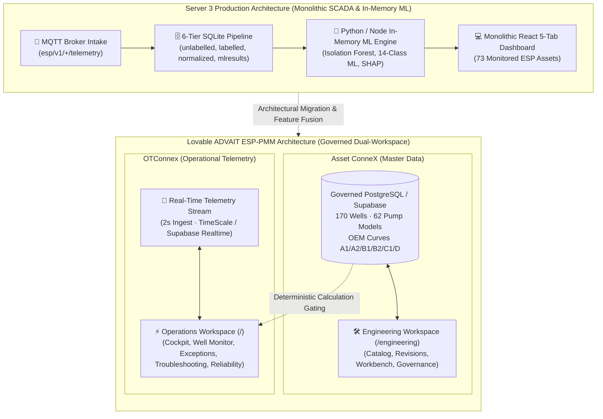

### 1.1 Philosophical & Architectural Paradigm Shift
- **Server 3 ML Dashboard** was conceived as an operational edge and surveillance tool for a specific 73-well cluster (Blocks 3 & 4). It tightly couples telemetry streaming, local disk persistence (SQLite 6-tier databases), mathematical feature dynamics (Pearson correlation matrices, OLS regression, Gaussian KDE), and machine-learning anomaly scoring into a single unified JavaScript dashboard.
- **Lovable ADVAIT ESP-PMM** is an enterprise-grade Asset Performance Management (APM v2.0) platform designed around the strict dual-workspace architecture:
  1. **Operations Workspace (`/`)**: Dedicated to real-time surveillance, exception triage, signature-based troubleshooting, and fleet reliability.
  2. **Engineering & Configuration Workspace (`/engineering`)**: Dedicated to governed master equipment specifications (Asset ConneX), calculation-grade pump curve management, well completion revisions, and deterministic simulation.

### 1.2 Master Data vs. Telemetry Stream Separation (Non-Pollution Rule)
A critical rule enforced in Lovable that must govern the migration is the **Separation of Concerns**:
- **Governed Master Data (`Asset ConneX`)**: Stores certified, immutable, versioned equipment definitions (OEM pump geometry, stage counts, motor winding limits, casing profiles, fluid PVT). *Real-time telemetry is never written to master data records.*
- **Operational Measurements (`OTConnex`)**: Stores high-frequency time-series measurements (PIP, PDP, motor current, winding temperature, frequency). *Master data is never estimated or fabricated from telemetry trends.*
- **Integration Rule**: In the unified architecture, Server 3's real-time calculations (e.g., in-situ H-Q degradation, TDH, power balance) become dynamic overlays computed by joining real-time OTConnex telemetry with certified Asset ConneX equipment baselines.

### 1.3 Compute, Inferencing & Calculation Gating
| Dimension | Server 3 ML Dashboard | Lovable ADVAIT ESP-PMM | Target Unified Strategy |
| :--- | :--- | :--- | :--- |
| **Telemetry Ingest** | Paho MQTT WebSockets directly in browser (`192.168.1.155:1883`) | Simulated / Supabase Edge WebSocket subscription (`2s scan`) | Enterprise WebSocket Gateway bridging MQTT broker topics directly to Supabase Realtime / React Query state. |
| **Historical Storage** | 4 Local SQLite databases (`unlabelled.db`, `labelled.db`, `normalized.db`, `mlresults.db`) | Relational PostgreSQL schema with Timescale hyper-tables in Supabase | Migrate SQLite tables into PostgreSQL tables with hyper-table partitioning for time-series and indexed JSONB for ML feature vectors. |
| **ML Inference** | Server-side Node/Python daemon executing Isolation Forest & 14-Class Random Forest / XGBoost | Heuristic rule evaluation in TypeScript + placeholders for ML inference | Deploy Server 3 ML models as containerized Python microservices (FastAPI/ONNX) pushing inference outputs to `esp_ml_inferences` table. |
| **Calculation Gating** | Open: Computes curves and metrics on all incoming data | Gated: Calculations lock if pump model is unverified (`C1`/`D` reliability grade) | Maintain Lovable's strict calculation gating to ensure that hydraulic simulations only execute when calculation-grade OEM curves exist (`A1`/`A2`/`B1`/`B2`). |

### 1.4 Asset Scale & Hierarchy Harmonization (73 Wells vs. 170 / 25 Wells)
- **Server 3 Monitored Fleet**: 73 physical wellheads (IDs: `FS-001` through `FS-073`, located in Blocks 3 & 4).
- **Lovable Governed Master Data**: 170 wellbores across 1 operational enterprise (`CCED`), referencing 62 distinct OEM pump models.
- **Lovable Operations Demo Fleet**: 25 live operational wells across 3 fields (`Nardah North`, `Kalisto West`, `Tamrin Deep`).
- **Harmonized Scale Strategy**:
  - The unified application registers all **170 wellbores** in the Asset ConneX master hierarchy.
  - The live operational stream accommodates all **73 real telemetry feeds** from Server 3, mapping them to the active operational registry, with the 25 Lovable demo wells serving as pre-configured scenario testbeds.

---

# 2. Global Shell & Navigation Mapping

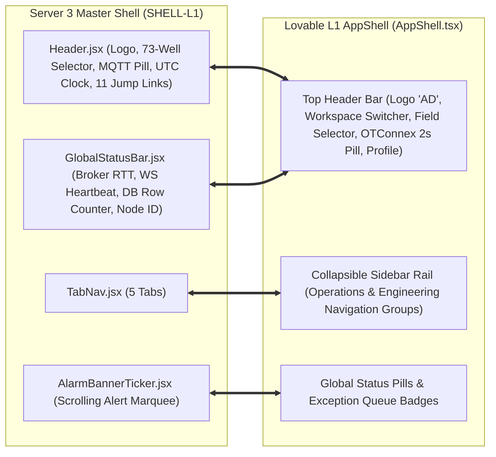

### 2.1 Master Header & L1 Application Shell Mapping

| Server 3 ML Dashboard Component (`Header.jsx`) | Lovable Equivalent Component (`AppShell.tsx`) | Parity Status | Mapping & Functional Integration |
| :--- | :--- | :--- | :--- |
| `[Company Brand Logo]` (CCED logo) | `Top Bar Header -> Logo Badge` (`"AD"`) | **Equivalent** | Replace placeholder `"AD"` badge with enterprise brand logo and system branding `"ADVAIT ESP-PMM"`. |
| `[System Title Label]` (`"ESP OPERATIONS CENTER"`) | `Top Bar Header -> Application Title` (`"ADVAIT ESP-PMM \| ESP Performance Monitoring & Management"`) | **Identical** | Serves as the global title banner. |
| `[Field Location Badge]` (`"BLOCKS 3 & 4"`) | `Top Bar Header -> Field Scope Selector` (`All fields (3)`, `Nardah North`, etc.) | **Equivalent** | Expand Lovable field dropdown to include Blocks 3 & 4 alongside regional asset fields. |
| `[Platform Version Pill]` (`"SCADA • APM v2.0"`) | `Workspace Selector Dropdown` (`Operations` vs `Configuration`) | **Equivalent** | Version pill merged with Lovable's top-level workspace switcher. |
| `[11 Quick Section Jump Links]` (Production KPIs, Controls, Telemetry, etc.) | Sub-navigation tab strip within `/wells/$wellId` and `/engineering/workbench` | **Equivalent** | Server 3 jump links were anchor tags for a single long page; in Lovable, these map cleanly to dedicated tabs within `/wells/$wellId` and page sub-routes. |
| `[Global Well Asset Selector Dropdown]` (73 wells) | `Header Asset Selector` & `/wells` Directory | **Identical** | Persist global well selector in top bar when in Operations mode, dynamically scoping `/wells/$wellId` and `/engineering/workbench`. |
| `[Dark/Light Theme Toggle Button]` | Global Tailwind dark mode provider | **Identical** | Retain global dark/light theme switching with SCADA high-contrast dark mode default. |
| `[Ingestion Collector Status Pill]` (`COLLECTOR ACTIVE`) | `StatusPill tone="normal"` (`"OTConnex live · 2 s scan"`) | **Identical** | Direct visual and functional match. |
| `[MQTT Broker Connection Status Button]` (`MQTT: CONNECTED`) | `MqttConnectionModal` trigger pill in Header | **Gap in Lovable** | Port Server 3's interactive MQTT broker modal trigger pill into Lovable top header. |
| `[Live System UTC Clock]` (Digital clock) | Top bar header utility element | **Partial** | Embed live UTC clock readout in Lovable global top bar. |

### 2.2 Alarm Ticker, Notification & Footer Status Mapping

| Server 3 Component | Lovable Equivalent Component | Parity Status | Technical Migration Recommendation |
| :--- | :--- | :--- | :--- |
| `AlarmBannerTicker.jsx` (Scrolling marquee of active field alarms with click-to-jump action) | `Top Bar Critical Alarm Pill` (`{N} critical open`) & `Exceptions Queue` (`/exceptions`) | **Partial** | Lovable uses static summary pills. Implement a collapsible top ticker marquee beneath the header in Lovable that pulls directly from `esp_incidents_labelled` and `/exceptions`. |
| `GlobalStatusBar.jsx` (API RTT latency, WebSocket heartbeat, SQLite row counter, MQTT topic, Node ID) | `AppShell` header badges & `/engineering/governance/sources` | **Partial** | Embed latency (ms) and socket heartbeat in Lovable footer rail or header status drawer for real-time telemetry diagnostics. |

### 2.3 Global Navigation Routing & View Switcher Matrix

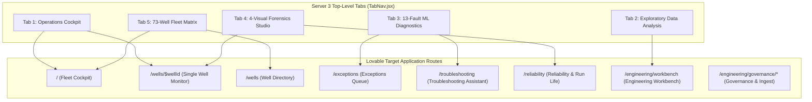

---

# 3. Detailed Screen-by-Screen Functional & Visual Mapping

---

## 3.1 Tab 1: Operations Cockpit (VIEW-01) ⟷ Lovable Fleet Cockpit (`/`) & Well Monitor (`/wells/$wellId`)

```mermaid
flowchart TD
    subgraph S3_Cockpit["Server 3 Operations Cockpit (VIEW-01)"]
        R1["Region 1: VFM & Production Ribbon"]
        R2["Region 2: System Summary 7-Card Grid"]
        R3["Region 3: Ingestion Stream Controls"]
        R4["Region 4: 14-Parameter Telemetry Matrix"]
        R5["Region 5: ML Diagnosis Banner"]
        R6["Region 6: Vertical Wellbore Drawing"]
        R7["Region 7: P10-P90 Operating Envelope"]
        R8["Region 8: Synchronized Trends Graph"]
        R9["Region 9: 13 Sparklines + Speed Advisor"]
        R10["Region 10: Real-Time Pump Curve"]
        R11["Region 11: Field Wells Health Matrix"]
        R12["Region 12: DB & CSV Historian Export"]
    end

    subgraph Lovable_Destinations["Lovable Target Views"]
        L_Kpi["Top KPI Strips (AppShell / Cockpit / Well Monitor)"]
        L_Gov["/engineering/governance/import (Ingestion Stream)"]
        L_Well_Overview["/wells/$wellId -> Tab 1 (Overview)"]
        L_Well_Trends["/wells/$wellId -> Tab 2 (Trends)"]
        L_Well_Point["/wells/$wellId -> Tab 3 (Operating point)"]
        L_Well_String["/wells/$wellId -> Tab 5 (ESP string)"]
        L_Exceptions["/exceptions (Prioritized Triage Queue)"]
        L_Directory["/wells (Fleet Table)"]
        L_Advisor["AdvisorPanel.tsx (ESP Advisor Drawer)"]
    end

    R1 --> L_Kpi
    R2 --> L_Kpi
    R3 --> L_Gov
    R4 --> L_Well_Overview
    R5 --> L_Exceptions
    R5 --> L_Advisor
    R6 --> L_Well_String
    R6 --> L_Well_Overview
    R7 --> L_Well_Overview
    R8 --> L_Well_Trends
    R9 --> L_Well_Trends
    R9 --> L_Advisor
    R10 --> L_Well_Point
    R11 --> L_Directory
    R12 --> L_Gov
```

### Granular Component & Metric Mapping:

#### 1. Virtual Flow Metering (VFM) & Production Ribbon (`ProductionKpiRibbon.jsx`)
- **Server 3 Metrics**: Energy Balance Status (`ENERGY BALANCE: VERIFIED` / `WELL SHUT-IN`), Energy Variance % ($\text{Var} = \frac{P_{hyd} - P_{elec}}{P_{elec}}$), Hydraulic Power (HP), Electrical Power (HP), Gross Liquid Rate (BPD), Net Oil Rate (BOPD), Produced Water Volume (BWPD with Water Cut %), Associated Gas Rate (MSCFD), Lost Production Deferment (BPD), Power Conversion Efficiency ($\eta_{sys} = \frac{\text{Hydraulic HP}}{\text{Electrical HP}} \times 100\%$).
- **Lovable Placement**:
  - Global Fleet Aggregates $\rightarrow$ `/` Top KPI Summary Strip (`KpiCard`: `OIL RATE 26,052 bopd`, `PRODUCTION DEFERMENT 4,676 bopd`, `VALUE AT STAKE $330.9k/day`).
  - Single Well Real-Time VFM $\rightarrow$ `/wells/$wellId` Header `KpiStrip` (Tiles: `LIQUID / OIL: 3,180 / 1,431 bpd`, `DEFERMENT: 0 bopd`).
- **Parity Status**: **Equivalent**.
- **Migration Enhancement**: Add the exact physical formulas from Server 3 (`Hydraulic HP = (Q * TDH * SG) / 3960`, `Electrical HP = (sqrt(3) * V * I * PF * eff) / 746`) directly into Lovable `/wells/$wellId` Tab 1 Overview panel.

#### 2. System Operational Summary 7-Card Grid (`SystemSummary.jsx`)
- **Server 3 Metrics**: Total Telemetry Records, Ingestion Speed (`rec/sec`), Active Wellhead Count (`73/73`), MQTT Uptime, Fleet Nominal Health % (`94.5%`), Active Trip Alarms, Storage Disk Usage.
- **Lovable Placement**: `/` Fleet Cockpit Header + `/reports` Management Scorecard.
- **Parity Status**: **Equivalent**.

#### 3. Ingestion & Stream Controls (`IngestionControls.jsx`)
- **Server 3 Controls**: Simulator Run/Pause, Speed Multiplier (1x, 2x, 5x, 10x), Active Well Radio Chips, Scenario Injection Dropdown (`Gas Lock`, `Scale`, `Broken Shaft`, `Motor Overheat`), Stream Reset Button.
- **Lovable Placement**: Admin / Simulation Drawer & `/engineering/governance/import`.
- **Parity Status**: **Partial (Gap in UI controls)**.
- **Migration Enhancement**: Embed an Ingestion Stream Control toolbar in Lovable for testing and operator scenario simulations.

#### 4. 14-Parameter Live Telemetry Matrix (`TelemetryTable.jsx`)
- **Server 3 Sensors**: Intake Pressure (PIP), Discharge Pressure (PDP), Wellhead Pressure (WHP), Flowline Pressure (FLP), Casing Pressure (AP), Motor Current (Amps), Bus Voltage (Volt), Operating Frequency (Hz), Cable Leakage Current (mA), Downhole Gauge Current (mA), Motor Internal Temp (°C), Intake Fluid Temp (°C), Radial Vibration RMS (G), Liquid Rate (BPD).
- **Lovable Placement**: `/wells/$wellId` Tab 1 Overview & Tab 5 ESP String Component Registry.
- **Parity Status**: **Identical**. All 14 physical tags map 1:1.

#### 5. Active ML Diagnosis Banner (`DiagnosisBanner.jsx`)
- **Server 3 Elements**: Diagnostic State Badge (`HEALTHY NOMINAL` vs `ACTIVE ANOMALY DETECTED`), Primary Fault Classification string, ML Confidence %, Circular Health Index Gauge (0-100), Isolation Forest Outlier Score, Estimated Time to Trip (ETT), Prescriptive Operational Action Box.
- **Lovable Placement**: `/wells/$wellId` PageHeader + `AdvisorPanel.tsx` (ESP Advisor Drawer) + `/exceptions` Right Dossier.
- **Parity Status**: **Equivalent**.

#### 6. Digital Twin Vertical Wellbore Drawing (`WellboreSchematic.jsx`)
- **Server 3 Visual**: SVG cross-section showing Surface Wellhead (WHP/FLP), Casing & Annulus (AP), PSD Marker (ft), Multistage ESP Pump (PDP), Gas Separator (PIP/Int Temp), Protector/Seal (Vibration Vx), Submersible Motor (Temp/Volt/Amps), Downhole Gauge (DHG), and 4 Depth-Calibrated Telemetry Callout Panels.
- **Lovable Component**: `EspWellVisual.tsx` (Full vertical downhole SVG schematic in `/wells/$wellId` Tab 1 Overview and Tab 5 ESP String, plus `/troubleshooting`).
- **Parity Status**: **Identical & Enhanced in Lovable**. Lovable's `EspWellVisual` provides interactive marker tooltips bound to Asset ConneX component specifications.

#### 7. Statistical Operating Envelope P10–P90 Grid (`OperatingEnvelopeCorridor.jsx`)
- **Server 3 Visual**: 14 individual parameter cards showing Current Live Value, P10 Lower Bound, P50 Median Baseline, P90 Upper Bound, and dynamic horizontal range position bar.
- **Lovable Placement**: `/wells/$wellId` Tab 1 `OPERATING ENVELOPE` panel & `/engineering/installations/limits`.
- **Parity Status**: **Equivalent**. Port Server 3's 14-parameter corridor visual into `/wells/$wellId` Tab 1.

#### 8. Multi-Axis Synchronized Time-Series Trends (`SynchronizedTrends.jsx`)
- **Server 3 Visual**: 60-minute Chart.js multi-axis line graph plotting PIP (cyan), PDP (blue), Amps (yellow), Motor Temp (red), Frequency (amber) with crosshair tooltip and legend toggles.
- **Lovable Component**: `TrendChart.tsx` in `/wells/$wellId` Tab 2 Trends View (24h, 7d, 30d, 60d ranges with multi-signal tag selection).
- **Parity Status**: **Identical**.

#### 9. 13-Sensor Sparkline Grid & AI Speed Advisor (`LiveTelemetryGrid.jsx`)
- **Server 3 Visual**: 13 mini area sparkline cards with live reading, rate of change (+/- per min), and min/max limits; plus AI VSD Frequency Advisor Card (Current Hz, Target Hz, Expected BOPD Uplift, Thermal Safety Check).
- **Lovable Placement**: `/wells/$wellId` Tab 2 Trends + `AdvisorPanel.tsx` (Optimization Advisories).
- **Parity Status**: **Equivalent**.

#### 10. Real-Time Pump Performance H-Q Curve (`PumpPerformanceCurve.jsx`)
- **Server 3 Visual**: 2D Total Dynamic Head (ft) vs. Liquid Flow Rate (BPD), factory catalog curve scaled to frequency via affinity laws ($\frac{Q_1}{Q_2} = \frac{N_1}{N_2}$, $\frac{H_1}{H_2} = (\frac{N_1}{N_2})^2$), ROR shaded region, BEP star marker, live operating point dot, and operating zone classification.
- **Lovable Component**: `MiniOperatingPoint.tsx` in `/wells/$wellId` Tab 1 Overview & Tab 3 Operating Point Detail, plus full simulation in `/engineering/workbench`.
- **Parity Status**: **Identical**.

#### 11. Field Wells Health Card Matrix (`FleetHealthGrid.jsx`)
- **Server 3 Visual**: Responsive grid of cards for assets FS-001 to FS-073 with Well ID, Health Score Pill, Status Badge, Diagnostic Summary, Liquid Rate, and Inspect Action.
- **Lovable Placement**: `/` Fleet Cockpit (`Needs Attention Now` + `Optimization Opportunities`) and `/wells` (`FleetTable.tsx`).
- **Parity Status**: **Equivalent**.

#### 12. SQLite Database & CSV Historian Export (`DatabaseExportSection.jsx`)
- **Server 3 Tools**: Download buttons for `unlabelled.db`, `labelled.db`, `normalized.db`, `mlresults.db`, CSV export, and Browse SQLite Historian modal.
- **Lovable Placement**: `/engineering/governance/sources`, `/engineering/governance/import`, and data export actions in `/wells` and `/reports`.
- **Parity Status**: **Partial**. Retain direct CSV export across all Lovable tables and provide a Telemetry Historian Query interface in Governance.

---

## 3.2 Tab 2: Exploratory Data Analysis & Physics Dynamics (VIEW-02) ⟷ Lovable Engineering Workbench (`/engineering/workbench`) & Analytics

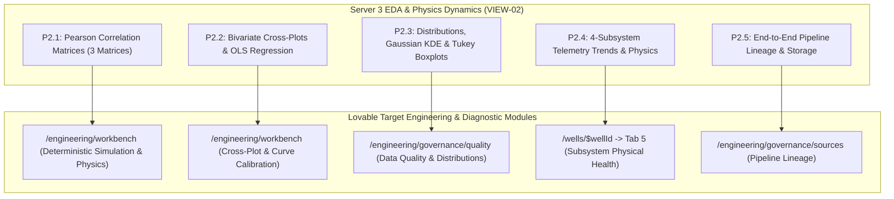

### Granular Analytical Module Mapping:

#### 1. Top Controls & 6-Tier Breadcrumb Banner
- **Server 3 Elements**: Well selector, Sample depth limit (50, 100, 150, 300, 500 rows), Live Sync toggle (3.5s scan), Manual refresh button, and 6-Tier Pipeline Breadcrumb (`MQTT Stream` $\rightarrow$ `labelled.db` $\rightarrow$ `unlabelled.db` $\rightarrow$ `normalized.db` $\rightarrow$ `ML-Model-Layers` $\rightarrow$ `mlresults.db`).
- **Lovable Placement**: Top header of `/engineering/workbench` and `/engineering/governance/sources`.
- **Parity Status**: **Equivalent**.

#### 2. Sub-View P2.1: Pearson Correlation Matrices (3 Matrices)
- **Matrix 1 (14×14 Inputs × Inputs)**: Heatmap grid showing pairwise Pearson coefficients ($r \in [-1.0, +1.0]$) between all 14 sensors, selected pairwise inspector card (physical mechanism explanation, commercial impact), and ranked pairwise sensitivity table (91 unique pairs) with threshold filter ($|r| \ge 0, 0.4, 0.6, 0.75$) and CSV export.
- **Matrix 2 (14×13 Inputs × Fault Types)**: Heatmap showing how each sensor correlates with each canonical fault mode.
- **Matrix 3 (13×13 Fault Types × Fault Types)**: Cascading failure risk matrix revealing secondary failure chains (e.g. Gas Lock $\rightarrow$ Fluid Velocity Starvation $\rightarrow$ Motor Thermal Overload).
- **Lovable Placement**: Dedicated "Correlation & Feature Dynamics" tab inside `/engineering/workbench` and diagnostic rule backing in `/troubleshooting`.
- **Parity Status**: **Partial (High-Value Feature to Port)**.
- **Migration Recommendation**: Port all 3 Pearson correlation matrices directly into Lovable `/engineering/workbench` as an advanced analytical studio.

#### 3. Sub-View P2.2: Bivariate Cross-Plots & OLS Regression
- **Server 3 Components**: 6 Petroleum Physics Presets:
  1. *Hydraulic Head*: PIP vs. PDP
  2. *Affinity & Load*: Frequency vs. Motor Current
  3. *Thermal Dissipation*: Motor Current vs. Motor Internal Temp
  4. *Production vs. PIP*: PIP vs. Liquid Rate
  5. *Vibration vs. Speed*: Frequency vs. Radial Vibration
  6. *Thermal Delta*: Intake Temp vs. Motor Internal Temp
- **Analytical Outputs**: Interactive SVG scatter canvas, live pulsing telemetry point, Ordinary Least Squares (OLS) linear trendline ($y = mx + c$), Pearson $r$ gauge, Coefficient of Determination ($R^2$), Slope ($m$), Intercept ($c$), and Physical Engineering Interpretation narrative.
- **Lovable Placement**: Integrated into `/engineering/workbench` as the "Bivariate Regression & Sensor Calibration" module.
- **Parity Status**: **Partial (Direct Port to Workbench)**.

#### 4. Sub-View P2.3: Distributions, Gaussian KDE & 1.5×IQR Outlier Boxplots
- **Server 3 Visuals**: Dual SVG canvas featuring:
  - Top Panel: Gaussian Kernel Density Estimation (KDE) probability curve with shaded area and arithmetic mean ($\mu$) dashed line.
  - Bottom Panel: Tukey 1.5×IQR horizontal box-and-whisker plot (Min, Lower Fence $[Q_1 - 1.5\text{IQR}]$, $Q_1$, $P_{50}$, $Q_3$, Upper Fence $[Q_3 + 1.5\text{IQR}]$, Max, red outlier markers).
  - 10-Moment Statistical Summary: Mean $\mu$, Std Dev $\sigma$, Median $P_{50}$, IQR, $Q_1$, $Q_3$, Min, Max, Skewness, Excess Kurtosis.
  - Tukey Outlier Fence Warning Alert card.
- **Lovable Placement**: Embedded in `/engineering/governance/quality` (Data Quality & Reconciliation Queue) and `/wells/$wellId` telemetry data quality modal.
- **Parity Status**: **Partial (Port to Lovable Governance & Quality)**.

#### 5. Sub-View P2.4: 4-Subsystem Telemetry Trends & Physics Derivatives
- **Server 3 Cards**:
  1. *Hydraulic Subsystem*: $\Delta P = \text{PDP} - \text{PIP}$ (PSI), Total Dynamic Head (TDH in ft), sensor status pills.
  2. *Electrical Subsystem*: Torque Proxy $A/\text{Hz} = \frac{\text{Current}}{\text{Frequency}}$, Apparent Power (kVA), sensor status pills.
  3. *Thermal Subsystem*: Thermal Elevation $\Delta T = T_{\text{motor}} - T_{\text{intake}}$, Arrhenius insulation degradation factor, sensor status pills.
  4. *Mechanical & Production Subsystem*: Radial Vibration RMS ($G$), ISO 10816 Class I vibration grading, Liquid Rate (BPD), sensor status pills.
  - Clicking any card opens the draggable Draggable Subsystem Physics Pop-Up Window (Overlay O5).
- **Lovable Placement**: `/wells/$wellId` Tab 1 Overview & Tab 5 ESP String.
- **Parity Status**: **Equivalent**.

#### 6. Sub-View P2.5: End-to-End Telemetry Pipeline Lineage & SQLite Architecture
- **Server 3 Cards**: 6 Ingestion Stage Cards (Tiers 1–6) detailing database schemas, row counts, and disk paths.
- **Lovable Placement**: `/engineering/governance/sources` (Source & Provenance Registry) + `/engineering/governance/import`.
- **Parity Status**: **Identical**.

---

## 3.3 Tab 3: 13-Fault ML Diagnostics Workbench (VIEW-03) ⟷ Lovable Troubleshooting (`/troubleshooting`) & Exceptions Queue (`/exceptions`)

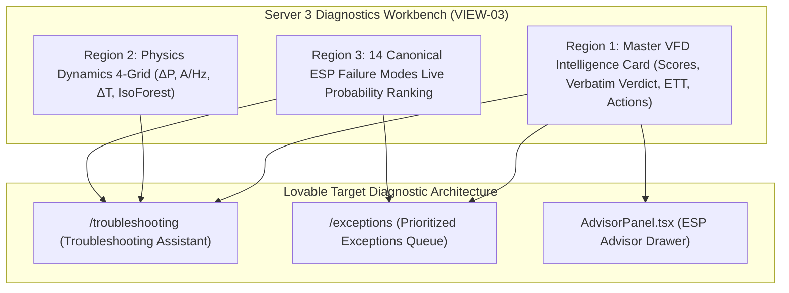

### Granular Diagnostic Feature Mapping:

#### 1. Master VFD Intelligence Card
- **Server 3 Features**: Asset ID, Status Badge (`HEALTHY` vs `ANOMALY DETECTED`), Health Index Score (0-100), Isolation Forest Anomaly Score %, Verbatim ML Output Callout (e.g. `"Anomaly is Detected — Gas Interference & Lock"`), Primary Failure Candidate + Likelihood %, Secondary Failure Candidate + Likelihood %, Estimated Time to Trip (ETT: `Stable Operation`, `24h–48h`, or `TRIPPED`), and Prescriptive Action Advisory.
- **Lovable Counterparts**:
  - `/troubleshooting` Diagnostic Card Header & Case Dossier.
  - `/exceptions` Right Panel Investigation Dossier (`EX-xx` with Rule, Observation, Evidence, Ranked Likely Causes %, Verification Steps, Recommended Action).
  - `AdvisorPanel.tsx` in `/wells/$wellId`.
- **Parity Status**: **Identical & Harmonized**.

#### 2. Physics Dynamics 4-Grid
- **Server 3 Cards**:
  1. *Differential Pressure ($\Delta P$)*: Flagged red if $< 800\text{ PSI}$, calibrated to $P_{50}$.
  2. *Torque Proxy ($A/\text{Hz}$)*: Flagged red if $< 1.0$ or $> 2.0\text{ A/Hz}$, calibrated to $P_{50}$.
  3. *Thermal Elevation ($\Delta T$)*: Flagged red if $> +50^\circ\text{C}$, calibrated to baseline.
  4. *Isolation Forest Flag*: `NOMINAL` vs `ANOMALOUS` (100 Estimators, 2% Contamination).
- **Lovable Placement**: Diagnostic Signature Table in `/troubleshooting` + KPI warning badges in `/wells/$wellId`.
- **Parity Status**: **Identical**.

#### 3. 14 Canonical ESP Failure Modes Live Probability Distribution
- **Server 3 14-Mode Model**:
  1. `Motor Thermal Overload`
  2. `Gas Interference & Lock`
  3. `Intake Pressure Drawdown`
  4. `Scale or Pump Wear`
  5. `Bearing Degradation`
  6. `Broken Shaft / Free Spin`
  7. `Blocked Intake / Screen`
  8. `Sand Ingestion`
  9. `High Viscosity Cold Start`
  10. `High Backpressure`
  11. `Open Choke Flashing`
  12. `Undervoltage`
  13. `Phase Imbalance`
  14. `Wellbore Inflow Variability`
- **Lovable Representation**:
  - `/troubleshooting`: `Signature library` cases (`TS-01` through `TS-14`) and `Ranked Causes` percentage progress bars.
  - `/exceptions`: Prioritized triage queue categorizing all fleet exceptions by these canonical failure modes.
- **Parity Status**: **Identical**. Server 3's ML probability distribution directly populates Lovable's `Ranked Causes` cards.

---

## 3.4 Tab 4: 4-Visual Forensic Visuals Studio (VIEW-04) ⟷ Lovable Well Monitor History, Diagnostics & Reliability (`/reliability`)

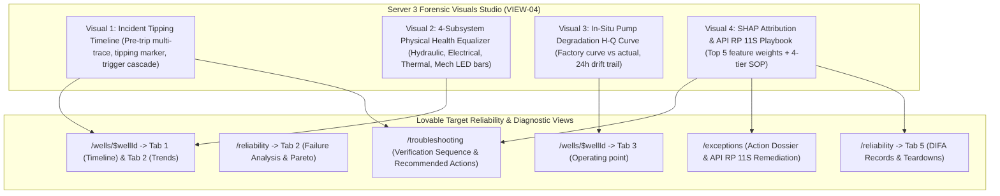

### Detailed Forensic Visuals Mapping:

#### 1. Forensic Visual 1: Incident Tipping Timeline (`IncidentTippingTimeline.jsx`)
- **Server 3 Features**: Pre-trip duration filters (`1h`, `4h`, `12h`, `24h`, `All`), Live vs. Historian mode toggle, Auto-Zoom Tipping Point toggle, Multi-trace synchronized canvas (PIP, PDP, Amps, Hz, Temp), Dashed vertical red tipping point marker line, Interactive hover inspector, and Cascade Trigger Culprit Panel (Step 1 $\rightarrow$ Step 2 $\rightarrow$ Step 3).
- **Lovable Placement**:
  - `/wells/$wellId` Tab 1: `OPERATING STATE TIMELINE` & `WHAT CHANGED` panels.
  - `/troubleshooting`: `Supporting evidence` 7-day multi-tag trend with alarm bands.
- **Parity Status**: **Equivalent**. Port Server 3's dedicated Tipping Timeline zoom canvas into Lovable `/troubleshooting` and `/wells/$wellId`.

#### 2. Forensic Visual 2: 4-Subsystem Physical Health Equalizer (`SubsystemEqualizer.jsx`)
- **Server 3 Features**: Audiophile-style graphic equalizer with vertical LED level bars for Hydraulic (PIP, PDP, $\Delta P$, FLP, WHP), Electrical (Amps, Volts, Hz, Leakage, DHG), Thermal (Motor T, Int T, $\Delta T$), and Mechanical (Vx, BPD, A/Hz), with deviation arrows ($\pm\%$) and status badges.
- **Lovable Placement**: `/wells/$wellId` Overview & Subsystem Equalizer Component.
- **Parity Status**: **Partial (High-Value Visual to Embed)**.

#### 3. Forensic Visual 3: In-Situ Pump Degradation H-Q Curve (`PumpPerformanceCurveView.jsx`)
- **Server 3 Features**: H-Q Performance canvas (Head ft vs Flow BPD), Factory catalog curve scaled via affinity laws, Safe operating window, Live operating point marker, Historical 24-hour ghosted drift trail, and Degradation Metrics Card (Head degradation %, Efficiency loss %, Operating zone).
- **Lovable Placement**: `/wells/$wellId` Tab 3 (`Operating point`) & `/engineering/workbench`.
- **Parity Status**: **Identical & Enhanced**.

#### 4. Forensic Visual 4: SHAP Attribution Waterfall & API RP 11S Playbook (`ShapWaterfallPlaybook.jsx`)
- **Server 3 Features**:
  - *Panel A (SHAP Waterfall)*: Horizontal bar chart ranking top 5 sensor contributors ($\Delta\text{PIP}$, $\Delta\text{PDP}$, $\Delta\text{Amps}$, $\Delta T_{\text{motor}}$, $\Delta V_x$) with risk badges.
  - *Panel B (4-Tier API RP 11S Playbook)*:
    1. *Tier 1: Immediate Safety & Remote Lockout* (Red border: Lockout restart, do not bypass trips).
    2. *Tier 2: Field Mechanical & Electrical Verification* (Amber border: Backspin lockout $>30\text{ min}$, Megger $>50\text{ M}\Omega$).
    3. *Tier 3: Physical Root Cause Assessment* (Cyan border: Hydrodynamic findings).
    4. *Tier 4: Recovery Ramp & Normalization Procedure* (Green border: Vent casing, restart at 35 Hz, ramp 1 Hz / 5 min).
- **Lovable Placement**:
  - SHAP Waterfall $\rightarrow$ `/troubleshooting` Case Diagnostic Card & `/exceptions` Evidence Panel.
  - 4-Tier API RP 11S Playbook $\rightarrow$ `/troubleshooting` (`VERIFICATION SEQUENCE` & `RECOMMENDED ACTIONS`) and `/exceptions` Remediation Dossier.
- **Parity Status**: **Identical**.

---

## 3.5 Tab 5: 73-Well Fleet Matrix Overview (VIEW-05) ⟷ Lovable Well Directory (`/wells`) & Governed Installed Fleet (`/engineering/installations`)

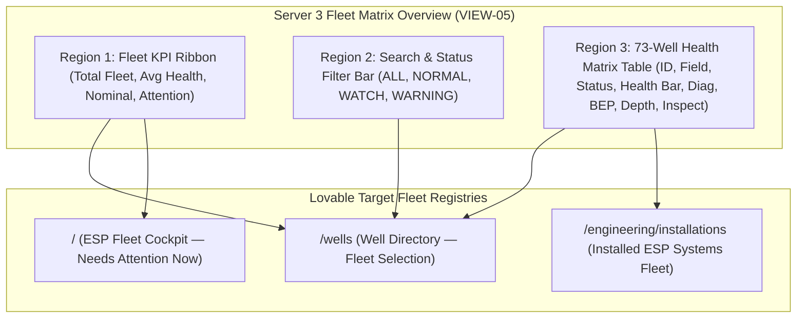

### Detailed Fleet View Mapping:

| Server 3 ML Dashboard Feature (`FleetOverviewView.jsx`) | Lovable Equivalent Route / Component | Parity Status | Functional Mapping & Behavior |
| :--- | :--- | :--- | :--- |
| `[Total Monitored Fleet Tile]` (`73 Wells`) | `/` Cockpit KPI Strip (`WELLS RUNNING: 22/25`) & `/wells` Header | **Identical** | Displays active fleet count dynamically bound to monitored assets. |
| `[Fleet Average Health Index Tile]` (`92/100`) | `/` Cockpit KPI Strip (`FLEET ESP HEALTH INDEX: 65.7`) | **Identical** | Fleet-weighted health index score. |
| `[Steady-State Nominal Tile]` (`68 Wells`) | `/` Cockpit Field Summary Chips (`Inside recommended range 88%`) | **Equivalent** | Count of assets operating safely within P10-P90 envelope. |
| `[Attention Required Tile]` (`5 Wells`) | `/` Cockpit Needs Attention Panel & `{N} critical open` Pill | **Identical** | Count of assets with Watch/Warning/Critical status. |
| `[Well Search Input Box]` | `/wells` Search Input & `/engineering/installations` Filter | **Identical** | Search by Well ID, field name, pump model, or fault diagnosis. |
| `[Status Filter Buttons]` (`ALL`, `NORMAL`, `WATCH`, `WARNING`) | `/exceptions` ToggleRow & `/wells` Table Filters | **Identical** | One-click filtering by operating health state. |
| `[73-Well Health Matrix Table]` (8 Columns: ID, Field, Status, Health Index with mini-bar, Assessment, BEP BPD, PSD ft, Action) | `/wells` `FleetTable.tsx` (11 Columns) & `/engineering/installations` | **Identical & Enhanced** | Lovable's `FleetTable` includes all 8 Server 3 columns plus Frequency (Hz), Current (A), PIP (psi), PDP (psi), Motor Temp (°F), and Run Life (days). |

---

## 3.6 Global Overlays, Drawers & Pop-Up Windows Mapping

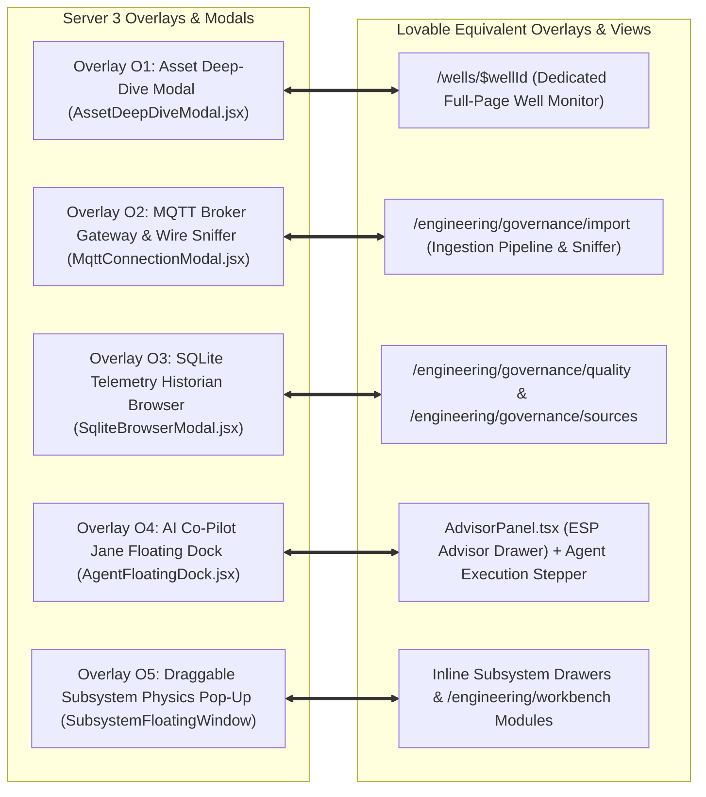

### Granular Overlay & Modal Mapping:

#### 1. Overlay O1: Asset Deep-Dive Modal (`AssetDeepDiveModal.jsx`)
- **Server 3 Features**: Full-screen modal with Time range selector (`1h`, `6h`, `24h`, `7d`, `30d`, `all`), Tab switcher (`Overview`, `Trends`, `Table`), 5-Domain Health Radar, Composite Health Meter, Out-of-Spec Corridor Warnings, Prescriptive Action Box, High-Resolution Trend Line Chart, and Historical Tabular Grid with CSV export.
- **Lovable Architecture**: In Lovable, this modal is superseded by the dedicated, full-featured **Single Well Monitor route (`/wells/$wellId`)**, providing all 3 tabs plus dedicated tabs for Operating Point, Pressure Profile, ESP String, and Events & Exceptions.
- **Parity Status**: **Identical & Superseded by Full Route**.

#### 2. Overlay O2: MQTT Broker Gateway & Wire Packet Sniffer (`MqttConnectionModal.jsx`)
- **Server 3 Features**:
  - *Config Tab*: Broker Host IP (`192.168.1.155`), TCP Port (`1883`), Topic Filter Selector (`esp/v1/+/telemetry`), Save & Reconnect, Disconnect.
  - *Packets Tab*: Live Wire Sniffer terminal (scrolling monospace raw JSON packets), Throughput counters (Total Packets, Msgs/sec), Auto-scroll toggle, Clear terminal button.
- **Lovable Target Placement**: Embed inside `/engineering/governance/import` (Import & Catalog Administration Pipeline) and accessible via top bar MQTT connection pill.
- **Parity Status**: **Partial (Port to Lovable Governance)**.

#### 3. Overlay O3: SQLite Telemetry Historian Database Browser (`SqliteBrowserModal.jsx`)
- **Server 3 Features**: Database switcher tabs (`unlabelled`, `labelled`, `normalized`, `mlresults`), Status filter (`ALL`, `NORMAL`, `ANOMALY`), Pagination (25, 50, 100 rows), full schema grid view, and Direct CSV download.
- **Lovable Target Placement**: Governed Data Browser in `/engineering/governance/sources` & `/engineering/governance/quality`.
- **Parity Status**: **Equivalent**.

#### 4. Overlay O4: AI Engineering Co-Pilot Jane Floating Dock (`AgentFloatingDock.jsx`)
- **Server 3 Features**: Floating trigger pill (robot avatar + unread badge), Resizable slide-out drawer (400px–800px), Multi-turn conversational dialogue, Execution Plan Stepper (`AgentPlanStepper.jsx` with steps: `PENDING`, `IN_PROGRESS`, `COMPLETED`, `FAILED`), Amber Safety Approval Banner (`Approve & Execute` vs `Reject / Abort`), 4-Tab Advisory Deck (`Executive Advisory`, `Physics & Calculations`, `API RP 11S Playbook`, `Agent Reasoning Traces`), and Prompt Shortcuts.
- **Lovable Component**: `AdvisorPanel.tsx` (ESP Advisor collapsible drawer on `/wells/$wellId` right rail).
- **Parity Status**: **Partial (High-Value Agent Engine Integration)**.
- **Migration Enhancement**: Upgrade Lovable's `AdvisorPanel.tsx` by integrating Server 3's interactive multi-turn chat, execution plan stepper, and Server 2 safety-gated actuation approval workflow.

#### 5. Overlay O5: Draggable 4-Subsystem Physics Pop-Up Window (`SubsystemFloatingWindow`)
- **Server 3 Features**: Draggable floating window with maximize/restore toggle, styled in subsystem theme colors, containing 4 internal tabs: `Live Gauges`, `First-Principles Physics` (mathematical proofs), `Degradation Modes`, and `SOP Guidelines`.
- **Lovable Target Placement**: Accessible directly from `/wells/$wellId` Tab 5 ESP String and `/engineering/workbench`.
- **Parity Status**: **Equivalent**.

---

# 4. Comprehensive Feature Parity, Similarity & Gap Matrix

| # | ML Dashboard Component / Feature (Server 3) | Lovable Equivalent Route / Component | Parity Status | Detailed Functional Comparison & Gaps | Technical Migration Recommendation |
| :---: | :--- | :--- | :---: | :--- | :--- |
| **1** | **Master Top Header** (`Header.jsx`) | `AppShell.tsx` (Top Header Bar) | **Identical** | Both host company branding, title, field scope, telemetry status pill, and theme toggle. | Standardize branding to CCED / ADVAIT ESP-PMM and retain unified dark SCADA theme. |
| **2** | **73-Well Global Asset Selector** | Header dropdown / `/wells` directory | **Identical** | Both allow global selection of active wellbore to re-bind all dashboard views. | Connect selector state to React Query context across all Operations & Workbench routes. |
| **3** | **Real-Time Alarm Ticker Bar** (`AlarmBannerTicker.jsx`) | Header `{N} critical open` pill & `/exceptions` | **Partial** | Server 3 features an animated marquee ticker with click-to-jump; Lovable uses static pills and full queue. | Add a collapsible animated alarm marquee directly under Lovable top header. |
| **4** | **Global Status & Latency Footer** (`GlobalStatusBar.jsx`) | Top bar badges & `/engineering/governance/sources` | **Partial** | Server 3 exposes live RTT latency (ms), WebSocket status, DB rows, and Node ID in persistent footer. | Integrate latency and socket health indicator into Lovable bottom bar or status dropdown. |
| **5** | **VFM Production Ribbon** (`ProductionKpiRibbon.jsx`) | `/` Top KPI Cards & `/wells/$wellId` `KpiStrip` | **Equivalent** | Both track Gross Liquid, Net Oil, Water Cut, Deferment, and Hydraulic/Electrical Power Balance. | Ensure exact physical equations ($\text{TDH}$, $\text{Hydraulic HP}$, $\text{Electrical HP}$) are displayed in `/wells/$wellId`. |
| **6** | **System Summary 7-Card Grid** (`SystemSummary.jsx`) | `/` Top KPI Summary Strip & `/reports` | **Equivalent** | Both display total records, active wells, fleet nominal health %, and trip counters. | Map 7-card fleet KPIs 1:1 to Lovable Fleet Cockpit top strip. |
| **7** | **Ingestion Stream Controls** (`IngestionControls.jsx`) | `/engineering/governance/import` | **Gap in UI** | Server 3 allows operators to start/pause simulation, adjust speed (1x–10x), and inject fault scenarios. | Build an Ingestion Simulator Control drawer in Lovable for testing and demonstration. |
| **8** | **14-Parameter Live Telemetry Matrix** (`TelemetryTable.jsx`) | `/wells/$wellId` Tab 1 & Tab 5 | **Identical** | Full support for PIP, PDP, WHP, FLP, AP, Amps, Volts, Hz, Leakage, DHG Current, Motor T, Int T, Vib, Rate. | Verify that all 14 canonical sensor tags are mapped to Supabase time-series schema. |
| **9** | **Active ML Diagnosis Banner** (`DiagnosisBanner.jsx`) | `/wells/$wellId` PageHeader & `AdvisorPanel.tsx` | **Equivalent** | Both show health index score, anomaly status, detected fault, confidence %, and prescriptive actions. | Direct data binding from `esp_ml_inferences` to Lovable well header and Advisor drawer. |
| **10** | **Vertical Wellbore Digital Twin** (`WellboreSchematic.jsx`) | `EspWellVisual.tsx` in `/wells/$wellId` & `/troubleshooting` | **Identical** | Both render full downhole assembly (wellhead, casing, pump, intake, seal, motor, gauge). | Lovable's `EspWellVisual` is already interactive and data-linked to Asset ConneX. |
| **11** | **P10–P90 Statistical Corridor Grid** (`OperatingEnvelopeCorridor.jsx`) | `/wells/$wellId` Tab 1 `OPERATING ENVELOPE` | **Equivalent** | Both display live sensor readings relative to P10 lower, P50 median, and P90 upper baseline bounds. | Embed the 14-parameter corridor visual directly in `/wells/$wellId` Overview tab. |
| **12** | **Multi-Axis Synchronized Trends** (`SynchronizedTrends.jsx`) | `TrendChart.tsx` in `/wells/$wellId` Tab 2 | **Identical** | Both support multi-trace time-series line charts with crosshairs, zoom, and tag toggles. | Standardize time windows to 24h, 7d, 30d, 60d in Lovable `TrendChart`. |
| **13** | **13-Sensor Sparkline Grid** (`LiveTelemetryGrid.jsx`) | `/wells/$wellId` Tab 2 Trends | **Equivalent** | Mini area sparkline graphs for all physical channels with min/max and rate of change. | Embed mini sparkline grid in Lovable `/wells/$wellId` Tab 2. |
| **14** | **AI VSD Speed Advisor** (`LiveTelemetryGrid.jsx`) | `AdvisorPanel.tsx` (Optimization Advisories) | **Identical** | Recommends optimal frequency target (+/- Hz), expected BOPD increment, and thermal safety checks. | Ensure advisory engine outputs are rendered in Lovable `AdvisorPanel` cards. |
| **15** | **Real-Time Pump H-Q Curve** (`PumpPerformanceCurve.jsx`) | `MiniOperatingPoint.tsx` & `/engineering/workbench` | **Identical** | Factory catalog curve dynamically scaled via affinity laws, ROR window, BEP marker, live operating point. | Uses Asset ConneX certified OEM curve points when available, with fallback to ROR bounds. |
| **16** | **73-Well Health Card Grid** (`FleetHealthGrid.jsx`) | `/` Fleet Cockpit & `/wells` Directory | **Equivalent** | Both display health status cards for all field assets with quick inspect navigation. | Seamless mapping between card view and `/wells` high-density tabular view. |
| **17** | **SQLite DB Export & Historian** (`DatabaseExportSection.jsx`) | `/engineering/governance/sources` & CSV Export | **Partial** | Direct download of `.db` files vs. enterprise database export. | Implement CSV and JSON dataset export utilities across all Lovable tabular views. |
| **18** | **Pearson Correlation Matrices** (`DataAnalysisView.jsx`) | `/engineering/workbench` (Analytical Studio) | **Gap in Lovable** | 3 Interactive Heatmaps: Inputs × Inputs (14×14), Inputs × Faults (14×13), Faults × Faults (13×13). | Port all 3 Pearson correlation matrix components directly into Lovable `/engineering/workbench`. |
| **19** | **Bivariate Cross-Plots & OLS Regression** (`DataAnalysisView.jsx`) | `/engineering/workbench` | **Gap in Lovable** | 6 physics presets, live pulsing telemetry point, OLS regression line ($y=mx+c$), $R^2$, slope, intercept. | Port Bivariate Cross-Plot and OLS regression engine into `/engineering/workbench`. |
| **20** | **Gaussian KDE & 1.5×IQR Boxplots** (`DataAnalysisView.jsx`) | `/engineering/governance/quality` | **Gap in Lovable** | Gaussian KDE probability curve, Tukey 1.5×IQR boxplot with outliers, 10-moment statistical summary. | Port KDE distributions and Tukey boxplots into Lovable Governance & Quality studio. |
| **21** | **4-Subsystem Telemetry Grid** (`DataAnalysisView.jsx`) | `/wells/$wellId` Tab 1 & Tab 5 | **Equivalent** | Hydraulic ($\Delta P$/TDH), Electrical ($A/\text{Hz}$/kVA), Thermal ($\Delta T$), Mechanical (Vibration RMS). | Render 4-subsystem physics metric cards in `/wells/$wellId` Overview. |
| **22** | **End-to-End Pipeline Lineage** (`DataAnalysisView.jsx`) | `/engineering/governance/sources` | **Identical** | 6-tier visual architecture tracking data flow from MQTT to persistent ML tables. | Fully represented in Lovable's 13-tier asset hierarchy and governance source registry. |
| **23** | **13/14-Fault Diagnostics Workbench** (`DiagnosticsWorkbench.jsx`) | `/troubleshooting` & `/exceptions` | **Identical** | VFD Intelligence card, Physics 4-grid, and 14-mode failure probability rankings. | Direct mapping to Lovable `Signature library`, `Ranked Causes`, and `Exceptions Queue`. |
| **24** | **Incident Tipping Timeline** (`IncidentTippingTimeline.jsx`) | `/wells/$wellId` Timeline & `/troubleshooting` | **Equivalent** | Chronological pre-trip sensor cascade, vertical tipping point line, and cascade culprit ranking. | Port Server 3's high-resolution Tipping Point zoom canvas into Lovable `/troubleshooting`. |
| **25** | **4-Subsystem Health Equalizer** (`SubsystemEqualizer.jsx`) | `/wells/$wellId` Subsystem Health | **Partial** | Audiophile-style graphic equalizer with vertical LED level bars and deviation percentages. | Port Subsystem Equalizer component into `/wells/$wellId` Overview / History tab. |
| **26** | **In-Situ Pump Degradation Tracker** (`PumpPerformanceCurveView.jsx`) | `/wells/$wellId` Tab 3 & `/engineering/workbench` | **Identical** | Compares real-time head/flow against factory curve, displaying 24h ghosted drift trail. | Embedded in Lovable Operating Point tab and Workbench curve simulator. |
| **27** | **SHAP Attribution Waterfall** (`ShapWaterfallPlaybook.jsx`) | `/troubleshooting` & `/exceptions` | **Identical** | Top 5 sensor contributors to ML fault verdict with percentage weights and risk tags. | Direct data binding from ML inference engine to Lovable `Ranked Causes` and Evidence cards. |
| **28** | **4-Tier API RP 11S Playbook** (`ShapWaterfallPlaybook.jsx`) | `/troubleshooting` & `/exceptions` | **Identical** | Tier 1 Lockout $\rightarrow$ Tier 2 Field Checks $\rightarrow$ Tier 3 Root Cause $\rightarrow$ Tier 4 Restart SOP. | Fully structured in Lovable's `VERIFICATION SEQUENCE` and `RECOMMENDED ACTIONS`. |
| **29** | **73-Well Fleet Matrix Table** (`FleetOverviewView.jsx`) | `/wells` (`FleetTable.tsx`) | **Identical** | High-density operations table with health scores, operating states, and inspect actions. | Lovable's `FleetTable` includes all Server 3 metrics plus electrical and run life fields. |
| **30** | **Asset Deep-Dive Modal** (`AssetDeepDiveModal.jsx`) | `/wells/$wellId` (Well Monitor Route) | **Superseded** | Full-screen modal vs. dedicated multi-tab route. | Replaced by Lovable's dedicated `/wells/$wellId` full-page application route. |
| **31** | **MQTT Gateway & Wire Sniffer** (`MqttConnectionModal.jsx`) | `/engineering/governance/import` | **Partial** | Real-time broker connection config and live JSON packet streaming terminal. | Port wire packet sniffer terminal into Lovable `/engineering/governance/import`. |
| **32** | **SQLite Historian Browser** (`SqliteBrowserModal.jsx`) | `/engineering/governance/sources` & `/quality` | **Equivalent** | Tabular browser for raw, normalized, and ML result tables with pagination and search. | Supported through Lovable Governance tables and Supabase Studio integration. |
| **33** | **AI Engineering Co-Pilot Jane** (`AgentFloatingDock.jsx`) | `AdvisorPanel.tsx` (ESP Advisor Drawer) | **Partial** | Multi-turn chat, AgentPlanStepper, safety approval banner, 4-tab advisory deck. | Upgrade Lovable's `AdvisorPanel` with Server 3's interactive chat, plan stepper, and actuation approvals. |
| **34** | **Draggable Physics Pop-Up** (`SubsystemFloatingWindow`) | `/wells/$wellId` & `/engineering/workbench` | **Equivalent** | Draggable window with live gauges, first-principles formulas, failure modes, and SOPs. | Accessible as inline modals or expandable drawers within Lovable Workbench. |

---

# 5. Data Model & Telemetry Pipeline Migration Strategy

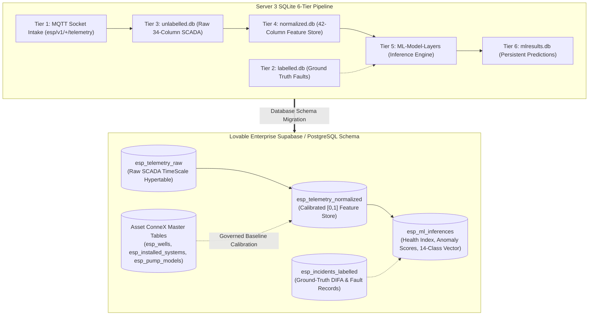

### 5.1 6-Tier Ingestion Pipeline ⟷ Supabase/PostgreSQL Enterprise Schema

1. **Raw SCADA Telemetry (`unlabelled.db` $\rightarrow$ `esp_telemetry_raw`)**:
   - Stores raw 34-column time-series records from the MQTT broker.
   - Converted to a **TimescaleDB hypertable** partitioned by `timestamp` and `well_id` with 1-second to 2-second resolution.
2. **Normalized Feature Store (`normalized.db` $\rightarrow$ `esp_telemetry_normalized`)**:
   - Stores 42 calibrated engineering feature vectors (normalized $[0,1]$ against P10–P90 baseline corridors, plus rolling first and second derivatives $\frac{dP}{dt}$, $\frac{dI}{dt}$, $\frac{dT}{dt}$).
3. **Machine Learning Results (`mlresults.db` $\rightarrow$ `esp_ml_inferences`)**:
   - Stores composite health index scores (0–100), Isolation Forest outlier scores ($[0.0, 1.0]$), 14-class probability distributions, primary/secondary fault classifications, ETT estimates, and SHAP feature attribution arrays.
4. **Ground-Truth Incident Labels (`labelled.db` $\rightarrow$ `esp_incidents_labelled`)**:
   - Stores validated historical failure events, teardown inspection summaries (DIFA), and verified operator annotations.
5. **Asset ConneX Master Data Tables**:
   - Governs equipment specifications (`esp_pump_models`, `esp_motor_models`, `esp_protector_models`, `esp_gas_handling_models`, `esp_sensor_models`, `esp_cable_models`, `esp_vsd_models`, `esp_installed_systems`, `esp_wells`).

---

### 5.2 14 Canonical Sensor Tags Mapping & Physical Corridors

| # | Sensor Tag String | Canonical Parameter Name | Eng. Unit | Physical Category | Supabase Column Name | Normal P10–P90 Corridor | Critical Trip Threshold |
| :---: | :--- | :--- | :---: | :---: | :--- | :---: | :---: |
| **1** | `Inp bar/psi` | Intake Pressure (PIP) | PSI | Hydraulic | `intake_pressure_psi` | 400 – 850 PSI | $< 250$ PSI (Underload / Gas Lock) |
| **2** | `Disch pr. Bar/psi` | Discharge Pressure (PDP) | PSI | Hydraulic | `discharge_pressure_psi` | 1,800 – 2,400 PSI | $> 2,800$ PSI (High Backpressure) |
| **3** | `WHP (PSI)` | Wellhead Surface Pressure | PSI | Hydraulic | `wellhead_pressure_psi` | 80 – 220 PSI | $> 350$ PSI (Flowline Choke Lock) |
| **4** | `FLP (PSI)` | Surface Flowline Pressure | PSI | Hydraulic | `flowline_pressure_psi` | 40 – 120 PSI | $> 180$ PSI (Line Blockage) |
| **5** | `AP (PSI)` | Casing Annulus Pressure | PSI | Hydraulic | `casing_pressure_psi` | 20 – 90 PSI | $> 150$ PSI (Gas Pocket Buildup) |
| **6** | `VSD Amps/Load` | Motor Electrical Current | A | Electrical | `motor_current_amps` | 40 – 110 A | $> 125$ A (Overcurrent) / $< 30$ A (Underload) |
| **7** | `Volt` | Input Bus Voltage | V | Electrical | `bus_voltage_volts` | 400 – 480 V | $< 360$ V (Undervoltage) |
| **8** | `Frequency` | Operating Drive Frequency | Hz | Electrical | `operating_frequency_hz` | 40 – 65 Hz | $> 65$ Hz (Overfrequency) |
| **9** | `Leak Current Ct` | Cable Leakage Current | mA | Electrical | `cable_leakage_ma` | 0 – 15 mA | $> 35$ mA (Insulation Breakdown) |
| **10** | `DHG Current` | Instrument Gauge Current | mA | Electrical | `dhg_current_ma` | 5 – 25 mA | $< 2$ mA or $> 35$ mA (Gauge Loss) |
| **11** | `Motor temp °C` | Motor Internal Winding Temp | °C | Thermal | `motor_temp_c` | 60 – 115 °C | $> 135$ °C (Thermal Overload Trip) |
| **12** | `Int temp °C` | Pump Intake Fluid Temp | °C | Thermal | `intake_temp_c` | 40 – 85 °C | $> 95$ °C (Hot Reservoir Fluid) |
| **13** | `Vibration G's-Vx`| Radial Vibration RMS | G | Mechanical | `vibration_rms_g` | 0.02 – 0.15 G | $> 0.35$ G (Severe Imbalance / Wear) |
| **14** | `Liquid Rate (BPD)`| Virtual Flow Rate | BPD | Production | `liquid_rate_bpd` | 500 – 3,000 BPD | Auto-drops to 0.0 if VFD off |

---

### 5.3 Machine Learning Inference Outputs Schema

```json
{
  "$schema": "https://json-schema.org/draft/2020-12/schema",
  "title": "ESP_ML_Inference_Record",
  "type": "object",
  "properties": {
    "well_id": { "type": "string", "example": "FS-031" },
    "timestamp": { "type": "string", "format": "date-time" },
    "health_index": { "type": "number", "minimum": 0, "maximum": 100, "example": 88.5 },
    "isolation_forest_score": { "type": "number", "minimum": 0.0, "maximum": 1.0, "example": 0.24 },
    "primary_fault": { "type": "string", "example": "Normal Operation" },
    "primary_confidence": { "type": "number", "example": 0.912 },
    "secondary_fault": { "type": "string", "example": "Gas Interference & Lock" },
    "secondary_confidence": { "type": "number", "example": 0.054 },
    "estimated_time_to_trip": { "type": "string", "example": "Stable Operation" },
    "shap_attribution": {
      "type": "object",
      "properties": {
        "delta_pip": { "type": "number", "example": 0.342 },
        "delta_pdp": { "type": "number", "example": 0.275 },
        "delta_amps": { "type": "number", "example": 0.181 },
        "delta_motor_temp": { "type": "number", "example": 0.124 },
        "delta_vibration": { "type": "number", "example": 0.078 }
      }
    },
    "prescriptive_action": { "type": "string", "example": "Maintain nominal operating frequency at 50 Hz." }
  }
}
```

---

# 6. Recommended Step-by-Step Conversion Roadmap

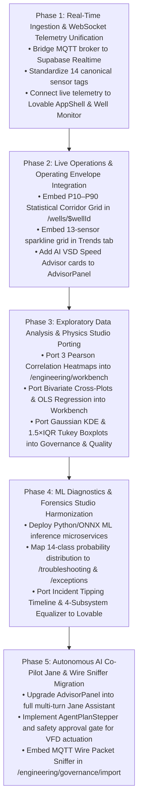

### Phase 1: Real-Time Ingestion & WebSocket Telemetry Unification (Week 1–2)
- Deploy an edge WebSocket bridge consuming MQTT topics (`esp/v1/+/telemetry`) from the on-site broker (`192.168.1.155:1883`) and broadcasting updates via Supabase Realtime.
- Map all 14 canonical SCADA sensor tags to the TimescaleDB `esp_telemetry_raw` hypertable.
- Ensure Lovable top bar indicator reads `"OTConnex live · 2 s scan"` with active WebSocket packet delivery.

### Phase 2: Live Operations & Operating Envelope Integration (Week 3–4)
- Port Server 3's **14-Parameter P10–P90 Statistical Corridor Grid** (`OperatingEnvelopeCorridor.jsx`) into Lovable `/wells/$wellId` Tab 1 Overview.
- Embed the **13-Sensor Sparkline Grid** and rate-of-change indicators into `/wells/$wellId` Tab 2 Trends.
- Integrate the **AI VSD Frequency Advisor** into `AdvisorPanel.tsx` with dynamic frequency uplift and thermal risk verification.

### Phase 3: Exploratory Data Analysis & Physics Studio Porting (Week 5–6)
- Port the **3 Interactive Pearson Correlation Matrices** (Inputs × Inputs, Inputs × Faults, Faults × Faults) with pairwise inspector and CSV export into Lovable `/engineering/workbench`.
- Port the **Bivariate Cross-Plot Engine** with 6 petroleum engineering presets, OLS regression trendlines ($y = mx + c$), $R^2$, and live telemetry markers into `/engineering/workbench`.
- Port the **Gaussian KDE Probability Curves & Tukey 1.5×IQR Outlier Boxplots** into Lovable `/engineering/governance/quality`.

### Phase 4: ML Diagnostics & Forensics Studio Harmonization (Week 7–8)
- Connect the 14-class machine-learning diagnostic classifier and Isolation Forest engine to push real-time inference payloads into `esp_ml_inferences`.
- Map ML outputs directly to Lovable `/troubleshooting` (Signature library & Ranked causes) and `/exceptions` (Prioritized exception dossier).
- Port the **Incident Tipping Timeline** (`IncidentTippingTimeline.jsx`) and **4-Subsystem Physical Health Equalizer** (`SubsystemEqualizer.jsx`) into Lovable `/wells/$wellId` History and `/troubleshooting`.
- Embed the **SHAP Feature Attribution Waterfall** and **4-Tier API RP 11S Playbook** across Lovable troubleshooting and exception action cards.

### Phase 5: Autonomous AI Co-Pilot Jane & Wire Sniffer Migration (Week 9–10)
- Upgrade Lovable's `AdvisorPanel.tsx` from a static preview drawer into the full **AI Engineering Co-Pilot (Jane)** featuring multi-turn chat, prompt shortcuts, and raw reasoning trace inspection.
- Integrate the **AgentPlanStepper** (`PENDING`, `IN_PROGRESS`, `COMPLETED`, `FAILED`) and the amber safety approval gate for safety-critical VFD setpoint adjustments.
- Embed the **MQTT Wire Packet Sniffer Terminal** with live packet streaming into `/engineering/governance/import`.

---
*End of Master Architectural & Functional Mapping Document — OTConnex ML Dashboard vs. Lovable ADVAIT ESP-PMM*
