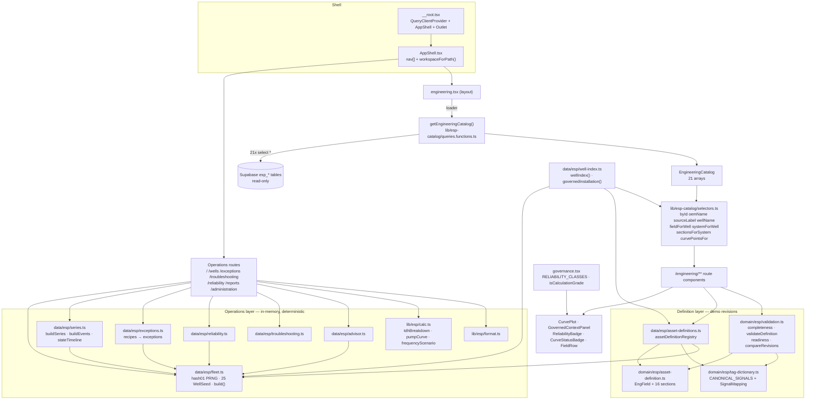
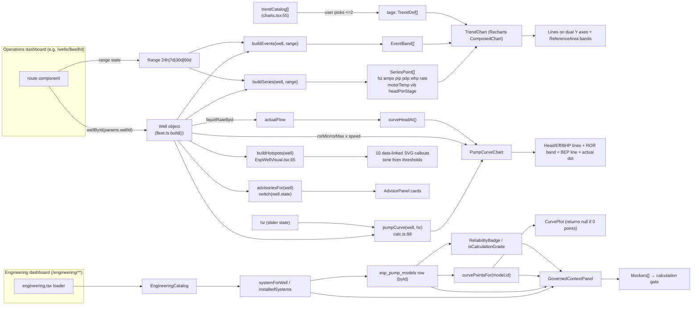

# PROJECT_DASHBOARD_ARCHITECTURE.md

ADVAIT ESP-PMM — ESP Performance Monitoring & Management.
Documentation generated by tracing the actual source under `src/`. Every claim below
carries a source path. Anything not confirmed in source is listed in
[§27 Unknown / Requires Verification](#27-unknown--requires-verification).

---

## Executive Summary

**How dashboards are structured.** There is no generic "dashboard engine" in this project.
There is **no dashboard entity, no dashboard record, no dashboard CRUD, no widget registry,
no widget type discriminator, no drag/resize grid, and no persisted dashboard configuration**.
Each "dashboard" is a hand-authored TanStack Router **file route** under `src/routes/` whose
component composes a fixed set of panels in JSX. The route file *is* the dashboard
configuration. Confirmed by reading every file in `src/routes/` — no `widgets: [...]` array,
no `type: "STAT"`-style switch, and no `WidgetRenderer` component exists anywhere.

**How widgets are structured.** "Widgets" are React components in
`src/components/esp/` (`ui.tsx`, `charts.tsx`, `EspWellVisual.tsx`, `PressureProfile.tsx`,
`FleetTable.tsx`, `AdvisorPanel.tsx`) and `src/components/esp/engineering/`
(`CurvePlot.tsx`, `GovernedContextPanel.tsx`, `governance.tsx`). They are selected at
author time by importing them, and configured by **React props only**.

**How widget parameters work.** Parameters are typed React props. There is no
parameter-resolution layer, no `parameterId`, no parameter binding language. The
closest analogue to a "parameter → tag" binding is `SignalMapping` in
`src/domain/esp/tag-dictionary.ts`, which maps a canonical signal id
(e.g. `ESP.PIP`) to an OT tag path — but that mapping is **documentation/validation data
rendered in a table**, not a runtime data-binding used by any chart.

**How assets/templates/tags relate.** Three independent layers, joined by the well id
string (e.g. `ESP-104`):

1. **Operations demo layer** — deterministic in-memory data generated from string hashes
   (`src/data/esp/fleet.ts`, `series.ts`, `exceptions.ts`, `reliability.ts`,
   `troubleshooting.ts`, `advisor.ts`, `design-cases.ts`). No network, no persistence.
2. **Governed engineering layer** — 21 Supabase `esp_*` tables read read-only by exactly
   one server function, `getEngineeringCatalog` in
   `src/lib/esp-catalog/queries.functions.ts:63`.
3. **Definition-revision layer** — a 16-section provenance contract
   (`src/domain/esp/asset-definition.ts`) with deterministic demo revisions in
   `src/data/esp/asset-definitions.ts`.

The declared join spine is `src/data/esp/well-index.ts` (`wellIndex()`,
`governedInstallation(catalog, wellId)`).

**How data reaches widgets.** Two — and only two — flows:

- *Operations routes* (`/`, `/wells`, `/wells/$wellId`, `/exceptions`,
  `/troubleshooting`, `/reliability`, `/reports`, `/administration`): the route component
  calls a pure function from `src/data/esp/*` **at render time**, computes derived values
  inline (`useMemo` or plain expressions), and passes them as props. **No API, no fetch,
  no async, no loading state, no cache.**
- *Engineering routes* (`/engineering/**`): the layout route `src/routes/engineering.tsx:21`
  runs `loader: () => getEngineeringCatalog()`; every descendant reads the same object via
  `getRouteApi("/engineering").useLoaderData()` and slices it with pure selectors in
  `src/lib/esp-catalog/selectors.ts`.

**APIs and state.** There is **no Redux, no Zustand, no Context provider, no MobX**.
A `QueryClient` is created in `src/router.tsx:6` and provided in `src/routes/__root.tsx:118`
but **no route or component uses `useQuery`/`useSuspenseQuery`/`queryOptions`** — it is dead
wiring. All state is component-local `useState`/`useMemo`, plus TanStack Router loader data,
plus one `localStorage` write in `AppShell.tsx`.

**How configuration controls rendering.** Rendering branches on *data values*
(`well.state`, `severity`, `reliability_code`, `curve_completeness`, `match_status`), not on
configuration documents. The single most important gating rule is
`RELIABILITY_CLASSES` / `isCalculationGrade` in
`src/components/esp/engineering/governance.tsx:5-22`: A1/A2/B1/B2 are calculation-grade,
C1/D are not, and `GovernedContextPanel.tsx:36-41` uses this to **block** engineering
calculations for unresolved, non-calc-grade, composite, unknown-stage, or
zero-digitised-curve assemblies.

**Most important architectural relationships.**

```text
Route file (the "dashboard")
   └─ imports panel/chart components directly (the "widgets")
        ├─ Operations: pure function from src/data/esp/* → derived value → props
        └─ Engineering: /engineering loader → getEngineeringCatalog() (21 Supabase tables)
                         → selectors.ts join by id → props
```

---

## Table of contents

1. [Project Overview](#1-project-overview)
2. [Project Modules](#2-project-modules)
3. [Dashboard Architecture](#3-dashboard-architecture)
4. [Dashboard → Widget Relationship](#4-dashboard--widget-relationship)
5. [Widget Catalog](#5-widget-catalog)
6. [Parameter Relationships](#6-parameter-relationships)
7. [Parameter Dependency Matrix](#7-parameter-dependency-matrix)
8. [Widget Data Model](#8-widget-data-model)
9. [Tag Relationships](#9-tag-relationships)
10. [Asset Relationships](#10-asset-relationships)
11. [Template Relationships](#11-template-relationships)
12. [API Inventory](#12-api-inventory)
13. [State Architecture](#13-state-architecture)
14. [Component Hierarchy](#14-component-hierarchy)
15. [Widget Lifecycle](#15-widget-lifecycle)
16. [Static vs Dynamic](#16-static-vs-dynamic-implementation)
17. [Role / Permission Relationships](#17-role--permission-relationships)
18. [Routing](#18-routing)
19. [Relationship Map](#19-relationship-map)
20. [Widget Relationship Graph](#20-widget-relationship-graph)
21. [Complete Dashboard Data Flow](#21-complete-dashboard-data-flow)
22. [User Interaction Flow](#22-user-interaction-flow)
23. [Configuration Schema](#23-configuration-schema)
24. [Important Files Reference](#24-important-files-reference)
25. [Function-Level Reference](#25-function-level-reference)
26. [Answers to the required questions](#26-answers-to-the-required-questions)
27. [Unknown / Requires Verification](#27-unknown--requires-verification)
28. [Master Relationship Matrix](#28-master-relationship-matrix)

---

## 1. Project Overview

### Purpose
A high-fidelity, read-only industrial monitoring application for Electric Submersible Pump
(ESP) fleets: 25 wells across 3 fictional fields, plus a governed engineering master-data
workspace backed by a real database. The app is explicitly **visualization only** — no
setpoint writes, no start/stop, no device control. This constraint is stated in code:
`src/components/esp/EspWellVisual.tsx:8-13` and `src/components/esp/AdvisorPanel.tsx`
("Decision support only. No control actions are issued from this module.").

### Frontend technology
- **React 19** + **TanStack Start v1** (SSR-capable full-stack React on Vite 7).
- **TanStack Router** file-based routing; generated tree `src/routeTree.gen.ts` (never edited).
- **Tailwind CSS v4** via `src/styles.css` (OKLCH semantic tokens, dark industrial theme).
- **Recharts** for all XY charts (`src/components/esp/charts.tsx`).
- **lucide-react** icons (`src/components/esp/AppShell.tsx:3-15`).
- **shadcn/ui** primitives exist in `src/components/ui/` but the ESP screens use the
  project's own dense primitives in `src/components/esp/ui.tsx` instead.

### Backend / API architecture
- Exactly **one** server function: `getEngineeringCatalog`
  (`src/lib/esp-catalog/queries.functions.ts:63`), `createServerFn({ method: "GET" })`.
- It creates a Supabase client per call from `SUPABASE_URL` / `SUPABASE_PUBLISHABLE_KEY`
  with no session persistence (`queries.functions.ts:65-69`) and issues **21 parallel
  `select("*")` reads** against `esp_*` tables (`:76-96`).
- No REST/GraphQL layer, no `src/routes/api/**`, no webhooks, no mutations, no writes.
- SSR entry is wrapped by `src/server.ts` (normalises catastrophic SSR 500s into a rendered
  error page); `src/start.ts` registers `errorMiddleware` + `csrfMiddleware`
  (`createCsrfMiddleware` scoped to `serverFn` handlers, `start.ts:23-29`).

### State-management architecture
No global store. Per-area:

| Concern | Mechanism | Source |
| --- | --- | --- |
| Governed catalog | TanStack Router loader on `/engineering` | `src/routes/engineering.tsx:21` |
| Everything operational | Pure module functions called during render | `src/data/esp/*` |
| UI state (tabs, filters, sort, selection, sliders) | `useState` in each route component | e.g. `wells.$wellId.tsx:54-56` |
| Derived values | `useMemo` or plain expressions | e.g. `FleetTable.tsx:80-121` |
| Workspace preference | `localStorage["advait.esp-pmm.workspace"]` (write-only) | `AppShell.tsx:39,71-77` |
| TanStack Query | Provisioned, **unused** | `router.tsx:6`, `__root.tsx:118` |

### UI/component architecture
`src/components/esp/ui.tsx` supplies the entire dense-panel design language
(`Panel`, `Metric`, `KpiStrip`, `StatusPill`, `Th`, `Td`, `SortHeader`, `ToggleRow`,
`Note`, `PageHeader`, `DataQualityBadge`). Every screen is `PageHeader` + `KpiStrip` +
a grid of `Panel`s containing tables/charts/SVGs.

### Routing architecture
File-based; `src/routes/__root.tsx` wraps everything in `QueryClientProvider` + `AppShell`
+ `<Outlet />`. Two workspaces are derived from the URL prefix
(`AppShell.tsx:37,59-61`): `/engineering` and `/administration` ⇒ *Configuration*;
everything else ⇒ *Operations*.

### Authentication / authorization
**None exists.** No login route, no session context, no route guards, no role checks, no
conditional rendering by permission. `/administration` renders a static roles table as UI
copy only (`src/routes/administration.tsx:46-51`). The only auth-named code is Supabase
client header plumbing (`src/integrations/supabase/*`), unrelated to app users. See §17.

### Actual folder structure

```text
src/
├── components/
│   ├── esp/                     # all domain widgets
│   │   ├── AppShell.tsx         # icon rail + workspace switcher + header ribbon
│   │   ├── ui.tsx               # Panel / Metric / StatusPill / Th / Td / ToggleRow …
│   │   ├── charts.tsx           # Recharts wrappers (Trend, PumpCurve, TDH, Pareto, Bar)
│   │   ├── EspWellVisual.tsx    # animated ESP schematic SVG + hotspots
│   │   ├── PressureProfile.tsx  # pressure-vs-depth SVG
│   │   ├── FleetTable.tsx       # sortable/filterable fleet register
│   │   ├── AdvisorPanel.tsx     # AI advisory preview (static reasoning text)
│   │   └── engineering/
│   │       ├── CurvePlot.tsx            # digitised OEM curve SVG
│   │       ├── GovernedContextPanel.tsx # calculation gate / blockers
│   │       └── governance.tsx           # reliability vocabulary + badges + FieldRow
│   └── ui/                      # shadcn primitives (largely unused by ESP screens)
├── data/esp/                    # deterministic demo data layer (no persistence)
│   ├── types.ts fleet.ts series.ts exceptions.ts reliability.ts
│   ├── troubleshooting.ts advisor.ts design-cases.ts
│   ├── asset-definitions.ts     # 16-section demo revisions
│   └── well-index.ts            # 3-layer join spine
├── domain/esp/                  # governed contracts (types + rules, no data)
│   ├── asset-definition.ts      # EngField provenance + 16 sections
│   ├── tag-dictionary.ts        # ~31 canonical OT signals + SignalMapping
│   └── validation.ts            # completeness, rules, readiness, revision diff
├── lib/
│   ├── esp/calc.ts              # deterministic ESP engineering formulas
│   ├── esp/format.ts            # number/date/currency formatting
│   └── esp-catalog/
│       ├── queries.functions.ts # THE server function (21 Supabase tables)
│       └── selectors.ts         # pure joins over the catalog
├── integrations/supabase/       # auto-generated client + types (do not edit)
├── routes/                      # every "dashboard" is a file here
├── routeTree.gen.ts             # generated
├── router.tsx  start.ts  server.ts  styles.css
docs/esp/                        # DATA_MODEL_MAP.md, BACKEND_HANDOFF.md, tag dictionary
```

---

## 2. Project Modules

| Module | Kind | Purpose | Main files | Important components | APIs | State |
| --- | --- | --- | --- | --- | --- | --- |
| App shell & navigation | Core | Icon rail, workspace switch, header status ribbon | `src/components/esp/AppShell.tsx` | `AppShell`, nav array `:42-57` | none | `useState expanded`, `useRouterState`, `localStorage` |
| Design system | Shared | Dense industrial primitives | `src/components/esp/ui.tsx` | `Panel`, `Metric`, `KpiStrip`, `StatusPill`, `Th`, `Td`, `SortHeader`, `ToggleRow`, `Note`, `PageHeader`, `DataQualityBadge` | none | none |
| Charting | Shared | Recharts wrappers | `src/components/esp/charts.tsx` | `TrendChart`, `PumpCurveChart`, `TdhWaterfall`, `MiniOperatingPoint`, `SimpleBar`, `ParetoChart`, `trendCatalog` | none | none |
| Visualisation | Shared | ESP schematic + pressure profile | `EspWellVisual.tsx`, `PressureProfile.tsx` | `EspWellVisual`, `EspStatusGlyph`, `EspWellMini`, `PressureProfile` | none | `useState active` hotspot |
| Fleet surveillance | Dashboard | Cockpit + register | `src/routes/index.tsx`, `components/esp/FleetTable.tsx` | `FleetCockpit`, `FleetTable` | none | local filters/sort/selection |
| Well monitor | Dashboard | Per-well 6-tab detail | `src/routes/wells.$wellId.tsx`, `wells.index.tsx` | tab bodies, `TrendChart`, `AdvisorPanel` | none | `tab`, `range`, `tagKeys` |
| Exceptions | Dashboard | Ranked exception queue + triage | `src/routes/exceptions.tsx`, `data/esp/exceptions.ts` | queue table, detail panel | none | `view`, `selectedId`, `statuses` overrides |
| Troubleshooting | Dashboard | Signature-library diagnostics | `src/routes/troubleshooting.tsx`, `data/esp/troubleshooting.ts` | case picker, `EspWellVisual highlight`, `TrendChart` | none | `caseId` |
| Reliability | Dashboard | Run life, Pareto, bad actors, DIFA | `src/routes/reliability.tsx`, `data/esp/reliability.ts` | `ParetoChart`, `SimpleBar`, `EspWellMini` | none | `tab` |
| Reports | Dashboard | Management scorecard | `src/routes/reports.tsx` | scorecard tables, `SimpleBar` | none | none |
| Administration | Configuration | Static signal map, rules, roles, AI governance | `src/routes/administration.tsx` | static tables `:21-52` | none | none |
| Engineering catalog | Dashboard / Asset | OEM equipment catalog, 9 tabs | `engineering.catalog.index.tsx`, `engineering.catalog.pumps.$modelId.tsx` | tab tables, `CurvePlot` | `getEngineeringCatalog` | `tab`, `oem`, loader data |
| Installed fleet | Asset | Installed ESP systems & well engineering | `engineering.installations.*.tsx` (7 files) | tables, `FieldRow` panels | `getEngineeringCatalog` | `field`, `match`, `q` |
| Well definition | Template / Config | 16-section governed revisions | `engineering.definition.index.tsx`, `engineering.definition.$wellId.tsx`, `data/esp/asset-definitions.ts`, `domain/esp/*` | section tables, validation tab, compare tab | none (demo data) | `revision`, `tab`, `section`, diff filters |
| Governance | Configuration | Validation, sources, quality, import | `engineering.governance.*.tsx` (6 files) | readiness tables, alias tables | `getEngineeringCatalog` | severity/status filters |
| Engineering workbench | Dashboard | Curves, TDH, frequency what-if | `engineering.workbench.tsx` | `GovernedContextPanel`, `PumpCurveChart`, `TdhWaterfall`, `PressureProfile` | `getEngineeringCatalog` | `hz`, `compare`, `?well=` search param |
| Design cases | Dashboard | Design vs current vs what-if | `engineering.design-cases.tsx`, `data/esp/design-cases.ts` | comparison tables | none | `wellId`, `aId`, `bId` |
| Data / API module | API | The only backend read | `lib/esp-catalog/queries.functions.ts`, `selectors.ts` | `getEngineeringCatalog`, 8 selectors | Supabase | router loader cache |
| Calculations | Shared | Deterministic ESP physics | `lib/esp/calc.ts`, `lib/esp/format.ts` | 15 pure functions | none | none |
| Auth / roles | **Absent** | — | — | — | — | — |

---

## 3. Dashboard Architecture

A "dashboard" here = a route component that composes panels. There is no dashboard record,
no dashboard id, no create/delete/duplicate. **Dashboards are added by creating a file in
`src/routes/`.**

| Dashboard | Location | Purpose | Route | Entry component | Configuration source | Data source |
| --- | --- | --- | --- | --- | --- | --- |
| Fleet Cockpit | `src/routes/index.tsx` | Fleet-wide surveillance, attention queue, deferment | `/` | `FleetCockpit` (`:30`) | JSX in the route file | `fleet.ts`, `exceptions.ts` (in-memory) |
| Well Monitor selector | `src/routes/wells.index.tsx` | Pick a well | `/wells` | route component (`:19`) | JSX | `FleetTable` → `fleet.ts` |
| Well Monitor | `src/routes/wells.$wellId.tsx` | 6-tab per-well detail | `/wells/$wellId` | route component (`:51`) | JSX + `tab` state | `fleet.ts`, `series.ts`, `exceptions.ts`, `advisor.ts`, `calc.ts` |
| Exception Queue | `src/routes/exceptions.tsx` | Triage queue + detail | `/exceptions` | route component | JSX + `view` state | `exceptions.ts` |
| Troubleshooting | `src/routes/troubleshooting.tsx` | Signature library | `/troubleshooting` | route component | JSX + `caseId` | `troubleshooting.ts`, `series.ts` |
| Reliability | `src/routes/reliability.tsx` | 5-tab reliability analytics | `/reliability` | route component | JSX + `tab` | `reliability.ts` |
| Reports | `src/routes/reports.tsx` | Management scorecard | `/reports` | route component | JSX | `fleet.ts`, `exceptions.ts`, `reliability.ts` |
| Administration | `src/routes/administration.tsx` | Static config reference | `/administration` | route component | **hardcoded literals `:21-52`** | none |
| Engineering Overview | `src/routes/engineering.index.tsx` | Governed master-data KPIs | `/engineering` | route component (`:22`) | JSX | loader → `getEngineeringCatalog` |
| Equipment Catalog | `src/routes/engineering.catalog.index.tsx` | 9-tab OEM catalog | `/engineering/catalog` | route component | JSX + `tab`,`oem` | loader data |
| Pump Model Detail | `engineering.catalog.pumps.$modelId.tsx` | Curve + provenance | `/engineering/catalog/pumps/$modelId` | route component | JSX + `$modelId` | loader data |
| Installed Fleet (+4 tabs) | `engineering.installations.index/assembly/well/fluid/limits.tsx` | Installed systems | `/engineering/installations[/…]` | route components | JSX + filters | loader data |
| Installed System Detail | `engineering.installations.$systemId.tsx` | One assembly, full context | `/engineering/installations/$systemId` | route component | JSX + `$systemId` | loader data |
| Definition Registry | `engineering.definition.index.tsx` | Per-well revision registry | `/engineering/definition` | route component | JSX + filters | `data/esp/asset-definitions.ts` (demo) |
| Definition Workspace | `engineering.definition.$wellId.tsx` | 16 sections, validation, compare | `/engineering/definition/$wellId` | route component | JSX + `revision`/`tab`/`section` | demo revisions + `domain/esp/validation.ts` |
| Governance ×4 | `engineering.governance.validation/sources/quality/import.tsx` | Readiness, provenance, DQ queue, import | `/engineering/governance/*` | route components | JSX + filters | loader data |
| Engineering Workbench | `engineering.workbench.tsx` | Curves, TDH, frequency what-if | `/engineering/workbench` | route component | JSX + `?well=` + `hz` | loader data **and** `fleet.ts` + `calc.ts` |
| Design Cases | `engineering.design-cases.tsx` | Design vs current vs what-if | `/engineering/design-cases` | route component | JSX + `wellId`/`aId`/`bId` | `data/esp/design-cases.ts` |

**How each dashboard is opened.** Via `AppShell` nav `<Link>` (`AppShell.tsx:42-57`), via
cross-links inside panels (e.g. `index.tsx:167` links to `/engineering/workbench` with
`search={{ well }}`), or by direct URL.

**How a dashboard is created.** Only by a developer adding a route file. There is no
runtime creation UI anywhere — grep for create/save/delete dashboard yields nothing.

**How configuration is retrieved.** It isn't; it is the JSX. The nearest thing to declarative
config is:
- `trendCatalog` (`charts.tsx:55-65`) — 9 selectable trend series.
- `nav` (`AppShell.tsx:42-57`) — navigation entries.
- `SECTIONS`/`GROUPS` (`engineering.tsx`) — engineering sub-nav.
- `RELIABILITY_CLASSES` (`governance.tsx:5-12`) — gating vocabulary.
- `CANONICAL_SIGNALS` (`tag-dictionary.ts:121-154`) — canonical tag list.
- `VALIDATION_RULES` (`validation.ts:34-59`) — 24 rule definitions.

**How widgets are retrieved / rendered.** By static ES import + JSX; no registry lookup.

**How dashboard data is refreshed.** Operations dashboards recompute on every render from
pure functions with a fixed epoch (`series.ts:34` `NOW = Date.UTC(2026,7,13,17,0,0)`) — the
data never changes, and there is no polling/interval/websocket anywhere. Engineering
dashboards refetch on navigation because `defaultPreloadStaleTime: 0` (`router.tsx:12`)
disables loader staleness caching.

---

## 4. Dashboard → Widget Relationship

The general relationship in this codebase is:

```text
Route file (dashboard)
   ↓ static ES import
Widget component
   ↓ React props (typed, hand-written at the call site)
Pure data function (src/data/esp/*)  OR  loader data (getEngineeringCatalog)
   ↓ selector / formula (src/lib/esp-catalog/selectors.ts, src/lib/esp/calc.ts)
Derived value
   ↓
Rendered UI
```

There is **no** DashboardConfig → WidgetConfig → WidgetType → Parameter → Tag chain. That
chain does not exist in this repository.

### Dashboard: Fleet Cockpit (`src/routes/index.tsx`)

| # | Widget | Widget type | Component | Configuration | Data source | Parameters | API/State |
| --- | --- | --- | --- | --- | --- | --- | --- |
| 1 | Page header | header | `PageHeader` (`ui.tsx:188`) | props `title`,`description`,`meta` | literal strings | — | none |
| 2 | Field summary strip | pill row | `StatusPill` (`ui.tsx:39`) | `tone` computed per field | `fields`, `wells` | `alarmed > fw.length/2 ? "watch":"normal"` | none |
| 3 | Fleet KPI strip | metric tiles | `KpiStrip` + `Metric` | 7 tiles | `fleetSummary()` (`fleet.ts:341`) | value/unit/sub/tone | none |
| 4 | Needs attention now | table | inline `<table>` + `Th`/`Td`/`StatusPill` | top 9 rows | `needsAttention()` (`exceptions.ts:457`) | severity, wellId, category, impactBopd, durationH, confidence, owner | none |
| 5 | Optimization opportunities | table | inline table | all rows | `optimizationQueue()` (`exceptions.ts:462`) | wellId, rule, opportunityUsdDay, confidence | link `?well=` |
| 6 | Open exceptions by category | bar list | inline divs | grouped counts | `exceptions` filtered `status!=="Closed"` | category, count | none |
| 7 | Fleet register | data grid | `FleetTable` (`FleetTable.tsx:66`) | `maxHeight="480px"` | `wells` | see §5 | local sort/filter |
| 8 | Selected well visual | SVG schematic | `EspWellVisual` (`EspWellVisual.tsx:218`) | `variant="compact"` | `wells.find(selectedId)` | `well`, `variant` | `useState selectedId` |
| 9 | Deferment & upside by field | bar chart | `SimpleBar` (`charts.tsx:312`) | 2 bars | `deferByField` (computed inline) | `xKey="field"`, bars deferred/opportunity | none |
| 10 | Worst actors — health index | table | inline table | bottom 8 by health | `wells` sorted asc | wellId, state, healthIndex, deferredBopd | none |

### Dashboard: Well Monitor (`src/routes/wells.$wellId.tsx`)

| # | Widget | Type | Component | Configuration | Data source | Parameters | State |
| --- | --- | --- | --- | --- | --- | --- | --- |
| 1 | ESP schematic | SVG | `EspWellVisual` | `variant="full"` | `wellById(wellId)` | `well` | hotspot `active` |
| 2 | Operating-state timeline | bar strip | inline | 24h segments | `stateTimeline(well)` (`series.ts:169`) | fromH/toH/tone | none |
| 3 | What changed | table | inline | before/after rows | `whatChanged(well)` (`series.ts:239`) | signal, before, after | none |
| 4 | Operating envelope | gauge bar | inline | ROR band | `envelopePosition(well)` (`calc.ts:218`) | rate vs rorMin/rorMax | none |
| 5 | Operating point mini | line chart | `MiniOperatingPoint` (`charts.tsx:288`) | `height=130` | `pumpCurve(well, hz)` | `well` | none |
| 6 | TDH table | table | inline | 4 components | `tdhBreakdown()` (`calc.ts:32`) | vertical/friction/wellhead/total | none |
| 7 | Main trend | composed chart | `TrendChart` (`charts.tsx:67`) | up to 2 tags, dual axis | `buildSeries(well, range)`, `buildEvents(well, range)` | `data`,`tags`,`events`,`height` | `tagKeys`, `range` |
| 8 | Secondary trends ×2 | composed chart | `TrendChart` | fixed tag pairs `[2,3]`, `[6,5]` of `trendCatalog` | same | same | `range` |
| 9 | Actual vs design table | table | inline | 7 rows | `well.*` + `design*` fields | delta% highlight >10% | none |
| 10 | Pressure profile | SVG | `PressureProfile` (`PressureProfile.tsx:9`) | — | `pressureProfile(well)` (`calc.ts:183`) | `well` | none |
| 11 | Component registry | table | inline + `DataQualityBadge` | 15 rows | `well.components` (`fleet.ts:37`) | name, group, source, status | none |
| 12 | Events & exceptions | list | inline | per well | `exceptionsForWell(id)` (`exceptions.ts:447`) | evidence/verify/actions | none |
| 13 | ESP Advisor | advisory cards | `AdvisorPanel` (`AdvisorPanel.tsx:6`) | collapsible | `advisoriesFor(well)` (`advisor.ts:4`) | `well` | `useState open` |

### Dashboard: Exception Queue (`src/routes/exceptions.tsx`)

| # | Widget | Type | Component | Data source | Parameters | State |
| --- | --- | --- | --- | --- | --- | --- |
| 1 | View toggle | segmented control | `ToggleRow` (`ui.tsx:142`) | literal 6 options | `value`,`onChange` | `view` |
| 2 | Severity totals | metrics | `Metric` | counts over `exceptions` | — | none |
| 3 | Queue table | table | inline | `exceptions` filtered+sorted by `severityRank` (`exceptions.ts:449`) | row click → select | `selectedId` |
| 4 | Detail panel | panel | `Panel` | `exceptions.find(selectedId)` | rule/observation/evidence/causes/verify/actions | `statuses` override map |

### Dashboard: Troubleshooting (`src/routes/troubleshooting.tsx`)

| # | Widget | Type | Component | Data source | Parameters | State |
| --- | --- | --- | --- | --- | --- | --- |
| 1 | Signature library | list | inline | `troubleshootingCases` (`troubleshooting.ts:4`) | id/title | `caseId` |
| 2 | Case detail | panel | `Panel` | selected case | signature/causes/verify/actions | — |
| 3 | Implicated subsystem | SVG | `EspWellVisual` | `highlight = caseSubsystem(title, tripCode)` (`troubleshooting.tsx:31-42`) | `well`,`variant="compact"`,`highlight` | — |
| 4 | Supporting evidence ×2 | chart | `TrendChart` | `buildSeries(well,"7d")` | fixed tag pairs `[1,5]`,`[2,3]` | — |
| 5 | VSD trip code reference | table | inline | `tripCodes` (`troubleshooting.ts:170`) | code/description | — |

### Dashboard: Reliability (`src/routes/reliability.tsx`)

| # | Widget | Type | Component | Data source | Tab |
| --- | --- | --- | --- | --- | --- |
| 1 | KPI strip | metrics | `Metric` | computed from `failures`,`interventions`,`badActors` | all |
| 2 | Run-life histogram | bar | `SimpleBar` | `runLifeBuckets` (`reliability.ts:72`) | Run life |
| 3 | Run life by field | table | inline | `runLifeByField` (`:57`) | Run life |
| 4 | Run life by family | bar (vertical) | `SimpleBar` | `runLifeByFamily` (`:84`) | Run life |
| 5 | Risk factor weights | table | inline | `runLifeFactors` (`:4`) | Run life |
| 6 | Failure Pareto | composed | `ParetoChart` (`charts.tsx:352`) | `failureModePareto` (`:100`) | Failure analysis |
| 7 | Component distribution | bar | `SimpleBar` | `componentDistribution` (`:112`) | Failure analysis |
| 8 | Asset context thumbnails | SVG | `EspWellMini` (`EspWellVisual.tsx:618`) | top 8 `badActors` (`:118`) | Bad actors |
| 9 | Bad actor ranking | table | inline | `badActors` | Bad actors |
| 10 | Interventions | table | inline | `interventions` (`:142`) | Interventions |
| 11 | DIFA / pull history | table | inline | `failures` (`:29`) | DIFA records |

### Dashboard: Reports (`src/routes/reports.tsx`)
KPI strip; Field scorecard table (`fieldRows` computed inline); `SimpleBar` deferment/upside;
top-8 `badActors`; `SimpleBar` `runLifeByField`; top-7 `failureModePareto`; disclaimer `Note`.

### Dashboard: Engineering Workbench (`src/routes/engineering.workbench.tsx`)

| # | Widget | Type | Component | Data source | Parameters | State |
| --- | --- | --- | --- | --- | --- | --- |
| 1 | Governed context / calc gate | panel | `GovernedContextPanel` (`GovernedContextPanel.tsx:14`) | loader catalog | `catalog` | `systemId` |
| 2 | KPI strip | metrics | `Metric` | `frequencyScenario(well,hz)` (`calc.ts:136`) | — | `hz` |
| 3 | Pump performance curve | composed | `PumpCurveChart` (`charts.tsx:144`) | `pumpCurve(well,hz)` | `well`,`hz`,`actualFlow`,`actualHead`,`compareHz` | `hz`,`compare` |
| 4 | Frequency what-if | slider + table | inline | `frequencyScenario` | delta vs current | `hz` |
| 5 | TDH breakdown | bar | `TdhWaterfall` (`charts.tsx:259`) | `tdhBreakdown` | `well`,`hz` | `hz` |
| 6 | Pressure profile + schematic | SVG | `PressureProfile`, `EspWellVisual` | `pressureProfile(well)` | `well` | — |
| 7 | Frequency sweep | table | inline | `frequencyScenario` over range | — | — |

### Dashboard: Equipment Catalog (`engineering.catalog.index.tsx`)
9 tabs, each a table over one loader array: `pumpModels`, `curvePoints`, `motors`,
`gasHandling`, `protectors`, `cables`, `vsds`, `sensors`, `discovery` (capped at 400 rows).
Every row resolves OEM/source via `oemName`/`sourceLabel` selectors and renders
`ReliabilityBadge` / `CurveStatusBadge` / `VerificationBadge`.

### Dashboard: Definition Workspace (`engineering.definition.$wellId.tsx`)
Sections nav (16 keys, `SECTION_LABELS` `asset-definition.ts:778-795`); per-section tables —
hierarchy/curves/signals/wellTests/lifecycle/provenance have bespoke tables, all other
sections render generic `FieldRows` over `EngField` leaves discovered by
`collectFields()` (`validation.ts:73`); Validation tab (`validateDefinition`, `readiness`);
Compare tab (`compareRevisions`).

---

## 5. Widget Catalog

> Every widget below is identified **by its module export name and import site**, not by a
> type discriminator string. No `type: "STAT"`-style identifiers exist in this codebase.

### Widget: `Metric` (KPI tile)
- **Location** `src/components/esp/ui.tsx:98-123`; grid wrapper `KpiStrip` `:125-129`.
- **Purpose** Single KPI: uppercase label, large value, optional unit and sub-caption.
- **Type identification** By import; no runtime type field.
- **Component** `<div>` → label span → value span (`.num`, optionally `textTone[tone]`) →
  unit span → sub span.
- **Configuration**

| Parameter | Type | Required | Default | Purpose | Source |
| --- | --- | --- | --- | --- | --- |
| `label` | string | yes | — | Tile caption | literal at call site |
| `value` | string \| number | yes | — | Displayed number | computed at call site (e.g. `fleetSummary().health`) |
| `unit` | string | no | — | Suffix | literal |
| `sub` | string | no | — | Secondary caption/basis text | literal |
| `tone` | `Tone` | no | undefined | Colours value text via `textTone` | computed at call site |
| `className` | string | no | — | Layout override | literal |

- **Data flow** `route component → fleetSummary()/inline reduce → number → prop value → span`.
- **APIs** none. **State** none (fully controlled by props).
- **Rendering logic** Value is rendered verbatim; formatting (`n0`, `usd`, `pct`) is applied
  by the caller *before* the prop, e.g. `index.tsx:97` `value={n0(s.oil)}`. Tone only
  changes text colour; no thresholds inside the widget.
- **Calculations** none inside; all upstream.

### Widget: `StatusPill`
- **Location** `ui.tsx:39-62`; tone tables `:4-37`.
- **Purpose** Coloured status badge with optional dot.
- **Configuration** `tone` (`Tone`, default `"muted"`), `children`, `dot` (default `true`),
  `className`.
- **Rendering logic** `toneClasses[tone]` for background/border/text, `dotClasses[tone]` for
  the dot. Tone is always decided by the caller — e.g. `stateTone[well.state]`
  (`fleet.ts:307-339`), `healthBand(h)` (`calc.ts:230`), `severity === "critical" ? …`.

### Widget: `Panel`
- **Location** `ui.tsx:64-96`.
- **Configuration** `title`, `subtitle`, `actions` (ReactNode, right-aligned in header),
  `children`, `className`, `bodyClassName` (default `p-3`; tables pass `p-0`), `footer`.
- **Rendering logic** Header block is rendered only when `title` is set.

### Widget: `ToggleRow<T>`
- **Location** `ui.tsx:142-173`. Generic over a string-literal union.
- **Configuration** `options: readonly T[]`, `value: T`, `onChange: (v:T)=>void`, `size`.
- **Used by** `/exceptions` (`view`), `/reliability` (`tab`), `/wells/$wellId` (`range`).
- **State** none internally; the parent owns `useState`.

### Widget: `Th` / `Td` / `SortHeader`
- **Location** `ui.tsx:211-276`.
- `SortHeader<T>` renders ▲/▼/↕ from `sort.field === field` and calls `onSort(field)`.
  Sorting itself is implemented in the consuming table (`FleetTable.tsx:80-124`).

### Widget: `DataQualityBadge`
- **Location** `ui.tsx:131-140`. Maps `good|degraded|stale|lost` → tone + label.
- **Data source** `EspComponent.status` from `components(well)` (`fleet.ts:37-102`), where
  only the downhole gauge row is dynamic (`= well.gaugeStatus`); the other 14 are `"good"`.

### Widget: `TrendChart`
- **Location** `charts.tsx:67-142`. Library: Recharts `ComposedChart`.
- **Purpose** Time-series trend of up to two signals with event bands.
- **Configuration**

| Parameter | Type | Required | Default | Purpose | Source |
| --- | --- | --- | --- | --- | --- |
| `data` | `SeriesPoint[]` | yes | — | Time series | `buildSeries(well, range)` (`series.ts:42`) |
| `tags` | `TrendDef[]` | yes | — | Which series to plot (max 2 honoured) | `trendCatalog` (`charts.tsx:55-65`) selected by user |
| `events` | `EventBand[]` | no | — | Shaded periods | `buildEvents(well, range)` (`series.ts:112`) |
| `height` | number | no | 220 | Chart height | literal |

- **Data flow**
  `well + range → buildSeries() (deterministic wave() noise) → SeriesPoint[] →
   tags[0] → yAxisId "l", tags[1] → yAxisId "r" → Recharts Line;
   buildEvents() → ReferenceArea with bandFill[tone]`.
- **Rendering logic** Two y-axes only when two tags are selected. Colours come from
  `TrendDef.color` (CSS variables). Event band fill from `bandFill` map.
- **Calculations** In `series.ts`: `wave(seed,i,freq) = sin(i*freq + hash01(seed)*2π)`
  (`:29-32`), added to each well's static baseline; special cases: tripped→zeros,
  gas-interference→wider amplitude, pump-wear→head decays 17 % across the window,
  `gaugeStatus === "lost"` → pip/pdp/motorTemp forced to 0 (`:42-103`).

### Widget: `PumpCurveChart`
- **Location** `charts.tsx:144-257`.
- **Configuration** `well`, `hz`, `actualFlow`, `actualHead`, `compareHz?: number[]`,
  `height=300`, `showPower=true`.
- **Data flow**
  `well + hz → pumpCurve(well, hz) (calc.ts:88) → CurvePoint[] → Line(head, yAxisId "h"),
   Line(efficiency, "e"), Line(BHP dashed, "p"); ReferenceArea(rorMin..rorMax × speed);
   ReferenceLine(BEP flow); ReferenceDot(design via curveHeadAt) + ReferenceDot(actual)`.
- **Calculations** (`calc.ts:70-117`)
  - `headFraction(r) = max(1.28 − 0.12r − 0.42r², 0.02)`
  - `efficiencyFraction(r) = max(1 − 2.05(r−1)², 0.04)`
  - `speed = hz / ratedHz`; `bep = bepRate × speed`;
    `bepHeadTotal = headPerStage × stages × speed²`
  - `power = (flow × 0.0000616 × head × fluidSg) / max(eff, 0.3)`

### Widget: `TdhWaterfall`
- **Location** `charts.tsx:259-286`. Horizontal `BarChart` of `tdhBreakdown()`.
- **Calculations** (`calc.ts:32-50`)
  `verticalLiftFt = max(pumpSettingFt − psiToFt(pipPsi,sg), 0)`;
  `frictionFt = (L/1000) × 11 × (q)^1.85 × (2.441/tubingId)^4.87` with `q = rateBpd/1000`;
  `wellheadFt = psiToFt(whpPsi,sg)`; `totalFt = sum`; `psiToFt(psi,sg) = psi/(0.433·sg)`.

### Widget: `MiniOperatingPoint`
- **Location** `charts.tsx:288-310`. Compact head-vs-flow line + ROR band + actual dot
  (`curveHeadAt`, `calc.ts:112`).

### Widget: `SimpleBar`
- **Location** `charts.tsx:312-350`. Generic multi-series bar chart.
- **Configuration** `data`, `xKey`, `bars: {key,label,color}[]`, `height=220`,
  `layout="horizontal"|"vertical"`, `yWidth=46`.

### Widget: `ParetoChart`
- **Location** `charts.tsx:352-372`. `Bar` (count) + `Line` (cumulative %) on dual axes.
- **Data** `failureModePareto` (`reliability.ts:100-110`): counts per mode sorted desc with a
  running `cumulativePct`.

### Widget: `EspWellVisual` (animated ESP schematic)
- **Location** `src/components/esp/EspWellVisual.tsx`; viewBox 380×470 (`:8-13`).
- **Configuration** `well: Well` (required), `variant: "full"|"compact"` (default `"full"`),
  `highlight?: EspSubsystem`, `className`.
- **Subsystems** `EspSubsystem` union (`:15-25`): vsd, wellhead, tubing, pump, intake,
  protector, motor, cable, gauge, perfs.
- **Hotspots** `buildHotspots(w)` (`:65-203`) produces 10 data-linked callouts —
  hz, whp, rate, pdp, vib, pip, amps, temp, gauge, perfs — each with a computed tone:
  - `tempTone` (`:43-48`): critical if `motorTempF > motorTempLimitF`; warning within 12 °F.
  - `loadTone` (`:50-55`): stopped if `hz === 0`; critical > 78 %; watch > 70 %.
  - `deltaTone(actual, design, tol=8)` (`:57-63`): normal ≤ tol %, watch ≤ 2.2·tol, else warning.
  - Rate hotspot flags low/high vs `rorMin`/`rorMax`; PIP hotspot flags gas interference at
    `gvfPct > 18`.
- **Rendering logic** Flow-dot animation duration scales with `well.hz` (`:237`);
  `tripped`/`unstable` change dot styling; gas bubbles animate when `gvfPct > 12`; gauge dot
  colour from `well.gaugeStatus`; `highlight` dims other subsystems to opacity 0.35 and adds
  a primary ring.
- **State** local `active` hotspot (hover/focus/click) → tooltip box.
- **Siblings** `EspStatusGlyph` (`:597-615`, 12×16 table glyph),
  `EspWellMini` (`:618-635`, 60×120 thumbnail).

### Widget: `PressureProfile`
- **Location** `src/components/esp/PressureProfile.tsx:9-98`.
- **Data** `pressureProfile(well)` (`calc.ts:183-216`) — a fixed 5-node chain
  Reservoir → Pwf → PIP → PDP → WHP at literal depths
  (`perfDepthFt+120`, `perfDepthFt`, `pumpSettingFt`, `pumpSettingFt−60`, `0`);
  defaults `pumpSettingFt = 6200`, `perfDepthFt = 7400`.
- **Rendering logic** psi on x, depth on y (inverted, capped at `maxDepth`); a highlighted
  pump-ΔP band drawn between **hardcoded** depths 6260/6140 ft with
  `pumpDp = well.pdpPsi − well.pipPsi`; staggered right-side callouts with leader lines to
  avoid PIP/PDP label overlap.

### Widget: `FleetTable`
- **Location** `src/components/esp/FleetTable.tsx`.
- **Configuration** `wells = allWells`, `maxHeight?`, `compact?` (`:66-74`).
- **Internal state** `field` (select), `group` (10 buckets, `stateGroups` `:26-37` +
  `matchesGroup` `:39-64`), `q` (matches `id padName oem pumpModel`),
  `sort` (`{field, dir}`, default `{field:"health", dir:"asc"}`), 13 sortable fields (`:11-24`).
- **Rows** `EspStatusGlyph`, well link → `/wells/$wellId`, field/pad, state pill, health
  (coloured by `healthBand`), Hz, load % (red > 75, watch 70–75), motor temp
  (red > 268 °F, watch 255–268), PIP, PDP, liquid/oil rates, ROR pill via
  `envelopePosition(w)`, run life, deferred bopd, headline.
- **Note** The load/temp thresholds here are **literal numbers in the component**, not shared
  constants — see §16.

### Widget: `AdvisorPanel`
- **Location** `src/components/esp/AdvisorPanel.tsx:6-81`.
- **Configuration** `well`. **State** `open` (default true).
- **Data** `advisoriesFor(well)` (`advisor.ts:4-116`) — a `switch (well.state)` producing one
  state-specific `AdvisoryItem` plus one always-appended generic "Predictive" item (`:104-113`).
- **Rendering logic** Pill tone by `kind` (Predictive→watch, Optimization→opportunity, else
  info), confidence %, and a `<dl>` of Observation / Engineering context / Assessment /
  Recommended checks / Evidence references. Footer disclaimer: decision support only.
- **This is not an LLM integration.** All text is generated by string templates over
  `well.*` values. No AI gateway call exists in the repo.

### Widget: `CurvePlot` (engineering)
- **Location** `src/components/esp/engineering/CurvePlot.tsx:7-76`. Hand-rolled SVG (not Recharts).
- **Configuration** `model: PumpModel`, `points: CurvePoint[]`, `height?`.
- **Rendering logic** Returns `null` when `points.length === 0` (`:16`) — explicitly
  documented never to synthesise a curve (`:3-6`). Groups points by `reference_hz` (`:18`);
  solid polyline = head/stage, dashed = power/stage (`:49-60`); shaded ROR band from
  `model.ror_min_bpd`/`ror_max_bpd` (`:37-47`); BEP marker from `bep_flow_bpd` /
  `bep_head_ft_per_stage` (`:63-68`).
- **Data flow** `esp_pump_curve_points` rows → `curvePointsFor(catalog, modelId)`
  (`selectors.ts:35`) → `points` prop.

### Widget: `GovernedContextPanel` (calculation gate)
- **Location** `src/components/esp/engineering/GovernedContextPanel.tsx:14-106`.
- **Configuration** `catalog: EngineeringCatalog`. **State** `systemId` (defaults to
  `installedSystems[0].id`).
- **Resolution chain** `systemId → installedSystems row → well → sections
  (sectionsForSystem) → pump (normalized_pump_model_id ?? sections[0].pump_model_id) →
  curve points (curvePointsFor)`.
- **Blockers** (`:36-41`) — the calculation gate:
  1. pump model unresolved,
  2. reliability class not calculation-grade (`isCalculationGrade`),
  3. composite/tapered assembly,
  4. stage count unknown,
  5. zero digitised curve points.
- **Rendering** system `<select>`, `ReliabilityBadge`, `CurveStatusBadge`, match-status pill,
  `FieldRow`s (well, installation, raw designation, normalized model, assembly, stages, CCED
  anchors, floater/compression ROR, evidence source), blockers list, link to
  `/engineering/installations/$systemId`.

### Widget family: `governance.tsx` badges
- **Location** `src/components/esp/engineering/governance.tsx`.
- `RELIABILITY_CLASSES` (`:5-12`) — A1, A2, B1, B2 (calc-grade); C1, D (not calc-grade).
- `reliabilityInfo`, `isCalculationGrade` (`:16-22`).
- `ReliabilityBadge` — pill for `reliability_code`.
- `curveAvailability(text)` (`:39-53`) — heuristic over the `curve_completeness` string.
- `CurveStatusBadge` (`:59-77`) — **separates catalog curve availability from digitised
  point count**; zero digitised points renders "BEP/Envelope only".
- `VerificationBadge` (`:79-82`), `FieldRow` (`:84-93`), `num(v, digits, suffix)` (`:95-98`).

---

## 6. Parameter Relationships

Parameters here are React props. Confirmed relationships, per widget:

### `PumpCurveChart`
```text
PumpCurveChart
├── well            (Well object from fleet.ts; supplies bepRate, stages,
│                    headPerStage, ratedHz, rorMin, rorMax, fluidSg, designTdhFt)
├── hz              (user slider state in engineering.workbench.tsx)
├── actualFlow      (well.liquidRateBpd — measured)
├── actualHead      (curveHeadAt(well, well.hz, actualFlow) — computed, calc.ts:112)
└── compareHz[]     (optional overlay speeds)

Relationships (confirmed, charts.tsx:144-257):
- hz is the independent variable: it rescales the whole curve via speed = hz / well.ratedHz.
- rorMin/rorMax are speed-corrected by the same `speed` factor before the ROR band draws,
  so the envelope MOVES with hz — the band is not a static annotation.
- actualFlow/actualHead are display-only: they position the "actual" ReferenceDot and are
  never fed back into the curve computation.
- compareHz produces additional independent curves; it does not affect the primary curve.
```

### `TrendChart`
```text
TrendChart
├── data    ← buildSeries(well, range)     (series.ts:42)
├── tags    ← user picks ≤2 from trendCatalog (charts.tsx:55-65)
├── events  ← buildEvents(well, range)     (series.ts:112)
└── height

Relationships:
- `range` controls BOTH data and events; they must be built from the same range or the band
  indices (idxStart/idxEnd are array indices, not timestamps) would misalign — see
  series.ts:112-160 where bands are computed as fractions of `points`.
- tags[0] binds yAxisId "l", tags[1] binds yAxisId "r"; a third selection is ignored.
- Selecting tags does NOT refetch anything: `data` already contains every field.
```

### `EspWellVisual` hotspots
```text
EspWellVisual(well)
├── temp hotspot
│   ├── Source: well.motorTempF
│   ├── Compared against: well.motorTempLimitF
│   └── Relationship: comparison determines tone (critical / warning / normal)
├── amps hotspot
│   ├── Source: well.amps
│   ├── Compared against: well.motorRatingA (as load %)
│   └── Relationship: load % thresholds 70/78 determine tone; hz === 0 forces "stopped"
├── rate hotspot
│   ├── Source: well.liquidRateBpd
│   ├── Compared against: well.rorMin / well.rorMax
│   └── Relationship: outside band → low-flow / high-flow status text
├── pip hotspot
│   ├── Source: well.pipPsi
│   ├── Secondary: well.gvfPct  (> 18 ⇒ gas-interference annotation)
│   └── Relationship: gvfPct modifies the status text of the PIP hotspot
└── pdp / whp / hz hotspots
    └── Relationship: each compared to its design twin (designPdpPsi, designHz…) via
        deltaTone(actual, design, tol = 8)
```
Source: `EspWellVisual.tsx:43-63` (tone helpers) and `:65-203` (`buildHotspots`).

### `GovernedContextPanel`
```text
GovernedContextPanel(catalog)
├── systemId  (local select)                → esp_installed_systems row
├── pump model id
│   ├── Source A: system.normalized_pump_model_id
│   └── Source B (fallback): sections[0].pump_model_id
├── reliability_code (of the pump model)    → isCalculationGrade → BLOCKER
├── assembly_type                           → "composite/tapered" → BLOCKER
├── stages_known (per section)              → false → BLOCKER
└── curvePointsFor(pumpModelId).length      → 0 → BLOCKER

Relationship: these five parameters are AND-combined into a single blockers[] array; a
non-empty array is rendered as a hard gate against running engineering calculations.
```

### `frequencyScenario` (workbench what-if)
```text
hz (slider)  →  speed = hz / well.hz
   ├── liquid = well.liquidRateBpd × speed                (affinity law, 1st power)
   ├── amps   = well.amps × min(speed³, 2.2)              (affinity law, cube; clamped)
   ├── pip    = max(well.pipPsi − (liquid − liquidRateBpd)/max(piBpdPsi, 0.05), 40)
   ├── tdh    = designTdhFt × (hz/designHz)² × 0.85 + 0.15 × designTdhFt
   ├── pdp    = whpPsi + ftToPsi(tdh, fluidSg) × 0.98
   ├── load   = amps / motorRatingA × 100
   ├── motorTempF = well.motorTempF + (hz − well.hz) × 2.4
   ├── bepRatio = liquid / (bepRate × hz/ratedHz)  → envelope classification
   └── gvfPct = max(well.gvfPct + (well.pipPsi − pip) × 0.02, 0)

Confirmed chain (calc.ts:136-173): hz drives liquid; liquid drives pip; pip drives gvfPct;
tdh drives pdp; amps drives load. These are genuinely dependent, not independent props.
```

---

## 7. Parameter Dependency Matrix

| Widget | Parameter | Source | Depends on | Relationship | Used for |
| --- | --- | --- | --- | --- | --- |
| `Metric` | `value` | caller expression | — | none | display |
| `Metric` | `tone` | caller expression | `value` (usually) | threshold at call site | text colour |
| `StatusPill` | `tone` | `stateTone[well.state]` / `healthBand()` | `well.state`, `healthIndex` | lookup / band | badge colour |
| `TrendChart` | `data` | `buildSeries(well, range)` | `well`, `range` | generation | series |
| `TrendChart` | `events` | `buildEvents(well, range)` | same `range` as `data` | index alignment | shaded bands |
| `TrendChart` | `tags` | user selection from `trendCatalog` | — | ≤2 honoured | axis binding |
| `PumpCurveChart` | `hz` | slider state | — | independent variable | curve scaling |
| `PumpCurveChart` | ROR band | `well.rorMin/rorMax` | `hz` (speed factor) | speed correction | envelope shading |
| `PumpCurveChart` | `actualHead` | `curveHeadAt(well, well.hz, actualFlow)` | `actualFlow` | evaluation | actual point |
| `TdhWaterfall` | components | `tdhBreakdown()` | `pipPsi`, `whpPsi`, `rateBpd`, `tubingId`, `sg`, `pumpSettingFt` | formula | bar values |
| `PressureProfile` | pump ΔP band | `pdpPsi − pipPsi` | both pressures | subtraction | band label |
| `FleetTable` | health cell colour | `healthBand(healthIndex)` | `healthIndex` | band | colour |
| `FleetTable` | ROR pill | `envelopePosition(w)` | `liquidRateBpd`, `rorMin`, `rorMax` | comparison | in/low/high |
| `FleetTable` | rows | `wells` | `field`, `group`, `q`, `sort` | filter+sort | table body |
| `EspWellVisual` | temp tone | `motorTempF` | `motorTempLimitF` | comparison | status colour |
| `EspWellVisual` | amps tone | `amps` | `motorRatingA`, `hz` | load % thresholds | status colour |
| `EspWellVisual` | flow animation | `hz` | — | duration scaling | animation speed |
| `EspWellVisual` | gas bubbles | `gvfPct > 12` | — | threshold | conditional render |
| `AdvisorPanel` | items | `advisoriesFor(well)` | `well.state` | switch | card list |
| `CurvePlot` | render at all | `points.length` | — | `0 ⇒ null` | empty state |
| `CurvePlot` | ROR band | `model.ror_min_bpd/ror_max_bpd` | — | direct | shading |
| `GovernedContextPanel` | blockers | 5 parameters (see §6) | each other (AND) | gate | block calculations |
| Exception detail | status pill | `statuses[id] ?? exception.status` | local override map | override | triage state |
| Definition sections | completeness | `collectFields()` walk | every `EngField.value !== null` | weighted count | % complete |
| Definition readiness | capability level | required signal mappings + per-capability `check()` | `signalMappings` | blocker set | READY/LIMITED/BLOCKED |

---

## 8. Widget Data Model

There is **no** `dashboard_id → widget_id → asset_id → template_id → tag_id` chain.
The two real chains are:

### A. Operations chain (in-memory, no ids beyond well id)
```text
route component
   ↓ (calls at render)
pure function in src/data/esp/*      e.g. buildSeries(well, range)
   ↓ deterministic hash01(seed) PRNG — no randomness, no network
plain object / array
   ↓ formula in src/lib/esp/calc.ts (optional)
   ↓ formatter in src/lib/esp/format.ts (optional)
React props
   ↓
Recharts / SVG / <table>
```
The only connecting id is `Well.id` (e.g. `"ESP-104"`), used by `wellById()`
(`fleet.ts:305`), `exceptionsForWell()`, `casesForWell()`, `advisoriesFor(well)`.

### B. Governed engineering chain (Supabase)
```text
/engineering loader
   ↓ getEngineeringCatalog()          (queries.functions.ts:63)
EngineeringCatalog { 21 arrays }      (queries.functions.ts:32-54)
   ↓ selectors.ts joins by foreign key
esp_wells.id ─────────► esp_installed_systems.well_id
esp_installed_systems.id ─► esp_installed_pump_sections.installed_system_id
esp_installed_systems.normalized_pump_model_id ─► esp_pump_models.id
esp_pump_models.id ─────► esp_pump_curve_points.pump_model_id
esp_pump_models.oem_id ─► esp_oems.id
esp_*_models.source_id ─► esp_sources.id
esp_wells.field_id ─────► esp_fields.id
esp_wells.id ───────────► esp_well_engineering.well_id / esp_fluid_pvt.well_id
                                              / esp_design_limits.well_id
   ↓
React props (rows + resolved labels)
   ↓
<table>, FieldRow, CurvePlot, badges
```

### C. Definition chain (demo, contract-shaped)
```text
AssetDefinitionRevision { definitionId, wellId, revision, status, …16 sections }
   ↓ every leaf is EngField<T> = { value, unit?, provenance }
   ↓ collectFields() walks each section (validation.ts:73)
completeness() / validateDefinition() / readiness() / compareRevisions()
   ↓
section tables, findings table, readiness table, diff table
```

---

## 9. Tag Relationships

Two distinct "tag" concepts exist. **Neither is used to fetch chart data.**

### 9.1 `trendCatalog` — the plottable-series list (operations)
- **Location** `src/components/esp/charts.tsx:55-65`.
- Shape: `{ key, label, unit, color }` where `key` is a **field name on `SeriesPoint`**, not
  a tag id. 9 entries covering hz, amps, pip, pdp, whp, rate, motorTemp, vib, headPerStage.
- Selection is UI-only (`wells.$wellId.tsx:56` `tagKeys`, max 2). The whole `SeriesPoint`
  object is already computed, so selecting a tag never triggers a fetch.

### 9.2 `CANONICAL_SIGNALS` / `SignalMapping` — the governed OT tag dictionary
- **Location** `src/domain/esp/tag-dictionary.ts`.
- `CanonicalSignal` (`:40-55`): `canonicalId`, `category`, source asset class,
  `engineeringUnit`, data type, `required`, `expectedMin/Max`, `usedBy[]`, `description`.
- ~31 signals (`:121-154`), e.g.
  `ESP.RUN_STATUS` (bool), `ESP.FREQUENCY` (Hz, required, 20–70),
  `ESP.MOTOR_CURRENT` (A, required, 0–200), `ESP.PIP`, `ESP.PDP` (psi, required),
  `ESP.MOTOR_TEMP` (degF, required, 0–450), `ESP.VIBRATION` (g, optional),
  `ESP.LIQUID_RATE`, `ESP.OIL_RATE`, `ESP.WATER_RATE`, `ESP.GAS_RATE`,
  `ESP.WATER_CUT`, `ESP.GOR`, `ESP.DQ_HEARTBEAT` (required).
- `SignalMapping` (`:58-92`): per-well binding of a canonical signal to a concrete OT tag —
  `sourceSystem`, `tagPath`, `connectionRef`, `protocol`, `rawUnit` vs `engineeringUnit`,
  `scale`, `offset`, `sampleRate`, `limitLowLow…limitHighHigh`, `quality`,
  `mappingStatus`, `sourceClass`, `confidence`.
- `canonicalSignalById` (`:156`), `REQUIRED_SIGNAL_IDS` (`:158`).

**Where the dictionary is actually consumed:** only by
`src/domain/esp/validation.ts` (`otCoverage()` `:184-191`, rule `SIG-001`, and `readiness()`
`:280-338`) and rendered as a table in the `signals` section of
`engineering.definition.$wellId.tsx`. **No chart, table, or KPI on any operations screen
reads a `tagPath`.**

**Naming used in code:** the field is `canonicalId` on the signal and `canonicalId` +
`tagPath` on the mapping. There is **no** `tagId`, `tag_id`, `tagName`, `sensor`, or
`variable` field anywhere in the configuration structures — confirmed by reading
`tag-dictionary.ts` in full.

### 9.3 Static tag map in Administration
`src/routes/administration.tsx:21-52` contains an 11-row `tagMap` literal (OTConnex tag
catalogue) that is **not** imported from `tag-dictionary.ts` and is not linked to it — a
documentation duplicate. Same for its `rules` and `roles` tables.

---

## 10. Asset Relationships

### Operations layer
`Field → Well → EspComponent[]`.
- `fields` (3 rows) and `fieldName(id)` — `fleet.ts`.
- `wells` (25 rows) built by `build(seed)` (`fleet.ts:136-216`) from 25 literal `WellSeed`s
  (`:104-301`); `Well.fieldId` is the only asset foreign key.
- `components(well)` (`fleet.ts:37-102`) returns a fixed 15-row component list in 4 groups
  (Reservoir & Completion, Downhole ESP String, Power & Control, Surface & Measurement),
  each tagged `source: "OTConnex" | "Asset ConneX"`.
- **Asset selection UI:** the Fleet Cockpit "Selected well visual" `<select>`
  (`index.tsx:214-224`), `FleetTable` field/group/search filters, the Well Monitor
  prev/next well links, and the workbench `?well=` search param.

### Governed layer (database)
`esp_fields → esp_wells → esp_installed_systems → esp_installed_pump_sections`, with the
installed system referencing eight component-model tables by id (pump, motor, gas handling,
protector, cable, VSD, sensor) plus per-well `esp_well_engineering`, `esp_fluid_pvt`,
`esp_design_limits`. Resolution helpers: `systemForWell`, `sectionsForSystem`,
`fieldForWell`, `wellName`, `byId` (`selectors.ts:3-37`).

### Cross-layer join
`src/data/esp/well-index.ts`:
- `wellIndex()` (`:44-68`) → `{ wellId, wellName, fieldId, fieldLabel, padName,
  operations{state, healthIndex, runLifeDays, hz}, definition{revisionCount, latestRevision,
  completenessPct, readiness} }`.
- `governedInstallation(catalog, wellId)` (`:77-92`) → `{ systemId, assemblyType,
  matchStatus, matchConfidence, pumpModelId, motorModelId, cableModelId, vsdModelId,
  sensorModelId, pumpSections }`. It requires the caller to pass loader data because the
  module performs no fetching itself.

### Multiple-asset handling
`systemForWell` returns the **first** matching installed system (`selectors.ts:25-27`) — a
well with more than one installed system would silently show only one. Not confirmed whether
the data contains such a case.

### Alias / raw-designation mapping
`esp_catalog_aliases` maps raw customer designations to normalized OEM/series/model with a
`mapping_status` and `cced_occurrences`; rendered in
`engineering.governance.quality.tsx` and `engineering.catalog.pumps.$modelId.tsx`.

---

## 11. Template Relationships

There is **no `template` entity, no `template_id`, and no template table** in this project.
The word "template" appears only in prose (e.g. "Asset ConneX ESP templates" on the cockpit
meta pill, `index.tsx:63`). The three constructs that play a template-like role are:

| Construct | Location | What it templates | Bound to an instance by |
| --- | --- | --- | --- |
| `AssetDefinitionRevision` (16 sections) | `domain/esp/asset-definition.ts:721-754` | The required engineering shape of every well | `wellId` + `revision` |
| `CANONICAL_SIGNALS` | `domain/esp/tag-dictionary.ts:121-154` | The required signal set for every ESP | `SignalMapping.canonicalId` per well |
| `esp_pump_models` (+ curve points) | database | The OEM model spec reused across installations | `esp_installed_systems.normalized_pump_model_id` |

So the confirmed chain is **Model (catalog) → Installed system (instance) → Well**, and
separately **Canonical signal (spec) → Signal mapping (instance) → Well**. Anything
described elsewhere as `Asset → Template → Tags` is NOT CONFIRMED FROM SOURCE for this repo.

---

## 12. API Inventory

| API | Method | File | Called by | Purpose | Request | Response | Used by |
| --- | --- | --- | --- | --- | --- | --- | --- |
| `getEngineeringCatalog` | server fn, `GET` | `src/lib/esp-catalog/queries.functions.ts:63` | `src/routes/engineering.tsx:21` (`loader`) | Read the entire governed catalog | none (no `inputValidator`) | `EngineeringCatalog` — 21 arrays | every `/engineering/**` route |

**Underlying database reads** (all `select("*")`, `queries.functions.ts:76-96`):
`esp_oems`, `esp_sources`, `esp_pump_models`, `esp_pump_curve_points`, `esp_motor_models`,
`esp_gas_handling_models`, `esp_protector_models`, `esp_cable_models`, `esp_vsd_models`,
`esp_sensor_models`, `esp_fields`, `esp_wells`, `esp_installed_systems`,
`esp_installed_pump_sections`, `esp_well_engineering`, `esp_fluid_pvt`, `esp_design_limits`,
`esp_catalog_aliases`, `esp_data_quality_issues`, `esp_catalog_discovery` (`.limit(1000)`),
`esp_engineering_validations`. Most are ordered (e.g.
`.order("cced_installed_count", { ascending: false })`); `wellEngineering`, `fluidPvt`,
`designLimits` are unordered. Every result is coalesced with `?? []` (`:100-120`), so
consumers never see `undefined`.

**Call chain**

```text
User navigates to /engineering/**
  → TanStack Router matches the /engineering layout route
  → engineering.tsx loader runs (server-side on SSR, client-side on navigation)
  → getEngineeringCatalog()  [createServerFn GET, csrfMiddleware applies]
  → createClient(SUPABASE_URL, SUPABASE_PUBLISHABLE_KEY, { auth: { persistSession: false } })
  → Promise.all of 21 select("*") queries
  → EngineeringCatalog object returned over the RPC boundary
  → stored in router loader cache for the /engineering match
  → descendant route: getRouteApi("/engineering").useLoaderData()
  → selectors.ts join by id
  → props → table/badge/CurvePlot
```

**No other network calls exist.** No mutations, no writes, no POST/PUT/DELETE, no webhooks,
no `src/routes/api/**`, no AI gateway call, no realtime subscription.

**Security posture:** the client is created with the publishable key and no session; the
tables are read-only by policy per the code comment (`queries.functions.ts:2-3`) — the
schema summary shows every `esp_*` table denies INSERT/UPDATE/DELETE. `csrfMiddleware`
(`start.ts:23-25`) protects server-fn invocation.

---

## 13. State Architecture

**There is no Redux/Zustand/MobX/Context store.** For completeness, here is the equivalent
state inventory.

| "Slice" (owner) | State | Actions (setters) | Thunks | Selectors | Used by |
| --- | --- | --- | --- | --- | --- |
| Router loader (`/engineering`) | `EngineeringCatalog` | loader re-run on navigation | `getEngineeringCatalog` | `byId`, `oemName`, `sourceLabel`, `wellName`, `fieldForWell`, `systemForWell`, `sectionsForSystem`, `curvePointsFor` (`selectors.ts`) | all `/engineering/**` |
| `AppShell` | `expanded`, derived `workspace` | `setExpanded`, `switchWorkspace` | — | `workspaceForPath` (`:59-61`) | shell |
| Fleet Cockpit | `selectedId` | `setSelectedId` | — | inline | well visual panel |
| `FleetTable` | `field`, `group`, `q`, `sort` | setters | — | `matchesGroup`, `val()` | fleet register |
| Well Monitor | `tab`, `range`, `tagKeys` | setters, `toggleTag` (`:78-79`, max 2) | — | — | tabs & charts |
| Exceptions | `view`, `selectedId`, `statuses` | setters | — | `severityRank` sort | queue + detail |
| Troubleshooting | `caseId` | `setCaseId` | — | `caseSubsystem` | case detail |
| Reliability | `tab` | `setTab` | — | — | tab bodies |
| Workbench | `hz`, `compare`, search `?well=` | setters, `validateSearch` zod (`:16,19`) | — | `frequencyScenario` | what-if |
| Catalog | `tab`, `oem` | setters | — | `oemName`, `sourceLabel` | tab tables |
| Installed fleet | `field`, `match`, `q` | setters | — | `useMemo` filter | list |
| Governance quality | `severity`, `status` | setters | — | — | DQ queue |
| Definition workspace | `revision`, `tab`, `section`, `localStatus`, `toast`, `leftRev`, `rightRev`, `diffFilter` | setters | — | `completeness`, `validateDefinition`, `readiness`, `otCoverage`, `compareRevisions` | sections/validation/compare |
| `GovernedContextPanel` | `systemId` | `setSystemId` | — | selectors | calc gate |
| `EspWellVisual` | `active` hotspot | `setActive` | — | `buildHotspots` | tooltip |
| `AdvisorPanel` | `open` | `setOpen` | — | `advisoriesFor` | advisory list |

**Loading / success / error states.** Only the engineering tree has an async boundary:
`engineering.tsx:22-25` defines `errorComponent` and `notFoundComponent`; `__root.tsx:96-97`
supplies global `notFoundComponent`/`errorComponent`. Operations routes have **no loading
state at all**, because their data is synchronous. `wells.$wellId.tsx:29-33` throws
`notFound()` when `wellById(params.wellId)` misses.

**Caching.** Router loader cache only, and `router.tsx:12` sets
`defaultPreloadStaleTime: 0`, so the 21-table catalog is refetched on each navigation to
`/engineering`. The `QueryClient` is never used.

---

## 14. Component Hierarchy

### Global

```text
RootShell (__root.tsx:100)                 <html>/<head><HeadContent/></head><body>
└── RootComponent (__root.tsx:114)
    └── QueryClientProvider                (client created in router.tsx:6 — unused)
        └── AppShell (AppShell.tsx)
            ├── Header ribbon
            │   ├── workspace <select>     (:104-116) → navigate to WORKSPACES[x].home
            │   ├── field-scope <select>   (:118-140, operations only, static)
            │   ├── StatusPill "Editor / Configurator role" (configuration only)
            │   ├── StatusPill OTConnex live
            │   ├── StatusPill critical count (needsAttention filter, :64)
            │   └── avatar chip "VK"
            ├── Icon rail (:144-225)       56 px collapsed / 196 px expanded
            │   └── per group → per nav entry → <Link activeProps=…>
            └── <Outlet />
```

### Fleet Cockpit

```text
FleetCockpit (index.tsx:30)
├── PageHeader
├── field summary strip → StatusPill ×3 + StatusPill(compliance %) + Link(/engineering)
├── KpiStrip → Metric ×7                       ← fleetSummary()
├── Panel "Needs attention now" → table        ← needsAttention().slice(0,9)
├── Panel "Optimization opportunities" → table ← optimizationQueue()
├── Panel "Open exceptions by category" → bars ← exceptions grouped
├── Panel "Fleet register" → FleetTable
│                            ├── filters (field / group / query)
│                            ├── SortHeader ×13
│                            └── row → EspStatusGlyph + Link + StatusPill + cells
├── Panel "Selected well visual"
│   ├── <select> (ranked wells)
│   ├── EspWellVisual variant="compact"
│   └── StatusPill + Link(/wells/$wellId)
├── Panel "Deferment & upside by field" → SimpleBar
└── Panel "Worst actors" → table
```

### Well Monitor

```text
WellMonitor (wells.$wellId.tsx:51)
├── PageHeader + prev/next Links + Link(/engineering/workbench?well=)
├── tab bar (6 tabs)
├── Overview       → EspWellVisual(full) | state timeline | what-changed table
│                    | envelope bar | MiniOperatingPoint | TDH table
├── Trends         → tag pickers | ToggleRow(range) | TrendChart ×3
├── Operating pt   → MiniOperatingPoint | actual-vs-design table
├── Pressure       → PressureProfile
├── ESP string     → EspWellVisual(full) | component table + DataQualityBadge
├── Events         → exception list
└── sidebar        → AdvisorPanel + advisory list
```

### Engineering tree

```text
EngineeringLayout (engineering.tsx)   loader: getEngineeringCatalog()
├── left sub-nav (SECTIONS/GROUPS)
└── <Outlet />
    ├── engineering.index            KPIs | hierarchy | reliability mix | blocking issues
    ├── engineering.catalog          <Outlet/>
    │   ├── catalog.index            9 tab tables
    │   └── catalog.pumps.$modelId   CurvePlot | design point | construction | provenance
    │                                | installed usage | aliases & issues
    ├── engineering.installations    tab bar + <Outlet/>
    │   ├── index / assembly / well / fluid / limits
    │   └── $systemId                metrics | pump sections | 3 FieldRow panels | provenance
    ├── engineering.definition
    │   ├── index                    registry table + filters + JSON export
    │   └── $wellId                  sections nav | section tables | validation | compare
    ├── engineering.governance       tab bar + <Outlet/>
    │   ├── index → redirect to validation
    │   ├── validation | sources | quality | import
    ├── engineering.workbench        GovernedContextPanel | KPIs | PumpCurveChart
    │                                | what-if | TdhWaterfall | PressureProfile
    │                                | EspWellVisual | sweep table
    └── engineering.design-cases     case list | inputs | outputs | model-vs-actual
```

---

## 15. Widget Lifecycle

Because no widget fetches anything, the lifecycle is uniform and simple.

### Operations widgets (`TrendChart`, `PumpCurveChart`, `EspWellVisual`, `FleetTable`, …)
1. **Initialization** — mounted by the route component; no `useEffect`, no subscription.
   (`EspWellVisual` and `AdvisorPanel` initialise one `useState`; `FleetTable` initialises
   four.)
2. **Configuration** — entirely via props supplied literally at the JSX call site.
3. **Data fetch** — **none.** Data is computed synchronously by the parent *before* render
   (e.g. `buildSeries(well, range)` is called in the parent's render body).
4. **Transformation** — inside the pure data functions (`series.ts`, `calc.ts`) and inline
   `useMemo` in the parent. Widgets do minimal shaping (grouping by Hz in `CurvePlot`,
   axis binding in `TrendChart`).
5. **Rendering** — Recharts `ResponsiveContainer` or hand-rolled SVG or `<table>`.
6. **Updates** — only when a parent `useState` changes (tab, range, tag selection, hz slider,
   sort, filter, selected well/system). Route param change remounts the route component.
7. **Cleanup** — nothing to clean: no timers, no intervals, no listeners, no in-flight
   requests, no subscriptions anywhere in `src/components/esp/**`.

### Engineering widgets (`CurvePlot`, `GovernedContextPanel`, badges)
1. **Initialization** — the `/engineering` loader has already resolved before any child
   component mounts (TanStack Router awaits loaders), so loader data is always present.
2. **Configuration** — `catalog` / `model` / `points` props.
3. **Data fetch** — none at widget level; the single fetch happened in the layout loader.
4. **Transformation** — `selectors.ts` joins + local grouping.
5. **Rendering** — `CurvePlot` returns `null` on zero points; `GovernedContextPanel` renders
   a blockers list when the gate fails.
6. **Updates** — local `systemId` select, or route navigation re-running the loader
   (`defaultPreloadStaleTime: 0`).
7. **Cleanup** — none required.

---

## 16. Static vs Dynamic Implementation

| Location | Static value | Why it is static | Should be dynamic? | Current behaviour |
| --- | --- | --- | --- | --- |
| `src/data/esp/fleet.ts:104-301` | 25 literal `WellSeed` rows | Mockup fleet, no persistence | Only if a real well master is connected | All operations screens read these |
| `fleet.ts:23-33` | `hash01` FNV-1a PRNG | Determinism requirement (identical render every load) | No | Replaces `Math.random` everywhere |
| `fleet.ts:359` | `valueUsdDay = (deferred + opportunity) × 68` | Demo price deck ($68/bbl), also shown as a pill on `/` | Yes, if economics become configurable | Fixed multiplier |
| `series.ts:34` | `NOW = Date.UTC(2026,7,13,17,0,0)` | Frozen epoch so trends never drift | Yes for live data | All timestamps derive from it |
| `series.ts:112-160`, `:169-229`, `:239-293` | Hardcoded event bands, state timelines, what-changed rows per state | Narrative demo content | Yes for real event framework | `switch (well.state)` |
| `exceptions.ts:20-279` | `recipes` per operating state | Rule authoring is code, not config | Yes if rules become user-editable | Generates exceptions at import time |
| `exceptions.ts:282-413` | 5 literal extra exceptions `EX-9001..9005` | Cover categories not derivable from state | — | Concatenated into `exceptions` |
| `exceptions.ts:415-443` | `owner` cyclic assignment, `status` by `i%5`/`i%7` | Deterministic demo variety | Yes | Assigned at build time |
| `reliability.ts:29-55` | 34 synthetic failure records seeded by index | Demo DIFA history | Yes | Feeds Pareto/bad actors |
| `reliability.ts:118-140` | `riskScore` weights `0.5 / 6 / 12 / 10`; `rulEstimateDays = max(30, 360 − risk×3)` | Illustrative risk model | Yes | Drives bad-actor ranking (with on-screen disclaimer) |
| `troubleshooting.ts:4-178` | 7 cases + 7 trip codes | Static knowledge base | Yes if knowledge base is managed | Signature library |
| `calc.ts:70-78` | Curve shape constants `1.28 / 0.12 / 0.42` and `2.05` | Simplified generic pump model, flagged "NOT OEM-certified" (`calc.ts:1-3`) | Yes — governed curves exist in `esp_pump_curve_points` | Used by all operations curves |
| `calc.ts:183` | `pumpSettingFt = 6200`, `perfDepthFt = 7400` defaults | Demo geometry | Yes — per-well geometry exists in `esp_well_engineering` | Pressure profile depths |
| `PressureProfile.tsx` | Pump ΔP band drawn at literal depths 6260/6140 ft | Visual convenience | Yes | Band position not derived from the well |
| `FleetTable.tsx` | Load thresholds 70/75 %, temp thresholds 255/268 °F | Inline literals | Yes — duplicates `EspWellVisual` thresholds 70/78 % and the per-well `motorTempLimitF` | Cell colouring |
| `EspWellVisual.tsx:43-63` | Tone thresholds (78 %, 70 %, 12 °F, ±8 %, gvf 18/12 %) | Inline literals | Yes | Hotspot colouring |
| `charts.tsx:55-65` | `trendCatalog` 9 series | Fixed plottable set | Maybe | Trend tag picker |
| `wells.$wellId.tsx` | Secondary trend pairs `[2,3]` and `[6,5]`; `troubleshooting.tsx` pairs `[1,5]`,`[2,3]` | Index-based selection into `trendCatalog` | Yes — brittle to catalog reordering | Fixed chart contents |
| `administration.tsx:21-52` | `tagMap` (11 rows), `rules` (8 rows), `roles` (5 rows) | Documentation-only UI copy | Yes — duplicates `tag-dictionary.ts` and `exceptions.ts` thresholds with **no code linkage** | Rendered as tables; changes nothing |
| `governance.tsx:5-12` | `RELIABILITY_CLASSES` A1/A2/B1/B2 calc-grade, C1/D not | Governance vocabulary | No — this is a deliberate policy constant | Gates calculations |
| `validation.ts:34-59` | 24 `VALIDATION_RULES` | Rule catalogue in code | Maybe | Drives findings table |
| `tag-dictionary.ts:121-154` | ~31 canonical signals | Fleet-wide standard | No | Drives OT coverage & readiness |
| `AppShell.tsx:118-140` | Field-scope `<select>` `defaultValue="all"` | Not wired to any filter | Yes | Purely decorative |
| `design-cases.ts:4-57` | Case multipliers (`×1.06`, `×1.02`, `×1.05`, eff 66.5/63.8, `speed³`) | Illustrative case generation | Yes | Design-case comparison |
| `exceptions.tsx` | `statuses` local override map | Mockup triage without persistence | Yes | Resets on reload (explicitly noted in code `:227-230`) |

---

## 17. Role / Permission Relationships

**No authorization exists in this application.**

Confirmed by exhaustive search across `src/`:
- No login route, no sign-up, no `useAuth`, no session context, no user object.
- No `beforeLoad` guard performing an auth check (the four `beforeLoad`s that exist are
  path redirects — see §18).
- No conditional rendering keyed to a role, permission, or scope.
- No `roles: [...]` arrays used in any check.

What looks like roles but is not:
| Appearance | Location | Reality |
| --- | --- | --- |
| "Roles and authority" table (5 rows) | `src/routes/administration.tsx:46-51` | Static literal array rendered as descriptive copy; gates nothing |
| "Editor / Configurator role" pill | `AppShell.tsx:118-140` | A label rendered when the URL is under `/engineering` or `/administration`; not an identity |
| "Ops Engineer" / "Configurator" avatar text | `AppShell.tsx:136-139` | Same — derived from the URL prefix |
| Workspace split (Operations vs Configuration) | `AppShell.tsx:21-61` | **Navigation filtering only.** Every route remains directly reachable by URL in either workspace |
| `src/integrations/supabase/auth-middleware.ts`, `auth-attacher.ts`, `previewAuthStorage.ts` | generated | Supabase key/header plumbing and Lovable preview-session brokering — not app user auth |
| `csrfMiddleware` | `src/start.ts:23-25` | CSRF origin protection for server-fn calls; not authentication |

Data-layer protection comes solely from the database: every `esp_*` table denies
INSERT/UPDATE/DELETE, and reads use the publishable key with no session.

---

## 18. Routing

| Route | File | Component | Permission | Params / search | Purpose |
| --- | --- | --- | --- | --- | --- |
| `/` | `routes/index.tsx` | `FleetCockpit` | none | — | Fleet cockpit |
| `/wells` | `wells.index.tsx` | route component | none | — | Well selector |
| `/wells/$wellId` | `wells.$wellId.tsx` | route component | none | `$wellId`; loader throws `notFound()` on miss (`:29-33`) | Well monitor |
| `/exceptions` | `exceptions.tsx` | route component | none | — | Exception queue |
| `/troubleshooting` | `troubleshooting.tsx` | route component | none | — | Diagnostics |
| `/reliability` | `reliability.tsx` | route component | none | — | Reliability analytics |
| `/reports` | `reports.tsx` | route component | none | — | Management scorecard |
| `/administration` | `administration.tsx` | route component | none | — | Static config reference |
| `/engineering` | `engineering.tsx` | layout + `<Outlet/>` | none | **`loader: getEngineeringCatalog()`** (`:21`) | Engineering shell |
| `/engineering/` | `engineering.index.tsx` | route component | none | — | Governed overview |
| `/engineering/catalog` | `engineering.catalog.tsx` | layout `<Outlet/>` | none | — | Catalog shell |
| `/engineering/catalog/` | `engineering.catalog.index.tsx` | route component | none | — | 9-tab catalog |
| `/engineering/catalog/pumps/$modelId` | `engineering.catalog.pumps.$modelId.tsx` | route component | none | `$modelId` | Pump model detail |
| `/engineering/installations` | `engineering.installations.tsx` | layout + tab bar | none | — | Installed fleet shell |
| `/engineering/installations/` | `…index.tsx` | route component | none | — | Systems list |
| `/engineering/installations/assembly` | `…assembly.tsx` | route component | none | — | Assembly stacks |
| `/engineering/installations/well` | `…well.tsx` | route component | none | — | Well engineering |
| `/engineering/installations/fluid` | `…fluid.tsx` | route component | none | — | Fluid/PVT |
| `/engineering/installations/limits` | `…limits.tsx` | route component | none | — | Design limits |
| `/engineering/installations/$systemId` | `…$systemId.tsx` | route component | none | `$systemId` | System detail |
| `/engineering/definition` | `engineering.definition.index.tsx` | route component | none | — | Revision registry |
| `/engineering/definition/$wellId` | `engineering.definition.$wellId.tsx` | route component | none | `$wellId`; incoming `search.tab` is **not** read (§27) | Definition workspace |
| `/engineering/governance` | `engineering.governance.tsx` | layout + tab bar | none | — | Governance shell |
| `/engineering/governance/` | `…index.tsx` | `beforeLoad` redirect (`:4-6`) | none | — | → `/engineering/governance/validation` |
| `/engineering/governance/validation` | `…validation.tsx` | route component | none | — | Readiness gates + WSW cross-check |
| `/engineering/governance/sources` | `…sources.tsx` | route component | none | — | Provenance registry |
| `/engineering/governance/quality` | `…quality.tsx` | route component | none | — | DQ reconciliation queue |
| `/engineering/governance/import` | `…import.tsx` | route component | none | — | Import administration |
| `/engineering/workbench` | `engineering.workbench.tsx` | route component | none | `validateSearch: z.object({ well: z.string().optional() })` (`:16,19`) — the only search schema in the app | Curves / TDH / what-if |
| `/engineering/design-cases` | `engineering.design-cases.tsx` | route component | none | — | Design vs current vs what-if |
| `/asset-definition[/*]` | `asset-definition.tsx:5-8` | `beforeLoad` redirect | none | splat preserved | → `/engineering/definition[/*]` |
| `/asset-definitions[/*]` | `asset-definitions.tsx:4-24` | `beforeLoad` redirect via `MAP` | none | first segment mapped | → `/engineering[...]` |
| `/workbench` | `workbench.tsx:4-6` | `beforeLoad` redirect | none | — | → `/engineering/workbench` |
| `/design-cases` | `design-cases.tsx:4-6` | `beforeLoad` redirect | none | — | → `/engineering/design-cases` |

**Route → dashboard resolution**

```text
URL
 → routeTree.gen.ts match
 → (engineering only) layout loader getEngineeringCatalog()
 → route component renders
 → panels call data functions / read loader data
 → widgets receive props
```

**Head metadata.** `__root.tsx:75-93` sets charset/viewport/og:type/twitter:card and a
default title; every content route defines its own `head()` with a unique title,
description, and og pair (e.g. `index.tsx:12-26`,
`engineering.catalog.pumps.$modelId.tsx:10-19` interpolates `$modelId`,
`wells.$wellId.tsx:34-44` derives from `loaderData.headline`).

---

## 19. Relationship Map



---

## 20. Widget Relationship Graph



---

## 21. Complete Dashboard Data Flow

### 21.1 Fleet Cockpit (`/`)
```text
User opens "/"
  → routeTree matches src/routes/index.tsx (no loader)
  → head() sets title/description/og
  → __root renders AppShell (workspaceForPath("/") = "operations")
  → FleetCockpit() executes:
        s = fleetSummary()                     // fleet.ts:341 — reduces over `wells`
        attention = needsAttention().slice(0,9)// exceptions.ts:457 — severityRank sort
        opportunities = optimizationQueue()    // exceptions.ts:462
        ranked = [...wells].sort(health asc)
        byCategory / deferByField computed inline
  → wells themselves were built at MODULE LOAD by seeds.map(build) (fleet.ts:303),
    deterministically from hash01() — no fetch, no async, no cache
  → props flow into Metric / tables / FleetTable / EspWellVisual / SimpleBar
  → render
  → user changes the well <select> → setSelectedId → EspWellVisual re-renders only
```

### 21.2 Well Monitor (`/wells/$wellId`)
```text
User clicks a well link
  → loader: wellById(params.wellId); notFound() if missing   (wells.$wellId.tsx:29-33)
  → head({loaderData}) sets "$wellId Monitor …" + headline description
  → component re-reads wellById(wellId) (live object, not the loader copy)
  → default tab "Overview", range "7d", tagKeys ["amps","pip"]
  → Overview: stateTimeline(well), whatChanged(well), envelopePosition(well),
              pumpCurve(well, well.hz), tdhBreakdown({...well})
  → user switches to Trends: buildSeries(well, range) + buildEvents(well, range)
       recomputed synchronously on each render (no memo) and passed to TrendChart
  → user toggles a tag: toggleTag caps selection at 2 → axis binding changes; NO refetch
  → user changes range: rangeConfig[range] changes point count/step → both series and
       event bands are rebuilt so band indices stay aligned
  → AdvisorPanel renders advisoriesFor(well) (switch on well.state)
```

### 21.3 Engineering route (`/engineering/**`)
```text
User navigates to /engineering/catalog
  → Router matches the /engineering layout FIRST
  → layout loader runs: getEngineeringCatalog()          (engineering.tsx:21)
       → createServerFn GET, csrfMiddleware applies      (start.ts:23-25)
       → Supabase client (publishable key, no session)   (queries.functions.ts:65-69)
       → Promise.all of 21 select("*") queries           (:76-96)
       → arrays coalesced with ?? []                     (:100-120)
  → loader data cached on the /engineering match
    (refetched on each navigation: defaultPreloadStaleTime = 0, router.tsx:12)
  → catalog.index reads getRouteApi("/engineering").useLoaderData()
  → per row: oemName(catalog, row.oem_id), sourceLabel(catalog, row.source_id)
  → badges: ReliabilityBadge(reliability_code), CurveStatusBadge(curve_completeness +
            digitised point count), VerificationBadge(verification_status)
  → user clicks a pump model → /engineering/catalog/pumps/$modelId
       → SAME loader data reused (no new fetch unless the layout loader re-runs)
       → byId(pumpModels, modelId) + curvePointsFor(catalog, modelId)
       → CurvePlot renders, or returns null → "BEP/Envelope only"
```

### 21.4 Engineering Workbench (`/engineering/workbench?well=ESP-104`)
```text
Link from cockpit/exception/well monitor carries search={{ well }}
  → validateSearch zod parses { well?: string }           (workbench.tsx:16,19)
  → catalog from /engineering loader → GovernedContextPanel (governance gate)
  → well from wellById(search.well) in the DEMO layer      (fleet.ts)
  → hz state initialised from well.hz
  → frequencyScenario(well, hz) recomputes the whole what-if chain (calc.ts:136)
  → PumpCurveChart(pumpCurve(well, hz)), TdhWaterfall(tdhBreakdown), PressureProfile
  → NOTE: the governed catalog and the demo well are displayed side by side but are NOT
    merged — the curve maths uses calc.ts, not esp_pump_curve_points.
```

### 21.5 Definition Workspace (`/engineering/definition/$wellId`)
```text
  → no loader; reads latestDefinition(wellId)/revisionsFor(wellId) from the demo registry
  → useMemo: completeness(def), validateDefinition(def), readiness(def), otCoverage(def)
  → Sections tab: collectFields(section) → generic FieldRows, or a bespoke table for
       hierarchy / curves / signals / wellTests / lifecycle / provenance
  → Validation tab: findings table (24 VALIDATION_RULES) + readiness-by-capability table
  → Compare tab: compareRevisions(left, right) → added/removed/modified/unchanged diff
```

---

## 22. User Interaction Flow

Only interactions that exist are listed. **Create / delete / duplicate dashboard, add /
remove / resize / reorder widget, and save configuration DO NOT EXIST** — there is no
persistence path in the app (the only backend call is a read).

| Interaction | Flow |
| --- | --- |
| Switch workspace | `<select onChange>` (`AppShell.tsx:104-116`) → `switchWorkspace(next)` → `navigate({ to: WORKSPACES[next].home })` → URL changes → `workspaceForPath` re-derives → nav list filters. A `useEffect` writes the choice to `localStorage` (`:71-77`) but nothing reads it back. |
| Collapse/expand rail | button → `setExpanded` → width 56 ↔ 196 px |
| Select a well (cockpit) | `<select onChange>` → `setSelectedId` → `EspWellVisual` + link update |
| Open a well | `<Link to="/wells/$wellId" params>` → loader → `notFound()` or render |
| Prev/next well | index lookup in `wells`, wraps around (`wells.$wellId.tsx:73-75`) |
| Change well-monitor tab | `setTab` → different panel subtree |
| Change trend range | `ToggleRow` → `setRange` → `buildSeries`/`buildEvents` rebuilt |
| Toggle a trend tag | button → `toggleTag` (max 2, `:78-79`) → axis rebinding |
| Sort the fleet table | `SortHeader onSort` → `setSort` (toggles dir) → `useMemo` re-sort |
| Filter the fleet table | field/group `<select>`, `q` input → `useMemo` refilter (`matchesGroup`) |
| Filter the exception queue | `ToggleRow` view → `useMemo` refilter + `severityRank` sort |
| Select an exception | row click → `setSelectedId` → detail panel |
| Acknowledge / assign / close an exception | button → `setStatuses(prev => ({...prev, [id]: status}))` → pill updates. **Local only; lost on reload** (`exceptions.tsx:227-230`) |
| Pick a troubleshooting case | list click → `setCaseId` → detail + `EspWellVisual highlight` via `caseSubsystem()` |
| Change reliability tab | `ToggleRow` → `setTab` |
| Hover/click an SVG hotspot | `setActive` → tooltip box (`EspWellVisual`) |
| Collapse the advisor | `setOpen` → vertical tab ↔ full panel |
| Change frequency (workbench) | slider → `setHz` → `frequencyScenario` + `pumpCurve` + `tdhBreakdown` recompute → 4 widgets update |
| Add a comparison speed | `setCompare` → extra overlay curves in `PumpCurveChart` |
| Open workbench for a well | `<Link search={{ well }}>` → `validateSearch` → workbench seeds from that well |
| Change catalog tab / OEM filter | `setTab` / `setOem` → different loader-data slice |
| Filter installed systems | field/match/query state → `useMemo` filter |
| Select a system (gate panel) | `<select>` → `setSystemId` → blockers recomputed |
| Filter the DQ queue | severity/status `<select>` → filter over `catalog.issues` |
| Choose definition revision / section / tab | state setters → different tables |
| Compare two revisions | `leftRev`/`rightRev` → `compareRevisions` → diff table (filterable) |
| Export definition registry | button → client-side JSON serialisation + download (`engineering.definition.index.tsx`) — no server call |
| Navigate a legacy URL | `beforeLoad` redirect (§18) |

---

## 23. Configuration Schema

No dashboard/widget JSON schema exists. The real configuration-shaped types are below,
taken verbatim in structure from source.

### 23.1 `EngineeringCatalog` — the loader payload
`src/lib/esp-catalog/queries.functions.ts:32-54`
```ts
interface EngineeringCatalog {
  oems; sources; pumpModels; curvePoints; motors; gasHandling; protectors;
  cables; vsds; sensors; fields; wells; installedSystems; pumpSections;
  wellEngineering; fluidPvt; designLimits; aliases; issues; discovery; validations;
}
// each field is Database["public"]["Tables"][<table>]["Row"][]  (never undefined; `?? []`)
```
`emptyCatalog` (`:56-61`) is the zero-value constant.

### 23.2 `EngField<T>` — the provenance wrapper (every leaf engineering value)
`src/domain/esp/asset-definition.ts:60-64`
```ts
interface EngField<T> {
  value: T | null;        // null === missing (drives completeness)
  unit?: string;
  provenance: Provenance; // :42-57
}
type SourceClass = "Customer" | "OEM" | "Engineering" | "Field Test"
                 | "OT" | "Calculated" | "Inferred" | "Default";   // :26-34
```

### 23.3 `AssetDefinitionRevision` — the 16-section aggregate root
`src/domain/esp/asset-definition.ts:721-754`; labels at `:778-795`
```text
 1 governance        GovernanceContext            (:91-120)
 2 hierarchy         AssetNode[]                  (:126-198)
 3 wellGeometry      WellGeometry                 (:204-258)
 4 reservoir         ReservoirInflow              (:266-280)
 5 fluid             FluidPvt                     (:286-309)
 6 designBasis       DesignBasis                  (:315-365)
 7 curves            CurveSet[] / CurvePoint      (:371-399)
 8 components        ComponentEngineering         (:405-484)
 9 electrical        ElectricalSystem             (:490-522)
10 signals           SignalMapping[]              (tag-dictionary.ts:58-92)
11 wellTests         WellTestRecord[]             (:528-551)
12 envelope          OperatingEnvelope            (:557-587)
13 calculation       CalculationConfig            (:593-616)
14 lifecycle         LifecycleEvent[] / RiskFactor[] (:622-671)
15 economics         EconomicContext              (:677-689)
16 provenance        rendered from riskFactors (no dedicated struct — see §27)
+ metadata: definitionId, wellId, revision, status(draft|under-review|approved|superseded),
            audit fields; EspEngineeringAssetDefinition adds assetCategory: "ESP" (:806-810)
```

### 23.4 `CanonicalSignal` / `SignalMapping`
`src/domain/esp/tag-dictionary.ts:40-55` and `:58-92`
```ts
interface CanonicalSignal {
  canonicalId; category; sourceAssetClass; engineeringUnit; dataType;
  required: boolean; expectedMin?; expectedMax?; usedBy: string[]; description;
}
interface SignalMapping {
  canonicalId; sourceSystem; tagPath; connectionRef; protocol;
  rawUnit; engineeringUnit; scale; offset; sampleRate;
  limitLowLow?; limitLow?; limitHigh?; limitHighHigh?;
  quality: SignalQualityState; mappingStatus: MappingStatus;
  sourceClass: SourceClass; confidence: Confidence;
}
```

### 23.5 `Well` (operations contract)
`src/data/esp/types.ts` — ~65 fields spanning identity (`id`, `name`, `fieldId`, `padName`),
live values (`hz`, `amps`, `pipPsi`, `pdpPsi`, `whpPsi`, `liquidRateBpd`, `oilRateBopd`,
`motorTempF`, `vibrationG`, `gvfPct`, `waterCutPct`, `gaugeStatus`), design twins
(`designHz`, `designPipPsi`, `designPdpPsi`, `designAmps`, `designTdhFt`, `designLiquidBpd`),
limits (`rorMin`, `rorMax`, `bepRate`, `motorRatingA`, `motorTempLimitF`), equipment
(`oem`, `pumpFamily`, `pumpModel`, `stages`, `headPerStage`, `motorHp`, `tubingId`),
reservoir/fluid (`reservoirPsi`, `pwfPsi`, `piBpdPsi`, `gorScfStb`, `fluidSg`), and
economics/health (`healthIndex`, `runLifeDays`, `deferredBopd`, `opportunityBopd`,
`state`, `headline`).

### 23.6 `TrendDef` — the closest thing to widget config
`src/components/esp/charts.tsx:55-65`
```ts
type TrendDef = { key: keyof SeriesPoint; label: string; unit: string; color: string };
// 9 entries: hz, amps, pip, pdp, whp, rate, motorTemp, vib, headPerStage
```

### 23.7 Nav entry
`src/components/esp/AppShell.tsx:42-57`
```ts
{ workspace: "operations" | "configuration",
  group: "Operations" | "Engineering" | "Administration",
  to: string, label: string, hint: string, icon: LucideIcon }
```

### 23.8 `RELIABILITY_CLASSES` (governance enum)
`src/components/esp/engineering/governance.tsx:5-12` — `A1, A2, B1, B2` calculation-grade;
`C1, D` not calculation-grade.

---

## 24. Important Files Reference

| File | Responsibility | Important functions/components | Related area |
| --- | --- | --- | --- |
| `src/routes/__root.tsx` | Root shell, head defaults, error/404 boundaries | `RootShell`, `RootComponent`, `NotFoundComponent`, `ErrorComponent` | global |
| `src/router.tsx` | Router + QueryClient creation | `getRouter()`; `defaultPreloadStaleTime: 0` | global |
| `src/start.ts` | Server middleware | `errorMiddleware`, `csrfMiddleware` | server |
| `src/server.ts` | SSR entry wrapper | `normalizeCatastrophicSsrResponse` | server |
| `src/components/esp/AppShell.tsx` | Nav rail, workspace switch, header | `AppShell`, `nav[]`, `workspaceForPath`, `switchWorkspace` | shell |
| `src/components/esp/ui.tsx` | Design system | `Panel`, `Metric`, `KpiStrip`, `StatusPill`, `Th`, `Td`, `SortHeader`, `ToggleRow`, `Note`, `PageHeader`, `DataQualityBadge` | widgets |
| `src/components/esp/charts.tsx` | All Recharts widgets | `trendCatalog`, `TrendChart`, `PumpCurveChart`, `TdhWaterfall`, `MiniOperatingPoint`, `SimpleBar`, `ParetoChart` | widgets |
| `src/components/esp/EspWellVisual.tsx` | ESP schematic + hotspots | `EspWellVisual`, `buildHotspots`, `tempTone`, `loadTone`, `deltaTone`, `EspStatusGlyph`, `EspWellMini` | widgets |
| `src/components/esp/PressureProfile.tsx` | Pressure-vs-depth SVG | `PressureProfile` | widgets |
| `src/components/esp/FleetTable.tsx` | Fleet register grid | `FleetTable`, `stateGroups`, `matchesGroup` | widgets |
| `src/components/esp/AdvisorPanel.tsx` | Advisory cards | `AdvisorPanel` | widgets |
| `src/components/esp/engineering/governance.tsx` | Governance vocabulary + badges | `RELIABILITY_CLASSES`, `isCalculationGrade`, `ReliabilityBadge`, `curveAvailability`, `CurveStatusBadge`, `VerificationBadge`, `FieldRow`, `num` | governance |
| `src/components/esp/engineering/CurvePlot.tsx` | Digitised OEM curve | `CurvePlot` | engineering |
| `src/components/esp/engineering/GovernedContextPanel.tsx` | Calculation gate | `GovernedContextPanel`, `blockers` | engineering |
| `src/lib/esp-catalog/queries.functions.ts` | **The only backend call** | `getEngineeringCatalog`, `EngineeringCatalog`, `emptyCatalog` | API |
| `src/lib/esp-catalog/selectors.ts` | Catalog joins | `byId`, `oemName`, `sourceLabel`, `wellName`, `fieldForWell`, `systemForWell`, `sectionsForSystem`, `curvePointsFor` | API |
| `src/lib/esp/calc.ts` | ESP physics | `psiToFt`, `ftToPsi`, `frictionHeadFt`, `tdhBreakdown`, `inflowRate`, `pwfFromPi`, `stagesRequired`, `headFraction`, `efficiencyFraction`, `pumpCurve`, `curveHeadAt`, `frequencyScenario`, `pressureProfile`, `envelopePosition`, `healthBand` | calculations |
| `src/lib/esp/format.ts` | Formatting | `n0`, `n1`, `n2`, `pct`, `signed`, `varianceClass`, `usd`, `hoursToDuration` | formatting |
| `src/data/esp/types.ts` | Operations contracts | `Well`, `EspException`, `DesignCase`, `FailureRecord`, `Intervention`, `AdvisoryItem`, `OperatingState` | data |
| `src/data/esp/fleet.ts` | Fleet generation | `hash01`, `jitter`, `build`, `wells`, `wellById`, `components`, `fleetSummary`, `stateLabels`, `stateTone` | data |
| `src/data/esp/series.ts` | Trend generation | `rangeConfig`, `wave`, `buildSeries`, `buildEvents`, `stateTimeline`, `whatChanged`, `NOW` | data |
| `src/data/esp/exceptions.ts` | Exception generation | `recipes`, `buildFromWells`, `exceptions`, `exceptionsForWell`, `severityRank`, `needsAttention`, `optimizationQueue` | data |
| `src/data/esp/reliability.ts` | Reliability analytics | `failures`, `runLifeByField`, `runLifeBuckets`, `runLifeByFamily`, `failureModePareto`, `componentDistribution`, `badActors`, `interventions` | data |
| `src/data/esp/troubleshooting.ts` | Diagnostic knowledge base | `troubleshootingCases`, `tripCodes` | data |
| `src/data/esp/advisor.ts` | Advisory generation | `advisoriesFor` | data |
| `src/data/esp/design-cases.ts` | Case generation | `makeCase`, `designCases`, `casesForWell`, `defaultCasePair` | data |
| `src/data/esp/asset-definitions.ts` | Demo definition revisions | `ef`, `assetDefinitionRegistry`, `definitionByRevision`, `latestDefinition`, `revisionsFor`, `summaryFor` | definition |
| `src/data/esp/well-index.ts` | 3-layer join spine | `wellIndex`, `wellIndexById`, `governedInstallation` | integration |
| `src/domain/esp/asset-definition.ts` | 16-section contract | `EngField`, `Provenance`, `AssetDefinitionRevision`, `SECTION_LABELS`, `AssetDefinitionSummary` | domain |
| `src/domain/esp/tag-dictionary.ts` | Canonical OT signals | `CANONICAL_SIGNALS`, `SignalMapping`, `canonicalSignalById`, `REQUIRED_SIGNAL_IDS` | domain |
| `src/domain/esp/validation.ts` | Rules & readiness | `VALIDATION_RULES`, `collectFields`, `sectionMeta`, `completeness`, `sourceMix`, `otCoverage`, `validateDefinition`, `readiness`, `compareRevisions` | domain |
| `docs/esp/DATA_MODEL_MAP.md` | Layer/route/provenance map | — | docs |
| `docs/esp/BACKEND_HANDOFF.md`, `CANONICAL_TAG_DICTIONARY.md`, `ENGINEERING_ASSET_DEFINITION.md` | Handoff specs | — | docs |

---

## 25. Function-Level Reference

| Function | File | Purpose | Inputs | Outputs | Called by | Calls |
| --- | --- | --- | --- | --- | --- | --- |
| `getEngineeringCatalog` | `lib/esp-catalog/queries.functions.ts:63` | Load all governed master data | none | `EngineeringCatalog` | `engineering.tsx:21` loader | `createClient`, 21 × `supabase.from().select()` |
| `byId` | `selectors.ts:3` | Generic id lookup | rows, id | row \| undefined | most engineering routes | — |
| `oemName` | `selectors.ts:7` | Resolve OEM label | catalog, oemId | string \| `"—"` | catalog tables | `byId` |
| `sourceLabel` | `selectors.ts:11` | Provenance label | catalog, sourceId | `"publisher · title"` | catalog/provenance panels | `byId` |
| `wellName` | `selectors.ts:16` | Well label | catalog, wellId | string | installations | `byId` |
| `fieldForWell` | `selectors.ts:20` | Well → field | catalog, wellId | field row | installations | `byId` |
| `systemForWell` | `selectors.ts:25` | Well → first installed system | catalog, wellId | system row | `governedInstallation`, limits, well tabs | — |
| `sectionsForSystem` | `selectors.ts:29` | System → ordered pump sections | catalog, systemId | section rows | `$systemId`, `GovernedContextPanel` | — |
| `curvePointsFor` | `selectors.ts:35` | Model → digitised points | catalog, pumpModelId | point rows | `CurvePlot`, gate | — |
| `isCalculationGrade` | `governance.tsx:16-22` | Reliability gate predicate | reliability code | boolean | `GovernedContextPanel`, validation route, engineering index | `RELIABILITY_CLASSES` |
| `curveAvailability` | `governance.tsx:39` | Interpret `curve_completeness` | string | label + tone | `CurveStatusBadge` | — |
| `hash01` | `data/esp/fleet.ts:23` | Deterministic PRNG (FNV-1a) | seed string | `[0,1)` | every data module | — |
| `build` | `fleet.ts:136` | Seed → full `Well` | `WellSeed` | `Well` | module init `seeds.map(build)` | `hash01`, `jitter` |
| `components` | `fleet.ts:37` | 15-row component list | well | `EspComponent[]` | ESP-string tab | — |
| `fleetSummary` | `fleet.ts:341` | Fleet KPI rollup | none | `{running,down,deferred,opportunity,oil,health,availability,valueUsdDay}` | `/`, `/reports` | — |
| `buildSeries` | `series.ts:42` | Generate a trend window | well, range | `SeriesPoint[]` | well monitor, troubleshooting | `wave`, `hash01` |
| `buildEvents` | `series.ts:112` | Event bands for a window | well, range | `EventBand[]` | `TrendChart` | — |
| `stateTimeline` | `series.ts:169` | 24 h state segments | well | `StateSegment[]` | overview tab | — |
| `whatChanged` | `series.ts:239` | Before/after signal rows | well | `WhatChangedItem[]` | overview tab | — |
| `buildFromWells` | `exceptions.ts:415` | Wells → exceptions via recipes | none | `EspException[]` | module init | `recipes` |
| `needsAttention` | `exceptions.ts:457` | Ranked open queue | none | `EspException[]` | `/`, `AppShell` badge | `severityRank` |
| `optimizationQueue` | `exceptions.ts:462` | Ranked upside list | none | `EspException[]` | `/` | — |
| `advisoriesFor` | `advisor.ts:4` | State-based advisories | well | `AdvisoryItem[]` | `AdvisorPanel` | — |
| `makeCase` | `design-cases.ts:4` | Build one design case | well, kind, idx | `DesignCase` | module init | — |
| `tdhBreakdown` | `calc.ts:32` | TDH components | `{pumpSettingFt,pipPsi,whpPsi,rateBpd,tubingId,sg}` | `{verticalLiftFt,frictionFt,wellheadFt,totalFt}` | `TdhWaterfall`, overview | `psiToFt`, `frictionHeadFt` |
| `pumpCurve` | `calc.ts:88` | Curve points at a speed | well, hz, points=26 | `CurvePoint[]` | `PumpCurveChart`, `MiniOperatingPoint` | `headFraction`, `efficiencyFraction` |
| `curveHeadAt` | `calc.ts:112` | Head at one flow | well, hz, flow | number | charts, overview | `headFraction` |
| `frequencyScenario` | `calc.ts:136` | Affinity-law what-if | well, hz | scenario object | workbench | `ftToPsi`, `efficiencyFraction` |
| `pressureProfile` | `calc.ts:183` | 5-node pressure chain | well, depths | `PressureNode[]` | `PressureProfile` | — |
| `envelopePosition` | `calc.ts:218` | ROR position | well | `{rel,lowMarginBpd,highMarginBpd,inside,bepRatio}` | `FleetTable`, overview | — |
| `healthBand` | `calc.ts:230` | Health → tone | number | tone | `FleetTable` | — |
| `collectFields` | `validation.ts:73` | Walk a section for `EngField` leaves | object, prefix | `{path, field}[]` | completeness, diff, generic tables | recursion |
| `sectionMeta` | `validation.ts:97` | Per-section counts | def, key | required/optional counts | sections nav | `collectFields` |
| `completeness` | `validation.ts:153` | Weighted % complete | def | number | registry, workspace | `sectionMeta` |
| `otCoverage` | `validation.ts:184` | Mapped-signal % | def | `{pct, unmappedRequired[]}` | workspace, readiness | `REQUIRED_SIGNAL_IDS` |
| `validateDefinition` | `validation.ts:197` | Run all rules | def | `ValidationFinding[]` | validation tab | `VALIDATION_RULES` |
| `readiness` | `validation.ts:280` | Capability readiness | def | `ReadinessResult[]` | registry, workspace | `otCoverage`, per-capability `check()` |
| `compareRevisions` | `validation.ts:359` | Field-level diff | a, b | diff rows | compare tab | `collectFields` |
| `wellIndex` | `well-index.ts:44` | 3-layer well rollup | none | `WellIndexEntry[]` | spine consumers | `summaryFor`, `latestDefinition`, `revisionsFor` |
| `governedInstallation` | `well-index.ts:77` | Governed resolution for a well | catalog, wellId | installation summary | spine consumers | `systemForWell`, `sectionsForSystem` |
| `workspaceForPath` | `AppShell.tsx:59` | URL → workspace | pathname | `"operations"\|"configuration"` | `AppShell` | `CONFIG_PREFIXES` |
| `matchesGroup` | `FleetTable.tsx:39` | State bucket predicate | well, group | boolean | `FleetTable` filter | — |
| `buildHotspots` | `EspWellVisual.tsx:65` | 10 data-linked callouts | well | `Hotspot[]` | `EspWellVisual` | `tempTone`, `loadTone`, `deltaTone` |
| `caseSubsystem` | `troubleshooting.tsx:31` | Case → highlighted subsystem | title, tripCode | `EspSubsystem` | troubleshooting | — |

---

## 26. Answers to the required questions

**Dashboard questions**
- *What dashboards exist?* The 19 route-based screens in §3.
- *How are dashboards identified?* By route path / file name. There is no dashboard id.
- *How are dashboards loaded?* Router matches the file route; only `/engineering` (layout)
  and `/wells/$wellId` have loaders. Everything else renders synchronously.
- *How are dashboards configured?* By the JSX in the route file. No stored configuration.
- *How do dashboards relate to assets?* Operations dashboards read `wells` from
  `fleet.ts`; engineering dashboards read `esp_wells` / `esp_installed_systems` from the
  loader payload. The link key is the well id string.
- *How do dashboards relate to templates?* No template entity exists (§11).
- *How do dashboards relate to widgets?* Static ES import + JSX composition.

**Widget questions**
- *What widgets exist / where?* §5 — 18 components across `src/components/esp/**`.
- *How is each widget identified?* By export name at the import site; **no type
  discriminator string exists**.
- *What parameters?* Typed React props, tabulated per widget in §5.
- *Where do parameters come from?* Route-component expressions over `src/data/esp/*`
  (operations) or `EngineeringCatalog` + selectors (engineering).
- *How are parameters related?* §6 and §7 — notably hz→liquid→pip→gvf in
  `frequencyScenario`, actual-vs-design comparisons in `EspWellVisual`, range→data+events
  alignment in `TrendChart`, and the AND-combined blockers in `GovernedContextPanel`.
- *What tags are used?* `trendCatalog` keys for plotting (§9.1); `CANONICAL_SIGNALS` /
  `SignalMapping` for governance only (§9.2). No chart reads a tag path.
- *What assets?* `Well` (demo) and `esp_wells`/`esp_installed_systems` (governed).
- *What APIs?* Exactly one: `getEngineeringCatalog` (§12).
- *What state?* Local `useState`/`useMemo` + router loader data. No Redux (§13).
- *What calculations?* `src/lib/esp/calc.ts` (§5, §25) and the derivations in
  `fleet.ts`/`series.ts`/`reliability.ts`/`design-cases.ts`.
- *How is the final value rendered?* Formatted by `format.ts` at the call site, then passed
  as a prop; tone/colour decided by the caller from thresholds.

**Relationship questions** — Dashboard→Widget: JSX import. Widget→Parameter: props.
Parameter→Tag: **only** in the governance dictionary, not at runtime. Parameter→Asset:
via the `well`/`system` object passed in. Asset→Template: no template entity; the analogue
is Installed system→Pump model. Tag→Historical data: `buildSeries` generates history
deterministically — no historian call. Tag→Current data: `Well` fields, static. Widget→API:
only engineering widgets, indirectly through the layout loader. Widget→Redux: none.
Dashboard→Permissions: none.

**Implementation questions**
- *Dashboard opens?* §21.
- *Widget loads?* §15 — mount, receive props, render; no fetch.
- *Parameter changes?* Parent `useState` changes → recompute in the parent render body →
  new props → re-render. Nothing is fetched.
- *Asset changes?* Selecting a different well/system swaps the source object; all derived
  values recompute synchronously.
- *Date range changes?* `range` state → `rangeConfig[range]` (point count/step) →
  `buildSeries` **and** `buildEvents` rebuilt together so band indices stay valid.
- *Dashboard configuration saved?* **Never — no save path exists.**
- *Widget configuration saved?* **Never.** The only mutable UI state that looks persistent
  (exception status overrides) is in-memory and resets on reload.

---

## 27. Unknown / Requires Verification

- **UNKNOWN** — `engineering.definition.$wellId.tsx` declares no `validateSearch`, yet
  `engineering.definition.index.tsx:190-205` links to it with `search={{ tab: "compare" }}` /
  `{ tab: "validation" }`. The destination seeds `tab` from a constant `useState`, so those
  params appear to have no effect. Requires a runtime click-through to confirm.
- **NOT CONFIRMED FROM SOURCE** — whether the Supabase RLS policies match the comment in
  `queries.functions.ts:2-3` ("narrow `TO anon` SELECT policies"). Policy bodies live in the
  database, not the repo. The table summary shows DELETE/INSERT/UPDATE denied.
- **UNKNOWN** — `AssetDefinitionSectionKey` includes `"provenance"` as section 16, but no
  dedicated `Provenance` aggregate type exists; the route renders it from `riskFactors`.
  Intentional naming or a mismatch cannot be resolved from source.
- **NOT CONFIRMED FROM SOURCE** — whether any well in the governed data has more than one
  `esp_installed_systems` row. `systemForWell` returns only the first match
  (`selectors.ts:25-27`), so multi-system wells would silently under-report.
- **UNKNOWN** — actual row counts in each `esp_*` table at runtime. `esp_catalog_discovery`
  is explicitly capped at 1000 rows in the query and 400 rows in the UI; whether that
  truncates real data is not determinable from the client repo.
- **NOT CONFIRMED FROM SOURCE** — whether the `AppShell` workspace `localStorage` write is
  intended to be read back. No `getItem` exists in that file, so the preference currently has
  no effect on load; workspace is always derived from the URL.
- **UNKNOWN** — the intended relationship between the static `rules`/`tagMap` tables in
  `administration.tsx:21-52` and the real thresholds in `exceptions.ts` / `calc.ts` /
  `FleetTable.tsx` / `EspWellVisual.tsx`. They agree in prose but share no code.
- **NOT CONFIRMED FROM SOURCE** — whether the unused `QueryClient` is intentional scaffolding
  for a future migration or leftover template wiring.
- **UNKNOWN** — whether `vite.config.ts`'s inherited settings (from
  `@lovable.dev/vite-tanstack-config`) affect routing/SSR behaviour; that package is not in
  the repo.
- **NOT CONFIRMED FROM SOURCE** — `docs/esp/DATA_MODEL_MAP.md` describes
  `/engineering/governance/import` as "catalog import administration"; the route renders a
  static pipeline description only. No import execution code exists, so whether an import
  capability is planned or was removed is unknown.

---

## 28. Master Relationship Matrix

| Entity A | Relationship | Entity B | Where defined | Where used | Notes |
| --- | --- | --- | --- | --- | --- |
| Route file | **is** | Dashboard | `src/routes/*.tsx` | router | No dashboard entity exists |
| Route | renders | Widget components | route JSX | all screens | Static imports, no registry |
| `__root` | wraps | Every route | `__root.tsx:114-124` | global | `QueryClientProvider` + `AppShell` + `Outlet` |
| `AppShell.nav[]` | links to | Routes | `AppShell.tsx:42-57` | rail | Filtered by workspace + group |
| URL prefix | determines | Workspace | `AppShell.tsx:37,59-61` | rail, header pills | `/engineering`,`/administration` ⇒ configuration |
| `/engineering` loader | calls | `getEngineeringCatalog` | `engineering.tsx:21` | all `/engineering/**` | The only backend call |
| `getEngineeringCatalog` | reads | 21 `esp_*` tables | `queries.functions.ts:76-96` | catalog payload | All `select("*")`, read-only |
| `EngineeringCatalog` | consumed via | `getRouteApi("/engineering").useLoaderData()` | descendant routes | engineering screens | No TanStack Query used |
| `esp_wells.field_id` | FK → | `esp_fields.id` | database | `fieldForWell` | — |
| `esp_installed_systems.well_id` | FK → | `esp_wells.id` | database | `systemForWell` | First match only |
| `esp_installed_pump_sections.installed_system_id` | FK → | `esp_installed_systems.id` | database | `sectionsForSystem` | Ordered by `section_sequence` |
| `esp_installed_systems.normalized_pump_model_id` | FK → | `esp_pump_models.id` | database | `GovernedContextPanel`, `$systemId` | Falls back to `sections[0].pump_model_id` |
| `esp_pump_curve_points.pump_model_id` | FK → | `esp_pump_models.id` | database | `curvePointsFor` → `CurvePlot` | 0 points ⇒ "BEP/Envelope only" |
| `esp_*_models.oem_id` | FK → | `esp_oems.id` | database | `oemName` | — |
| `esp_*.source_id` | FK → | `esp_sources.id` | database | `sourceLabel` | Provenance |
| `esp_wells.id` | 1:1 → | `esp_well_engineering` / `esp_fluid_pvt` / `esp_design_limits` | database | installations tabs | — |
| `esp_catalog_aliases.raw_designation` | maps to | normalized OEM/series/model | database | quality, pump detail | `mapping_status` governs |
| `reliability_code` | gates | Engineering calculations | `governance.tsx:5-22` | `GovernedContextPanel:36-41`, validation route | A1/A2/B1/B2 pass; C1/D block |
| `curve_completeness` + digitised count | determines | Curve status badge | `governance.tsx:39-77` | catalog, gate | Two independent facts |
| `WellSeed` | builds | `Well` | `fleet.ts:104-301`, `build:136` | all operations screens | Deterministic via `hash01` |
| `Well.id` | joins | exceptions / advisories / design cases / definitions | `exceptions.ts:447`, `advisor.ts:4`, `design-cases.ts:65`, `asset-definitions.ts` | everywhere | The universal key |
| `Well.fieldId` | FK → | `Field.id` | `fleet.ts` | cockpit, reports, FleetTable | — |
| `Well.state` | drives | Exception recipe, advisory, timeline, event bands, what-changed | `exceptions.ts:20`, `advisor.ts:4`, `series.ts:112/169/239` | many | Single biggest branching key |
| `Well` + `Range` | produce | `SeriesPoint[]` + `EventBand[]` | `series.ts:42/112` | `TrendChart` | Must share the same range |
| `Well` + `hz` | produce | `CurvePoint[]` | `calc.ts:88` | `PumpCurveChart` | Speed-scales ROR band too |
| `Well` | produces | TDH components | `calc.ts:32` | `TdhWaterfall`, overview | — |
| `Well` | produces | Pressure nodes | `calc.ts:183` | `PressureProfile` | Depths partly hardcoded |
| `Well` | produces | 10 hotspots | `EspWellVisual.tsx:65` | schematic | Actual-vs-design + limit comparisons |
| `failures[]` | aggregates to | Pareto / distribution / bad actors | `reliability.ts:100/112/118` | reliability, reports | Synthetic records |
| `AssetDefinitionRevision` | keyed by | `wellId` + `revision` | `asset-definition.ts:721` | definition routes | 16 sections |
| `EngField.value === null` | determines | Completeness % | `validation.ts:73/153` | registry, workspace | Weighted required×3 + optional |
| `SignalMapping.canonicalId` | FK → | `CanonicalSignal.canonicalId` | `tag-dictionary.ts` | `otCoverage`, readiness, signals table | Governance only |
| `REQUIRED_SIGNAL_IDS` | gates | Capability readiness | `validation.ts:280-338` | readiness table | READY / LIMITED / BLOCKED |
| `VALIDATION_RULES` | produce | Findings | `validation.ts:34-59/197` | validation tab | 24 rules |
| Route | requires | Permission | — | — | **No permission system exists** |
| Widget | reads | Redux | — | — | **No Redux exists** |
| Dashboard config | persisted to | Backend | — | — | **No persistence exists** |

---

*End of document. Generated by source inspection of `src/` and `docs/esp/`; no application
code was modified.*
